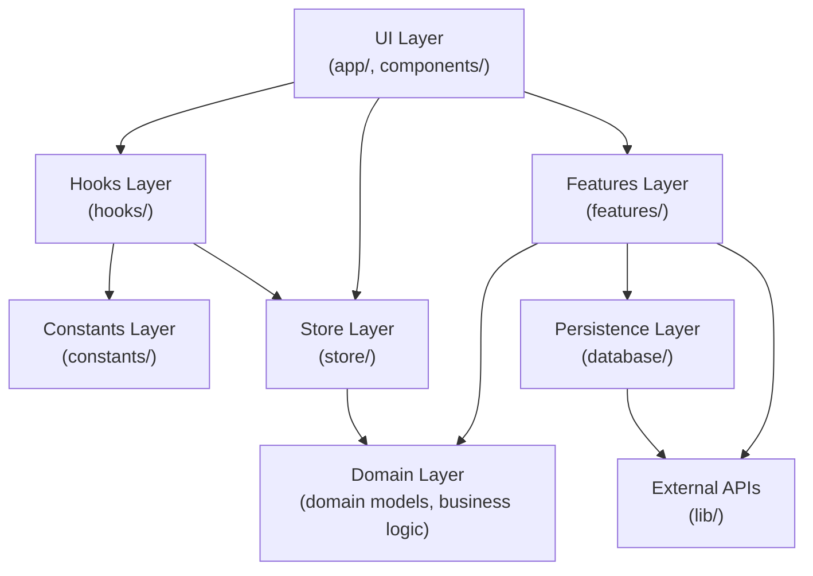
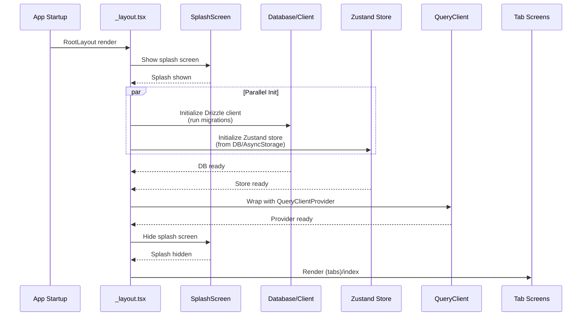
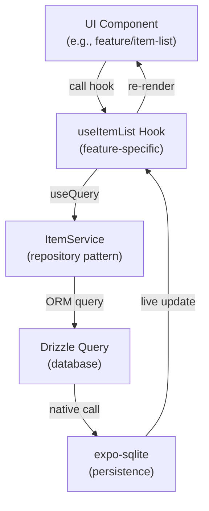
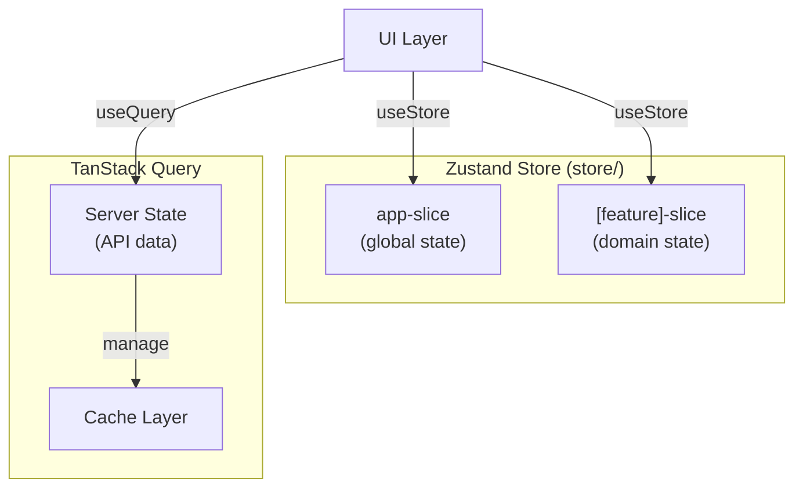

# Technical Design: Custom Boilerplate (RevenueCat除く)

## Overview

本設計は、Expo SDK 54 上で構築された プロダクション品質の React Native ボイラープレートを定義します。開発者が新規プロジェクト立ち上げ時に、基盤構築（ESLint/Prettier）、開発環境セットアップ（フォルダ構造、パスエイリアス、テスト環境）、コア機能（SQLite/Drizzle、Zustand、TanStack Query、テーマシステム）、UI/UX基盤（共通コンポーネント、ナビゲーション）を即座に利用できることを目的とします。

このボイラープレートにより、開発者は数分でプロダクション品質の開発環境を得られ、ビジネスロジック実装に専念できます。

### Goals

- **開発開始時間短縮**: `pnpm create expo-app` 後、数分でセットアップ完了、機能開発開始可能
- **型安全性確保**: TypeScript strict mode、Drizzle ORM による DB 型安全性、Zustand/TanStack Query の型推論
- **テスト駆動開発支援**: Jest + React Native Testing Library 完全セットアップ、sample test 実装
- **コード品質の統一**: ESLint Flat Config + Prettier で team-wide consistency、自動フォーマット
- **再利用可能なコンポーネント**: Button, Card, Spacer, LoadingOverlay など基本 UI 部品提供
- **スケーラブルなアーキテクチャ**: Feature-Sliced Design + Onion Architecture で parallel development 対応

### Non-Goals

- **認証機能の実装**: Authentication system は application の responsibility（boilerplate で base 提供のみ）
- **API integration の詳細**: API client specific implementation（TanStack Query セットアップのみ）
- **RevenueCat 統合**: 収益化機能は separate specification で実装
- **Third-party authentication (OAuth, etc.)**: Future phase
- **Advanced animation/gesture patterns**: Reanimated 4 は available だが, sample 実装外

## Architecture

### Existing Architecture Analysis

现在のコードベース（Expo SDK 54 template）は以下を備えます：

- **Routing**: expo-router 6.0 file-based routing (app/ directory)
- **Navigation**: React Navigation 7.x, bottom-tabs pattern (app/(tabs)/)
- **UI Components**: Themed components (ThemedText, ThemedView), UI primitives (Collapsible, IconSymbol)
- **Theming**: Centralized constants/theme.ts (Colors, Fonts), useColorScheme hook, light/dark mode support
- **Build Config**: Expo SDK 54, React 19.1.0, React Native 0.81.5, New Architecture enabled, React Compiler enabled
- **Tooling**: TypeScript 5.9 strict mode, @/ path alias configured, ESLint (expo config)

本設計は existing patterns を honor しながら、新規層（Database, Store, Features）を追加します。

### Architecture Pattern & Boundary Map

Onion Architecture (層別) + Feature-Sliced Design (機能別)の hybrid approach を採用：



**Architecture Integration**:

- **Selected Pattern**: Onion Architecture (層状分離) + Feature-Sliced Design (機能別組織)
  - Core domain layer では business logic と data models（store, database）
  - Application layer では use cases（features/）
  - UI layer では components, hooks, screens（app/, components/, hooks/）
  - Infrastructure layer では external APIs, utilities（lib/）

- **Domain Boundaries**:
  - **Store Domain**: Global app state (onboarded, isPremium, etc.) — Zustand で管理
  - **Database Domain**: Local data persistence — Drizzle ORM + expo-sqlite
  - **Features Domain**: Feature-specific logic — features/ folder per domain
  - **UI Domain**: Reusable components — components/ (shared), features/\*/components (feature-local)
  - **Constants Domain**: Theme, types, config — constants/, types/

- **Existing Patterns Preserved**:
  - expo-router file-based routing (app/ directory structure)
  - Themed components pattern (useThemeColor hook)
  - Constants-based theming (colors, fonts)
  - @/ path alias for clean imports
  - kebab-case file naming convention

- **New Components Rationale**:
  - `features/` — Feature-Sliced Design for scalability, parallel development
  - `store/` + `store/slices/` — Zustand state slicing pattern, app-wide state
  - `database/` — Drizzle ORM, schema, migrations, client initialization
  - `lib/` — Shared utilities (query client config, helpers, adapters)
  - `types/` — Global TypeScript types, shared domain models

- **Steering Compliance**:
  - Onion Architecture aligns with CLAUDE.md guideline
  - Feature-Sliced Design enables team-safe boundaries
  - DDD principles respect domain ownership

### Technology Stack

| Layer                     | Choice / Version             | Role in Feature            | Notes                                            |
| ------------------------- | ---------------------------- | -------------------------- | ------------------------------------------------ |
| **Core Runtime**          | React 19.1.0                 | Component framework, hooks | Compiler enabled for automatic optimization      |
|                           | React Native 0.81.5          | Native runtime             | New Architecture (TurboModules) enabled          |
|                           | Expo SDK 54                  | Managed services           | Native modules, build system, dev tools          |
|                           | TypeScript 5.9               | Type system                | Strict mode enforced                             |
| **Navigation**            | expo-router 6.0              | File-based routing         | Deep linking, type-safe routes, web SSG          |
|                           | React Navigation 7.x         | Navigation primitives      | Bottom-tabs, stacks (via expo-router)            |
| **Database**              | Drizzle ORM                  | Type-safe DB query builder | enableChangeListener for live updates            |
|                           | expo-sqlite                  | Local database             | Bundled SQLite, no setup, automatic persistence  |
| **State Management**      | Zustand                      | Global app state           | Hook-based, lightweight (2KB), TypeScript native |
|                           | TanStack Query 5.90.11       | Async state, caching       | Server state, auto cache, focus refetch          |
| **UI & Styling**          | React Native StyleSheet      | Component styling          | No CSS framework for mobile                      |
|                           | react-native-reanimated 4.1  | Hardware animations        | Worklets, native thread performance              |
|                           | expo-vector-icons            | Icon library               | Available icon sets                              |
| **Development & Testing** | Jest (jest-expo preset)      | Unit/integration testing   | React 19 compatible, built-in transform          |
|                           | React Native Testing Library | Component testing          | Behavior-focused, accessibility queries          |
|                           | jest-native                  | Matchers library           | Extended expectations for React Native           |
| **Code Quality**          | ESLint 9 (Flat Config)       | Linting                    | eslint-config-expo, prettier integration         |
|                           | Prettier                     | Code formatting            | Opinionated formatter, .prettierrc config        |
|                           | TypeScript                   | Type checking              | Standalone typecheck script                      |
| **Package Manager**       | pnpm                         | Dependency management      | Hoisted node linker, lock file                   |

## System Flows

### Initialization Flow (App Startup)



**Key Decisions**:

- App startup でハイブリッド初期化（並列実行で 高速化）
  - Database initialization は最小限のスキーマで高速化
  - マイグレーション は background で非ブロッキング実行
- Splash screen で UX を改善（2-3 秒表示）
- Store hydration は AsyncStorage + DB から復元
- QueryClient provider は root で wrap
- Error retry: 初期化失敗時は retry button を表示

### Data Flow: Feature-Specific



**Key Decisions**:

- Feature-specific hooks (e.g., `useItemList`) combine service calls + data fetching
- Repository pattern in service layer (database operations abstraction)
- useLiveQuery enables automatic re-render on DB changes
- No intermediate cache (TanStack Query caches API calls, not local DB)

### State Management Flow



**Key Decisions**:

- Zustand: App-wide state (onboarded, isPremium, user preferences)
- TanStack Query: API responses, server state (no TanStack Query for local DB)
- Local DB: Drizzle useLiveQuery (separate from TanStack Query)
- Separation prevents state duplication

## Requirements Traceability

| Requirement | Summary                                    | Components                                | Interfaces                                          | Flows                  |
| ----------- | ------------------------------------------ | ----------------------------------------- | --------------------------------------------------- | ---------------------- |
| 1.1         | Prettier インストール                      | .prettierrc, .prettierignore              | Config files                                        | Setup script           |
| 1.2         | ESLint Flat Config 設定                    | eslint.config.js                          | Linting rules                                       | `pnpm lint`            |
| 1.3         | Prettier 連携                              | eslint.config.js (prettier extend)        | ESLint rules                                        | Formatting             |
| 1.4         | `pnpm lint` 実行                           | ESLint rules                              | CLI interface                                       | Development workflow   |
| 2.1         | features/ ディレクトリ                     | features/ structure                       | Folder pattern                                      | Feature organization   |
| 2.2         | components/ ディレクトリ                   | components/, components/ui/               | Component exports                                   | Shared UI              |
| 2.3         | hooks/ ディレクトリ                        | hooks/                                    | Hook exports                                        | Reusable logic         |
| 2.4         | store/ ディレクトリ                        | store/index.ts, store/slices/             | Store interface                                     | State management       |
| 2.5         | database/ ディレクトリ                     | database/client.ts, database/schema.ts    | DB service                                          | Persistence            |
| 2.6         | lib/ ディレクトリ                          | lib/ utilities                            | Helper functions                                    | Shared logic           |
| 2.7         | types/ ディレクトリ                        | types/ TypeScript files                   | Type definitions                                    | Domain models          |
| 3.1         | @/\* パスエイリアス設定                    | tsconfig.json                             | Path mapping                                        | Import resolution      |
| 3.2         | @/ から型解決                              | TypeScript compiler                       | Import resolution                                   | Development            |
| 3.3         | @/ から hook 解決                          | TypeScript compiler                       | Import resolution                                   | Development            |
| 4.1         | `pnpm test` 実行                           | jest.config.js                            | Jest config                                         | Testing                |
| 4.2         | expo-sqlite transform 設定                 | jest.config.js                            | Babel transform                                     | Module resolution      |
| 4.3         | jest.setup.js 初期化                       | jest.setup.js                             | Test environment                                    | Setup                  |
| 4.4         | @/ alias Jest 解決                         | jest.config.js (moduleNameMapper)         | Path mapping                                        | Import resolution      |
| 5.1         | database/client.ts 初期化                  | database/client.ts                        | DrizzleDB service                                   | Persistence            |
| 5.2         | database/schema.ts スキーマ定義            | database/schema.ts                        | Table definitions                                   | Data model             |
| 5.3         | Drizzle 型安全クエリ                       | Drizzle ORM API                           | Query builder                                       | Data operations        |
| 5.4         | drizzle.config.ts 設定                     | drizzle.config.ts                         | Migration config                                    | Database management    |
| 6.1         | store/index.ts 作成                        | store/index.ts                            | create() function                                   | Store factory          |
| 6.2         | store/slices/ パターン                     | store/slices/                             | Slice interface                                     | Organization           |
| 6.3         | useStore 型安全                            | store/index.ts (TypeScript)               | Hook type inference                                 | DX                     |
| 6.4         | app-slice.ts 基本状態                      | store/slices/app-slice.ts                 | AppState type                                       | Global state           |
| 7.1         | QueryClientProvider セットアップ           | app/\_layout.tsx                          | Provider wrapper                                    | API setup              |
| 7.2         | キャッシュ管理                             | TanStack Query config                     | QueryClient config                                  | Auto caching           |
| 7.3         | QueryClient デフォルト設定                 | lib/query-client.ts                       | QueryClient instance                                | Configuration          |
| 8.1         | constants/theme.ts 拡張                    | constants/theme.ts                        | iOS System Colors型                                 | Theming                |
| 8.2         | ライト/ダーク定義                          | constants/theme.ts (light/dark)           | Colors.primary/background/text/semantic             | Theme variants         |
| 8.3         | useColorScheme Hook                        | hooks/use-color-scheme.ts                 | Hook API                                            | Color resolution       |
| 8.4         | iOS System Colors準拠カラー構造            | constants/theme.ts                        | Colors.primary/background/text/semantic/interactive | expo-design-system準拠 |
| 9.1         | button.tsx コンポーネント                  | components/ui/button.tsx                  | Button props                                        | UI primitive           |
| 9.2         | card.tsx コンポーネント                    | components/ui/card.tsx                    | Card props                                          | UI primitive           |
| 9.3         | spacer.tsx コンポーネント                  | components/ui/spacer.tsx                  | Spacer props                                        | UI primitive           |
| 9.4         | loading-overlay.tsx                        | components/ui/loading-overlay.tsx         | LoadingOverlay props                                | UI primitive           |
| 9.5         | components/index.ts エクスポート           | components/index.ts                       | Barrel export                                       | Module interface       |
| 10.1        | app/\_layout.tsx RootLayout                | app/\_layout.tsx                          | Layout component                                    | Route structure        |
| 10.2        | app/(tabs)/ タブナビゲーション             | app/(tabs)/\_layout.tsx                   | Tab bar config                                      | Navigation             |
| 10.3        | app/modal.tsx モーダル                     | app/modal.tsx                             | Modal screen                                        | Route                  |
| 10.4        | タブ切り替え遷移                           | expo-router linking                       | Navigation API                                      | User interaction       |
| 11.1        | pnpm test スクリプト                       | package.json (scripts)                    | Script definition                                   | CLI                    |
| 11.2        | pnpm lint, lint:fix                        | package.json (scripts)                    | Script definition                                   | CLI                    |
| 11.3        | pnpm format スクリプト                     | package.json (scripts)                    | Script definition                                   | CLI                    |
| 11.4        | pnpm typecheck スクリプト                  | package.json (scripts)                    | Script definition                                   | CLI                    |
| 11.5        | pnpm db:generate, db:studio                | package.json (scripts)                    | Script definition                                   | CLI                    |
| 12.1        | features/\_example/ サンプル機能           | features/\_example/                       | Feature structure                                   | Reference              |
| 12.2        | サンプル components/, hooks/, services/    | features/\_example/components/            | Feature modules                                     | Example                |
| 12.3        | repository.ts パターン                     | features/\_example/services/repository.ts | DB operation                                        | Example                |
| 12.4        | サンプルテスト成功                         | features/\_example/**tests**/             | Test files                                          | Quality assurance      |
| 13.1        | explore.tsx 削除                           | app/(tabs)/explore.tsx (remove)           | File deletion                                       | Cleanup                |
| 13.2        | 不要 sample コンポーネント削除             | components/hello-wave.tsx, etc.           | File deletion                                       | Cleanup                |
| 13.3        | デフォルト画面置き換え                     | app/(tabs)/index.tsx                      | Custom implementation                               | Ownership              |
| 14.1        | iOS System Colors準拠カラーパレット        | constants/theme.ts                        | Colors.primary/background/text/semantic/interactive | expo-design-system     |
| 14.2        | Primary Colors選択構造                     | constants/theme.ts                        | AppPrimaryColor enum                                | Blue/Green/Orange      |
| 14.3        | Background Colors 3段階                    | constants/theme.ts                        | Colors.background.base/secondary/tertiary           | 背景階層               |
| 14.4        | Text Colors 4段階                          | constants/theme.ts                        | Colors.text.primary/secondary/tertiary/inverse      | テキスト階層           |
| 14.5        | Semantic Colors定義                        | constants/theme.ts                        | Colors.semantic.success/warning/error/info          | 機能的な色             |
| 14.6        | Light/Dark Mode両対応                      | constants/theme.ts                        | Colors.light/Colors.dark                            | +10%明度調整           |
| 14.7        | Dark Mode +10%明度調整                     | constants/theme.ts                        | Dark primary/semantic colors                        | iOS標準準拠            |
| 14.8        | Interactive Elements定義                   | constants/theme.ts                        | Colors.interactive.separator/fill/fillSecondary     | 操作要素               |
| 14.9        | 共通UIコンポーネントでデザインシステム使用 | components/ui/\*.tsx                      | iOS System Colors参照                               | コンポーネント実装     |
| 14.10       | NG配色回避                                 | constants/theme.ts                        | No Indigo/gradient/neon/pastel                      | デザインルール         |
| 15.1        | `pnpm start` 正常起動                      | app/ routing                              | App execution                                       | Runtime                |
| 15.2        | `pnpm test` 成功                           | jest.config.js                            | Test execution                                      | Quality                |
| 15.3        | `pnpm lint` エラーなし                     | eslint.config.js                          | Linting                                             | Code quality           |
| 15.4        | `pnpm typecheck` エラーなし                | typescript                                | Type checking                                       | Type safety            |
| 15.5        | SQLite 読み書き動作                        | database/client.ts                        | DB operations                                       | Persistence            |
| 15.6        | Zustand 状態更新動作                       | store/                                    | State mutation                                      | State management       |
| 15.7        | expo-router ナビゲーション動作             | app/ routes                               | Navigation                                          | Routing                |

## Components and Interfaces

### Summary Table

| Component                | Domain/Layer         | Intent                                                                      | Req Coverage              | Key Dependencies                 | Contracts       |
| ------------------------ | -------------------- | --------------------------------------------------------------------------- | ------------------------- | -------------------------------- | --------------- |
| DrizzleDB Client         | Database/Persistence | Expo SQLite DB initialization, query builder                                | 5.1, 5.2, 5.3, 5.4        | expo-sqlite                      | Service         |
| Database Schema          | Database/Domain      | Table definitions, type inference                                           | 5.2                       | drizzle-orm                      | Type definition |
| Zustand Store            | Store/State          | Global app state (onboarded, isPremium)                                     | 6.1, 6.2, 6.3, 6.4        | zustand                          | Service, State  |
| TanStack Query Config    | Store/Async          | QueryClient setup, cache defaults                                           | 7.1, 7.2, 7.3             | @tanstack/react-query            | Service         |
| Theme Constants          | Constants/Domain     | iOS System Colors準拠テーマ（primary/background/text/semantic/interactive） | 8.1, 8.2, 8.4, 14.1-14.10 | expo-design-system, react-native | Type definition |
| Button Component         | UI/Components        | Primary/secondary/ghost/destructive ボタン（iOS System Colors準拠）         | 9.1, 14.9                 | Theme Constants, TouchTarget     | State           |
| Card Component           | UI/Components        | コンテンツコンテナ（background.secondary使用）                              | 9.2, 14.9                 | Theme Constants                  | State           |
| Spacer Component         | UI/Components        | 8pt Grid準拠スペーシング                                                    | 9.3                       | Spacing constants                | State           |
| LoadingOverlay Component | UI/Components        | フルスクリーンローディング（semantic.info使用）                             | 9.4, 14.9                 | Theme Constants                  | State           |
| RootLayout               | Routing/App          | Database init, store init, provider wrapper                                 | 5.1, 6.1, 7.1, 10.1, 14.1 | app/\_layout.tsx                 | Route layout    |
| Tab Navigation           | Routing/Navigation   | Bottom tab bar setup                                                        | 10.2                      | app/(tabs)/\_layout.tsx          | Route layout    |
| Features Module          | Features/Domain      | Feature-specific logic, components, services                                | 2.1, 12.1, 12.2, 12.3     | features/\_example               | Feature pattern |
| ESLint Config            | Tooling/Quality      | Linting rules, Prettier integration                                         | 1.2, 1.3                  | eslint.config.js                 | Configuration   |
| Prettier Config          | Tooling/Quality      | Code formatting rules                                                       | 1.1                       | .prettierrc                      | Configuration   |
| Jest Config              | Tooling/Testing      | Test runner setup, path alias                                               | 4.1, 4.2, 4.3, 4.4        | jest.config.js                   | Configuration   |

### Persistence Layer

#### DrizzleDB Client

| Field        | Detail                                                                  |
| ------------ | ----------------------------------------------------------------------- |
| Intent       | Expo SQLite database connection initialization, query builder interface |
| Requirements | 5.1, 5.2, 5.3, 5.4, 14.5                                                |

**Responsibilities & Constraints**

- Database connection initialization with enableChangeListener=true for live updates
- Migration management and execution on app startup
- Query builder interface for type-safe CRUD operations
- Live query hook integration (useLiveQuery)
- Schema export for client-side type inference

**Dependencies**

- Inbound: RootLayout (\_layout.tsx) — initialization trigger (P0)
- Inbound: Features (features/\*) — query interface (P0)
- Outbound: expo-sqlite — native database (P0)
- Outbound: Drizzle ORM — query builder (P0)
- External: react-native — native module (P0)

**Contracts**: Service [ ✅ ] / API [ ] / Event [ ] / Batch [ ] / State [ ]

##### Service Interface

```typescript
interface DrizzleDB {
  // Initialize database, run migrations
  initialize(): Promise<void>;

  // Query builder access
  db: Database;

  // Execute migrations
  runMigrations(): Promise<void>;

  // Type-safe query builder (exported from schema)
}

// Usage in features:
import { db } from '@/database/client';
const items = await db.select().from(schema.items).all();
```

- Preconditions: expo-sqlite ready, writable directory available
- Postconditions: Database file created, migrations applied
- Invariants: Single DB instance (singleton pattern), migrations idempotent

**Implementation Notes**

- Integration: Initialize in RootLayout useEffect, show splash during init
- Validation: Migration version tracking, rollback capability（Drizzle Studio）
- Risks: Async initialization may delay app startup (mitigate with background migration fallback)

---

#### Database Schema

| Field        | Detail                                                          |
| ------------ | --------------------------------------------------------------- |
| Intent       | Define table structures, types, relationships for type-safe ORM |
| Requirements | 5.2, 14.5                                                       |

**Responsibilities & Constraints**

- Table definitions with columns, types, constraints
- Type inference for insert/select/update operations
- Schema export for Drizzle tooling (migrations, studio)
- Domain model representation

**Dependencies**

- Inbound: DrizzleDB Client — schema import (P0)
- Inbound: Features (repository pattern) — type inference (P0)
- Outbound: Drizzle ORM schema builders (P0)

**Contracts**: Service [ ] / API [ ] / Event [ ] / Batch [ ] / State [ ]

```typescript
// database/schema.ts example
import { sqliteTable, text, integer, timestamp } from 'drizzle-orm/sqlite-core';

export const items = sqliteTable('items', {
  id: integer('id').primaryKey(),
  title: text('title').notNull(),
  description: text('description'),
  createdAt: timestamp('created_at').defaultNow(),
});

export type Item = typeof items.$inferSelect;
export type NewItem = typeof items.$inferInsert;
```

- Preconditions: Drizzle ORM installed
- Postconditions: Type definitions exported for client usage
- Invariants: Schema matches migration files, no orphaned tables

**Implementation Notes**

- Validation: TypeScript strict mode validation
- Risks: Schema changes require migration (mitigate with drizzle-kit)

---

### State Management Layer

#### Zustand Store

| Field        | Detail                                                            |
| ------------ | ----------------------------------------------------------------- |
| Intent       | Global application state (onboarded, isPremium, user preferences) |
| Requirements | 6.1, 6.2, 6.3, 6.4, 14.6                                          |

**Responsibilities & Constraints**

- App-wide state initialization and hydration
- Slice-based organization (store/slices/\*.ts)
- Type-safe hook API (useStore)
- State persistence/recovery

**Dependencies**

- Inbound: RootLayout (\_layout.tsx) — initialization (P0)
- Inbound: UI Components — state access via hooks (P0)
- Inbound: Features — domain-specific slices (P1)
- Outbound: Zustand core library (P0)

**Contracts**: Service [ ✅ ] / API [ ] / Event [ ] / Batch [ ] / State [ ✅ ]

##### Service Interface

```typescript
// store/types.ts
export interface UserPreferences {
  theme: 'light' | 'dark' | 'auto';
  language: string;
}

export interface AppState {
  // App state
  isOnboarded: boolean;
  setOnboarded: (value: boolean) => void;

  isPremium: boolean;
  setPremium: (value: boolean) => void;

  userPreferences: UserPreferences;
  updateUserPreferences: (prefs: Partial<UserPreferences>) => void;

  // Hydration
  hydrate: (state: Partial<AppState>) => void;
}

// store/slices/app-slice.ts
import type { StateCreator } from 'zustand';
import type { AppState } from '../types';

export const appSlice: StateCreator<AppState> = (set) => ({
  isOnboarded: false,
  setOnboarded: (value: boolean) => set({ isOnboarded: value }),

  isPremium: false,
  setPremium: (value: boolean) => set({ isPremium: value }),

  userPreferences: {
    theme: 'auto',
    language: 'en',
  },
  updateUserPreferences: (prefs) =>
    set((state) => ({
      userPreferences: { ...state.userPreferences, ...prefs },
    })),

  hydrate: (state) => set(state),
});

// store/index.ts
import { create } from 'zustand';
import { persist } from 'zustand/middleware';
import { appSlice } from './slices/app-slice';
import type { AppState } from './types';

export const useStore = create<AppState>()(
  persist(
    (set, get, api) => ({
      ...appSlice(set),
    }),
    {
      name: 'app-store',
      version: 1,
      // Storage: AsyncStorage (set up in RootLayout)
      // migrations are handled per slice
    }
  )
);

// Usage in components
function MyComponent() {
  const isOnboarded = useStore((state) => state.isOnboarded);
  const setOnboarded = useStore((state) => state.setOnboarded);

  return (
    <Button onPress={() => setOnboarded(true)}>
      Mark Onboarded
    </Button>
  );
}
```

**Persistence Layer** (AsyncStorage integration):

```typescript
// lib/storage.ts
import AsyncStorage from '@react-native-async-storage/async-storage';
import { MMKV } from 'react-native-mmkv';

// MMKV for better performance (optional, alternative to AsyncStorage)
export const storage = new MMKV();

// Zustand AsyncStorage adapter
export const asyncStorageAdapter = {
  getItem: async (name: string) => {
    const value = await AsyncStorage.getItem(name);
    return value ? JSON.parse(value) : null;
  },
  setItem: async (name: string, value: any) => {
    await AsyncStorage.setItem(name, JSON.stringify(value));
  },
  removeItem: async (name: string) => {
    await AsyncStorage.removeItem(name);
  },
};
```

##### State Management

- State model: Flat state tree with selectors, organized by slice
- Persistence: AsyncStorage hydration (future: persist middleware)
- Concurrency: Zustand handles concurrent updates, no locking needed

**Implementation Notes**

- Integration: Initialize in RootLayout, hydrate from AsyncStorage/DB
- Validation: Type checking via TypeScript generics, no runtime validation
- Risks: State duplication (mitigate with clear store/feature boundary)

---

#### TanStack Query Configuration

| Field        | Detail                                                                           |
| ------------ | -------------------------------------------------------------------------------- |
| Intent       | Setup QueryClient for API data caching, refetch strategy, stale state management |
| Requirements | 7.1, 7.2, 7.3                                                                    |

**Responsibilities & Constraints**

- QueryClient initialization with sensible defaults
- Cache management configuration (staleTime, cacheTime)
- Refetch behavior on focus/reconnect
- Dev tools integration (React Query DevTools optional)

**Dependencies**

- Inbound: RootLayout (\_layout.tsx) — QueryClientProvider wrapper (P0)
- Inbound: Features (useQuery hooks) — query client access (P0)
- Outbound: @tanstack/react-query — core library (P0)
- Outbound: @tanstack/react-query-devtools — debug tools (P1, optional)

**Contracts**: Service [ ✅ ] / API [ ] / Event [ ] / Batch [ ] / State [ ]

```typescript
// lib/query-client.ts
import { QueryClient } from '@tanstack/react-query';

export const queryClient = new QueryClient({
  defaultOptions: {
    queries: {
      staleTime: 1000 * 60 * 5, // 5 minutes
      gcTime: 1000 * 60 * 10,    // 10 minutes (formerly cacheTime)
      retry: 1,
      refetchOnWindowFocus: true,
      refetchOnReconnect: true,
    },
    mutations: {
      retry: 1,
    },
  },
});

// In app/_layout.tsx
<QueryClientProvider client={queryClient}>
  {/* app content */}
</QueryClientProvider>
```

- Preconditions: TanStack Query installed, network available (optional)
- Postconditions: Queries cached, stale queries refetched on focus
- Invariants: Single QueryClient instance, consistent cache policy

**Implementation Notes**

- Integration: Export queryClient from lib, import in \_layout.tsx
- Validation: Monitor cache hits/misses via console logs
- Risks: Cache staleTime too high may show outdated data (tune to feature needs)

---

### UI Components Layer

#### Button Component

| Field        | Detail                                                         |
| ------------ | -------------------------------------------------------------- |
| Intent       | Reusable button with primary/secondary variants, theme support |
| Requirements | 9.1                                                            |

**Responsibilities & Constraints**

- Primary button (filled, default CTA)
- Secondary button (outlined, alternative action)
- Theme-aware colors (light/dark mode)
- Accessible text, touch target size >= 44x44pt

**Dependencies**

- Inbound: Feature components — button usage (P0)
- Outbound: react-native (View, Text, Pressable) (P0)
- Outbound: constants/theme — colors (P0)
- Outbound: hooks/use-theme-color — color resolution (P0)

**Contracts**: Service [ ] / API [ ] / Event [ ] / Batch [ ] / State [ ✅ ]

```typescript
// components/ui/button.tsx
interface ButtonProps {
  variant?: 'primary' | 'secondary';
  disabled?: boolean;
  onPress?: () => void;
  children: React.ReactNode;
}

export function Button({
  variant = 'primary',
  disabled = false,
  onPress,
  children,
}: ButtonProps) {
  const backgroundColor = useThemeColor(
    {
      light: variant === 'primary' ? '#0a7ea4' : '#e0e0e0',
      dark: variant === 'primary' ? '#fff' : '#333',
    },
    'background'
  );

  return (
    <Pressable
      onPress={onPress}
      disabled={disabled}
      style={[styles.button, { backgroundColor }]}
    >
      <Text>{children}</Text>
    </Pressable>
  );
}
```

**Implementation Notes**

- Validation: disabled prop prevents onPress
- Risks: Ensure touch target >= 44pt for iOS accessibility

---

#### Card Component

| Field        | Detail                                                                     |
| ------------ | -------------------------------------------------------------------------- |
| Intent       | Reusable container for grouped content with theme support, padding, shadow |
| Requirements | 9.2                                                                        |

**Responsibilities & Constraints**

- Container styling (border, shadow, padding)
- Theme-aware background color
- Flexible content layout

**Dependencies**

- Inbound: Feature components — card wrapper (P0)
- Outbound: react-native (View) (P0)
- Outbound: constants/theme — colors (P0)

**Contracts**: Service [ ] / API [ ] / Event [ ] / Batch [ ] / State [ ✅ ]

```typescript
interface CardProps {
  children: React.ReactNode;
  style?: StyleProp<ViewStyle>;
}

export function Card({ children, style }: CardProps) {
  const backgroundColor = useThemeColor(
    { light: '#fff', dark: '#1a1a1a' },
    'background'
  );

  return (
    <View
      style={[
        { backgroundColor, borderRadius: 8, padding: 16 },
        styles.shadow,
        style,
      ]}
    >
      {children}
    </View>
  );
}
```

**Implementation Notes**

- Simple container, no complex behavior
- May be extended with variants (elevated, outlined) in future

---

#### Spacer Component

| Field        | Detail                                                           |
| ------------ | ---------------------------------------------------------------- |
| Intent       | Consistent spacing between elements, follows theme spacing scale |
| Requirements | 9.3                                                              |

**Responsibilities & Constraints**

- Fixed-size spacer (4px, 8px, 12px, 16px, 20px, 24px, etc.)
- Vertical/horizontal orientation

**Dependencies**

- Inbound: Feature components — spacing control (P0)
- Outbound: react-native (View) (P0)

**Contracts**: Service [ ] / API [ ] / Event [ ] / Batch [ ] / State [ ]

```typescript
interface SpacerProps {
  size?: 4 | 8 | 12 | 16 | 20 | 24 | 32;
  horizontal?: boolean;
}

export function Spacer({ size = 8, horizontal = false }: SpacerProps) {
  return (
    <View
      style={{
        width: horizontal ? size : 0,
        height: horizontal ? 0 : size,
      }}
    />
  );
}
```

**Implementation Notes**

- Purely layout component, no logic
- Encourage consistent spacing via constants

---

#### LoadingOverlay Component

| Field        | Detail                                                               |
| ------------ | -------------------------------------------------------------------- |
| Intent       | Full-screen overlay with spinner, prevent interaction during loading |
| Requirements | 9.4                                                                  |

**Responsibilities & Constraints**

- Full-screen view with semi-transparent background
- Center spinner with optional message
- Blocks user interaction

**Dependencies**

- Inbound: Feature components — loading state feedback (P0)
- Outbound: react-native (View, ActivityIndicator) (P0)
- Outbound: constants/theme — colors (P0)

**Contracts**: Service [ ] / API [ ] / Event [ ] / Batch [ ] / State [ ✅ ]

```typescript
interface LoadingOverlayProps {
  visible: boolean;
  message?: string;
}

export function LoadingOverlay({ visible, message }: LoadingOverlayProps) {
  if (!visible) return null;

  return (
    <View style={[styles.overlay, { backgroundColor: 'rgba(0, 0, 0, 0.5)' }]}>
      <ActivityIndicator size="large" color="#0a7ea4" />
      {message && <Text>{message}</Text>}
    </View>
  );
}
```

**Implementation Notes**

- Always render to prevent mounting/unmounting animation issues
- Adjust opacity and spinner color per theme

---

### Routing & Layout Layer

#### RootLayout (\_layout.tsx)

| Field        | Detail                                                                                  |
| ------------ | --------------------------------------------------------------------------------------- |
| Intent       | Initialize app (database, store, query client), wrap with providers, define root routes |
| Requirements | 5.1, 6.1, 7.1, 10.1, 14.1                                                               |

**Responsibilities & Constraints**

- Database initialization (runMigrations)
- Store initialization (Zustand)
- QueryClientProvider wrapper
- ThemeProvider wrapper (existing)
- Root route structure

**Dependencies**

- Inbound: expo-router startup (P0)
- Outbound: database/client (initialize) (P0)
- Outbound: store/index (useStore) (P0)
- Outbound: lib/query-client (queryClient) (P0)
- Outbound: app/(tabs)/\_layout (child route) (P0)
- Outbound: app/modal (modal route) (P0)

**Contracts**: Service [ ] / API [ ] / Event [ ] / Batch [ ] / Route [ ✅ ]

```typescript
// app/_layout.tsx
import React, { useEffect, useState } from 'react';
import { QueryClientProvider } from '@tanstack/react-query';
import { Stack } from 'expo-router';
import * as SplashScreen from 'expo-splash-screen';
import { useStore } from '@/store';
import { db } from '@/database/client';
import { queryClient } from '@/lib/query-client';
import { ThemeProvider } from '@/providers/theme-provider';

// Keep splash screen visible while app is loading
SplashScreen.preventAutoHideAsync();

export default function RootLayout() {
  const [appReady, setAppReady] = useState(false);
  const [initError, setInitError] = useState<Error | null>(null);
  const hydrate = useStore((state) => state.hydrate);

  useEffect(() => {
    const initializeApp = async () => {
      try {
        // 1. Initialize database (with timeout)
        const dbInitPromise = Promise.race([
          db.initialize(),
          new Promise((_, reject) =>
            setTimeout(() => reject(new Error('DB init timeout')), 5000)
          ),
        ]);

        // 2. Initialize store from AsyncStorage (parallel)
        const storeHydrationPromise = useStore.persist.rehydrate();

        // Run in parallel for faster startup
        await Promise.all([dbInitPromise, storeHydrationPromise]);

        setAppReady(true);
      } catch (error) {
        console.error('App initialization failed:', error);
        setInitError(error as Error);
        // Still mark as ready to show error screen
        setAppReady(true);
      } finally {
        await SplashScreen.hideAsync();
      }
    };

    initializeApp();
  }, [hydrate]);

  if (!appReady) {
    return null; // Keep splash screen visible
  }

  // Show error screen if initialization failed
  if (initError) {
    return (
      <ThemeProvider>
        <Stack>
          <Stack.Screen
            name="error"
            options={{
              headerShown: false,
              animationEnabled: false,
            }}
          />
        </Stack>
      </ThemeProvider>
    );
  }

  return (
    <QueryClientProvider client={queryClient}>
      <ThemeProvider>
        <Stack>
          <Stack.Screen
            name="(tabs)"
            options={{
              headerShown: false,
              animationEnabled: false,
            }}
          />
          <Stack.Screen
            name="modal"
            options={{
              presentation: 'modal',
              headerShown: true,
              title: 'Modal',
            }}
          />
        </Stack>
      </ThemeProvider>
    </QueryClientProvider>
  );
}
```

**Implementation Notes**

- Parallel initialization: DB + store hydration for fast startup (target <2s)
- Splash screen timeout: 5 second max (prevent indefinite blocking)
- Error handling: Show error screen if initialization fails, no silent failures
- AsyncStorage adapter: Zustand persist middleware with AsyncStorage backend
- Validation: All initializers complete before route rendering
- Recovery: Retry button available on error screen for manual retry

---

#### Tab Navigation (\_layout.tsx in (tabs)/)

| Field        | Detail                                                                       |
| ------------ | ---------------------------------------------------------------------------- |
| Intent       | Configure bottom tab bar, define home/explore screens, set active tint color |
| Requirements | 10.2                                                                         |

**Responsibilities & Constraints**

- Bottom-tabs navigator setup
- Tab icon/label configuration
- Active tint color (theme-aware)
- Nested screen definitions

**Dependencies**

- Inbound: RootLayout (nested route) (P0)
- Outbound: app/(tabs)/index.tsx (home screen) (P0)
- Outbound: app/(tabs)/explore.tsx (explore screen, removed per Req 13) (P1)
- Outbound: react-navigation/bottom-tabs (P0)

**Contracts**: Service [ ] / API [ ] / Event [ ] / Batch [ ] / Route [ ✅ ]

```typescript
// app/(tabs)/_layout.tsx (simplified)
import { BottomTabNavigationProp } from '@react-navigation/bottom-tabs';
import { useColorScheme } from '@/hooks/use-color-scheme';

export default function TabLayout() {
  const colorScheme = useColorScheme();
  const tintColor = Colors[colorScheme ?? 'light'].tint;

  return (
    <Tabs
      screenOptions={{
        tabBarActiveTintColor: tintColor,
        headerShown: true,
      }}
    >
      <Tabs.Screen
        name="index"
        options={{
          title: 'Home',
          tabBarIcon: () => <IconSymbol name="house" />,
        }}
      />
      {/* explore removed per Req 13 */}
    </Tabs>
  );
}
```

**Implementation Notes**

- Integration: Use colors from constants/theme
- Validation: Verify all tab screens exist

---

### Development & Quality Layer

#### ESLint Configuration

| Field        | Detail                                                                            |
| ------------ | --------------------------------------------------------------------------------- |
| Intent       | Code linting rules (Flat Config format), Prettier integration, TypeScript support |
| Requirements | 1.2, 1.3, 1.4, 14.3                                                               |

**Responsibilities & Constraints**

- ESLint rules (code quality, best practices)
- Prettier rule disable (avoid conflicts)
- TypeScript linting
- React/React Native specific rules

**Dependencies**

- Outbound: eslint 9 (core) (P0)
- Outbound: typescript-eslint (type-aware rules) (P0)
- Outbound: eslint-plugin-react, react-hooks, react-native (P0)
- Outbound: eslint-config-prettier (Prettier compatibility) (P0)

**Contracts**: Service [ ] / API [ ✅ ] / Event [ ] / Batch [ ] / State [ ]

```javascript
// eslint.config.js
import js from '@eslint/js';
import tseslint from 'typescript-eslint';
import react from 'eslint-plugin-react';
import reactNative from 'eslint-plugin-react-native';
import prettier from 'eslint-config-prettier';

export default [
  {
    files: ['**/*.{ts,tsx}'],
    languageOptions: {
      parser: tseslint.parser,
      parserOptions: { ecmaVersion: 'latest', sourceType: 'module' },
    },
  },
  js.configs.recommended,
  ...tseslint.configs.recommended,
  react.configs.recommended,
  reactNative.configs.all,
  prettier,
  {
    rules: {
      '@typescript-eslint/no-unused-vars': 'warn',
      'react-native/no-unused-styles': 'warn',
    },
  },
];
```

**Implementation Notes**

- Validation: Run `pnpm lint` on pre-commit (via Husky)
- Risks: Strict rules may block development (balance strictness vs developer velocity)

---

#### Prettier Configuration

| Field        | Detail                                          |
| ------------ | ----------------------------------------------- |
| Intent       | Code formatting rules (opinionated, consistent) |
| Requirements | 1.1, 1.3, 14.3                                  |

**Responsibilities & Constraints**

- Formatting rules (indentation, quotes, line length)
- File ignore patterns (build, node_modules)
- Consistent with ESLint (via eslint-config-prettier)

**Dependencies**

- Outbound: prettier (core) (P0)

**Contracts**: Service [ ] / API [ ✅ ] / Event [ ] / Batch [ ] / State [ ]

```javascript
// .prettierrc
{
  "arrowParens": "always",
  "bracketSameLine": false,
  "bracketSpacing": true,
  "singleQuote": true,
  "semi": true,
  "trailingComma": "all",
  "printWidth": 100,
  "tabWidth": 2,
}

// .prettierignore
build/
node_modules/
dist/
```

**Implementation Notes**

- Validation: Run `pnpm format` before commit
- IDE Integration: Install Prettier extension, enable "Format on Save"

---

#### Jest Configuration

| Field        | Detail                                                                             |
| ------------ | ---------------------------------------------------------------------------------- |
| Intent       | Test runner setup (jest-expo preset), path alias resolution, test environment init |
| Requirements | 4.1, 4.2, 4.3, 4.4, 14.2                                                           |

**Responsibilities & Constraints**

- Jest preset (jest-expo for Expo/RN transforms)
- Module name mapper for @/ alias
- Setup files for test environment
- Transform config for expo-sqlite, expo modules

**Dependencies**

- Outbound: jest (core) (P0)
- Outbound: jest-expo (preset, transforms) (P0)
- Outbound: @testing-library/react-native, jest-native (matchers) (P0)

**Contracts**: Service [ ] / API [ ✅ ] / Event [ ] / Batch [ ] / State [ ]

```javascript
// jest.config.js
module.exports = {
  preset: 'jest-expo',
  setupFilesAfterEnv: ['<rootDir>/jest.setup.js'],
  moduleNameMapper: {
    '^@/(.*)$': '<rootDir>/$1',
  },
  testEnvironment: 'node',
  testMatch: ['**/__tests__/**/*.test.ts?(x)'],
  collectCoverageFrom: [
    '**/*.{ts,tsx}',
    '!**/*.d.ts',
    '!**/node_modules/**',
    '!**/.expo/**',
    '!**/coverage/**',
  ],
  coverageThreshold: {
    global: {
      branches: 80,
      functions: 90,
      lines: 90,
      statements: 90,
    },
    './src/features': {
      branches: 85,
      functions: 90,
      lines: 90,
      statements: 90,
    },
    './src/store': {
      branches: 90,
      functions: 90,
      lines: 90,
      statements: 90,
    },
  },
};

// jest.setup.js
import '@testing-library/jest-native/extend-expect';

// Mock expo-sqlite
jest.mock('expo-sqlite', () => ({
  openDatabaseAsync: jest.fn().mockResolvedValue({
    execAsync: jest.fn().mockResolvedValue([]),
    runAsync: jest.fn().mockResolvedValue({ changes: 0 }),
    getFirstAsync: jest.fn().mockResolvedValue(null),
    getAllAsync: jest.fn().mockResolvedValue([]),
  }),
}));

// Mock AsyncStorage
jest.mock('@react-native-async-storage/async-storage', () => ({
  getItem: jest.fn().mockResolvedValue(null),
  setItem: jest.fn().mockResolvedValue(undefined),
  removeItem: jest.fn().mockResolvedValue(undefined),
  clear: jest.fn().mockResolvedValue(undefined),
}));

// Mock @tanstack/react-query DevTools (optional)
jest.mock('@tanstack/react-query-devtools', () => ({
  ReactQueryDevtools: () => null,
}));
```

**Example Test** (features/\_example/**tests**/repository.test.ts):

```typescript
import { ItemRepository } from '../services/repository';
import { db } from '@/database/client';
import type { Item, CreateItemInput } from '../types';

describe('ItemRepository', () => {
  let repository: ItemRepository;

  beforeEach(() => {
    repository = new ItemRepository();
    jest.clearAllMocks();
  });

  describe('getAll', () => {
    it('should return all items sorted by createdAt DESC', async () => {
      // Arrange: Happy path
      const expectedItems = [
        {
          id: 1,
          title: 'Item 1',
          description: 'Desc 1',
          createdAt: new Date('2025-01-02'),
        },
        {
          id: 2,
          title: 'Item 2',
          description: 'Desc 2',
          createdAt: new Date('2025-01-01'),
        },
      ];

      jest.spyOn(db, 'select').mockReturnValue({
        from: () => ({
          orderBy: () => ({
            all: jest.fn().mockResolvedValue(expectedItems),
          }),
        }),
      } as any);

      // Act
      const result = await repository.getAll();

      // Assert
      expect(result).toEqual(expectedItems);
      expect(result).toHaveLength(2);
      expect(result[0].title).toBe('Item 1');
      expect(result[0].createdAt instanceof Date).toBe(true);
    });

    it('should return empty array when no items exist (edge case)', async () => {
      // Arrange: Edge case - empty result
      jest.spyOn(db, 'select').mockReturnValue({
        from: () => ({
          orderBy: () => ({
            all: jest.fn().mockResolvedValue([]),
          }),
        }),
      } as any);

      // Act
      const result = await repository.getAll();

      // Assert
      expect(result).toEqual([]);
      expect(result.length).toBe(0);
      expect(Array.isArray(result)).toBe(true);
    });

    it('should handle large dataset (edge case)', async () => {
      // Arrange: Edge case - 1000+ items
      const largeDataset = Array.from({ length: 1000 }, (_, i) => ({
        id: i + 1,
        title: `Item ${i + 1}`,
        description: null,
        createdAt: new Date(),
      }));

      jest.spyOn(db, 'select').mockReturnValue({
        from: () => ({
          orderBy: () => ({
            all: jest.fn().mockResolvedValue(largeDataset),
          }),
        }),
      } as any);

      // Act
      const result = await repository.getAll();

      // Assert
      expect(result).toHaveLength(1000);
      expect(result[0].id).toBe(1);
      expect(result[999].id).toBe(1000);
    });

    it('should handle database connection errors (sad path)', async () => {
      // Arrange: Sad path - connection error
      jest.spyOn(db, 'select').mockImplementation(() => {
        throw new Error('Database connection failed');
      });

      // Act & Assert
      await expect(repository.getAll()).rejects.toThrow(
        'Database connection failed'
      );
    });

    it('should handle database timeout errors (sad path)', async () => {
      // Arrange: Sad path - timeout
      jest.spyOn(db, 'select').mockImplementation(() => {
        throw new Error('Query timeout');
      });

      // Act & Assert
      await expect(repository.getAll()).rejects.toThrow('Query timeout');
    });

    it('should handle null items in result set (edge case)', async () => {
      // Arrange: Edge case - mixed null descriptions
      const itemsWithNulls = [
        { id: 1, title: 'Item 1', description: null, createdAt: new Date() },
        {
          id: 2,
          title: 'Item 2',
          description: 'Valid desc',
          createdAt: new Date(),
        },
        {
          id: 3,
          title: 'Item 3',
          description: undefined,
          createdAt: new Date(),
        },
      ];

      jest.spyOn(db, 'select').mockReturnValue({
        from: () => ({
          orderBy: () => ({
            all: jest.fn().mockResolvedValue(itemsWithNulls),
          }),
        }),
      } as any);

      // Act
      const result = await repository.getAll();

      // Assert
      expect(result).toHaveLength(3);
      expect(result[0].description).toBeUndefined();
      expect(result[1].description).toBe('Valid desc');
    });
  });

  describe('getById', () => {
    it('should return item by id (happy path)', async () => {
      // Arrange
      const expectedItem = {
        id: 1,
        title: 'Item 1',
        description: 'Desc',
        createdAt: new Date(),
      };

      jest.spyOn(db, 'select').mockReturnValue({
        from: () => ({
          where: () => ({
            get: jest.fn().mockResolvedValue(expectedItem),
          }),
        }),
      } as any);

      // Act
      const result = await repository.getById(1);

      // Assert
      expect(result).toEqual(expectedItem);
      expect(result?.id).toBe(1);
    });

    it('should return null when item not found (sad path)', async () => {
      // Arrange
      jest.spyOn(db, 'select').mockReturnValue({
        from: () => ({
          where: () => ({
            get: jest.fn().mockResolvedValue(null),
          }),
        }),
      } as any);

      // Act
      const result = await repository.getById(999);

      // Assert
      expect(result).toBeNull();
    });

    it('should handle invalid id values (edge case)', async () => {
      // Arrange: Edge case - zero and negative ids
      jest.spyOn(db, 'select').mockReturnValue({
        from: () => ({
          where: () => ({
            get: jest.fn().mockResolvedValue(null),
          }),
        }),
      } as any);

      // Act
      const resultZero = await repository.getById(0);
      const resultNegative = await repository.getById(-1);

      // Assert
      expect(resultZero).toBeNull();
      expect(resultNegative).toBeNull();
    });

    it('should handle very large id values (edge case)', async () => {
      // Arrange: Edge case - max integer
      jest.spyOn(db, 'select').mockReturnValue({
        from: () => ({
          where: () => ({
            get: jest.fn().mockResolvedValue(null),
          }),
        }),
      } as any);

      // Act
      const result = await repository.getById(Number.MAX_SAFE_INTEGER);

      // Assert
      expect(result).toBeNull();
    });
  });

  describe('create', () => {
    it('should create item with valid input (happy path)', async () => {
      // Arrange
      const input: CreateItemInput = { title: 'New Item', description: 'Test' };
      const expectedItem: Item = {
        id: 1,
        title: 'New Item',
        description: 'Test',
        createdAt: new Date(),
      };

      jest.spyOn(db, 'insert').mockReturnValue({
        values: () => ({
          returning: () => ({
            get: jest.fn().mockResolvedValue(expectedItem),
          }),
        }),
      } as any);

      // Act
      const result = await repository.create(input);

      // Assert
      expect(result).toEqual(expectedItem);
      expect(result.id).toBe(1);
      expect(result.title).toBe('New Item');
    });

    it('should create item without optional description (edge case)', async () => {
      // Arrange: Edge case - minimal input
      const input: CreateItemInput = { title: 'Item Only' };
      const expectedItem: Item = {
        id: 2,
        title: 'Item Only',
        description: undefined,
        createdAt: new Date(),
      };

      jest.spyOn(db, 'insert').mockReturnValue({
        values: () => ({
          returning: () => ({
            get: jest.fn().mockResolvedValue(expectedItem),
          }),
        }),
      } as any);

      // Act
      const result = await repository.create(input);

      // Assert
      expect(result.description).toBeUndefined();
      expect(result.title).toBe('Item Only');
    });

    it('should handle very long title (edge case)', async () => {
      // Arrange: Edge case - max length string
      const longTitle = 'A'.repeat(1000);
      const input: CreateItemInput = { title: longTitle };

      jest.spyOn(db, 'insert').mockReturnValue({
        values: () => ({
          returning: () => ({
            get: jest.fn().mockResolvedValue({
              id: 3,
              title: longTitle,
              description: undefined,
              createdAt: new Date(),
            }),
          }),
        }),
      } as any);

      // Act
      const result = await repository.create(input);

      // Assert
      expect(result.title.length).toBe(1000);
    });

    it('should handle empty title (edge case)', async () => {
      // Arrange: Edge case - empty string
      const input: CreateItemInput = { title: '' };

      jest.spyOn(db, 'insert').mockReturnValue({
        values: () => ({
          returning: () => ({
            get: jest.fn().mockResolvedValue(null),
          }),
        }),
      } as any);

      // Act
      const result = await repository.create(input);

      // Assert
      expect(result).toBeNull();
    });

    it('should handle unicode characters in title (edge case)', async () => {
      // Arrange: Edge case - emoji and special characters
      const input: CreateItemInput = {
        title: '日本語 🎉 emoji test',
        description: '中文 한국어',
      };

      jest.spyOn(db, 'insert').mockReturnValue({
        values: () => ({
          returning: () => ({
            get: jest.fn().mockResolvedValue({
              id: 4,
              ...input,
              createdAt: new Date(),
            }),
          }),
        }),
      } as any);

      // Act
      const result = await repository.create(input);

      // Assert
      expect(result.title).toBe('日本語 🎉 emoji test');
      expect(result.description).toBe('中文 한국어');
    });

    it('should handle constraint violations (sad path)', async () => {
      // Arrange: Sad path - unique constraint
      jest.spyOn(db, 'insert').mockImplementation(() => {
        throw new Error('UNIQUE constraint failed');
      });

      // Act & Assert
      await expect(repository.create({ title: 'Duplicate' })).rejects.toThrow(
        'UNIQUE constraint failed'
      );
    });

    it('should handle database errors during insert (sad path)', async () => {
      // Arrange: Sad path - general database error
      jest.spyOn(db, 'insert').mockImplementation(() => {
        throw new Error('Disk I/O error');
      });

      // Act & Assert
      await expect(repository.create({ title: 'Test' })).rejects.toThrow(
        'Disk I/O error'
      );
    });
  });

  describe('update', () => {
    it('should update item with valid input (happy path)', async () => {
      // Arrange
      const updateInput = { title: 'Updated Item' };
      const updatedItem: Item = {
        id: 1,
        title: 'Updated Item',
        description: undefined,
        createdAt: new Date(),
      };

      jest.spyOn(db, 'update').mockReturnValue({
        set: () => ({
          where: () => ({
            returning: () => ({
              get: jest.fn().mockResolvedValue(updatedItem),
            }),
          }),
        }),
      } as any);

      // Act
      const result = await repository.update(1, updateInput);

      // Assert
      expect(result).toEqual(updatedItem);
      expect(result?.title).toBe('Updated Item');
    });

    it('should return null when item not found (sad path)', async () => {
      // Arrange
      jest.spyOn(db, 'update').mockReturnValue({
        set: () => ({
          where: () => ({
            returning: () => ({
              get: jest.fn().mockResolvedValue(null),
            }),
          }),
        }),
      } as any);

      // Act
      const result = await repository.update(999, { title: 'Test' });

      // Assert
      expect(result).toBeNull();
    });

    it('should handle partial update (edge case)', async () => {
      // Arrange: Edge case - only description, no title
      const partialUpdate = { description: 'Only description' };
      const updatedItem: Item = {
        id: 1,
        title: 'Original',
        description: 'Only description',
        createdAt: new Date(),
      };

      jest.spyOn(db, 'update').mockReturnValue({
        set: () => ({
          where: () => ({
            returning: () => ({
              get: jest.fn().mockResolvedValue(updatedItem),
            }),
          }),
        }),
      } as any);

      // Act
      const result = await repository.update(1, partialUpdate);

      // Assert
      expect(result?.description).toBe('Only description');
    });

    it('should handle database constraint errors (sad path)', async () => {
      // Arrange
      jest.spyOn(db, 'update').mockImplementation(() => {
        throw new Error('UNIQUE constraint failed');
      });

      // Act & Assert
      await expect(
        repository.update(1, { title: 'Duplicate' })
      ).rejects.toThrow();
    });
  });

  describe('delete', () => {
    it('should delete item successfully (happy path)', async () => {
      // Arrange
      jest.spyOn(db, 'delete').mockReturnValue({
        where: () => ({
          run: jest.fn().mockResolvedValue({ changes: 1 }),
        }),
      } as any);

      // Act
      const result = await repository.delete(1);

      // Assert
      expect(result).toBe(true);
    });

    it('should return false when item not found (sad path)', async () => {
      // Arrange
      jest.spyOn(db, 'delete').mockReturnValue({
        where: () => ({
          run: jest.fn().mockResolvedValue({ changes: 0 }),
        }),
      } as any);

      // Act
      const result = await repository.delete(999);

      // Assert
      expect(result).toBe(false);
    });

    it('should handle invalid id values (edge case)', async () => {
      // Arrange: Edge case - zero and negative
      jest.spyOn(db, 'delete').mockReturnValue({
        where: () => ({
          run: jest.fn().mockResolvedValue({ changes: 0 }),
        }),
      } as any);

      // Act
      const resultZero = await repository.delete(0);
      const resultNegative = await repository.delete(-1);

      // Assert
      expect(resultZero).toBe(false);
      expect(resultNegative).toBe(false);
    });

    it('should handle concurrent deletes (edge case)', async () => {
      // Arrange: Edge case - race condition (changes could be 0 or more)
      let callCount = 0;
      jest.spyOn(db, 'delete').mockReturnValue({
        where: () => ({
          run: jest.fn().mockImplementation(async () => {
            callCount++;
            return { changes: callCount === 1 ? 1 : 0 }; // First delete succeeds, second fails
          }),
        }),
      } as any);

      // Act
      const result1 = await repository.delete(1);
      const result2 = await repository.delete(1);

      // Assert
      expect(result1).toBe(true);
      expect(result2).toBe(false);
    });

    it('should handle database errors (sad path)', async () => {
      // Arrange
      jest.spyOn(db, 'delete').mockImplementation(() => {
        throw new Error('Database lock timeout');
      });

      // Act & Assert
      await expect(repository.delete(1)).rejects.toThrow(
        'Database lock timeout'
      );
    });
  });

  describe('liveGetAll', () => {
    it('should subscribe to live updates (happy path)', (done) => {
      // Arrange
      const items: Item[] = [
        { id: 1, title: 'Item', description: undefined, createdAt: new Date() },
      ];

      const mockLive = {
        on: jest.fn((event, callback) => {
          if (event === 'change') {
            callback(items);
          }
          return jest.fn(); // return unsubscribe function
        }),
      };

      jest.spyOn(db, 'select').mockReturnValue({
        from: () => ({
          orderBy: () => ({
            live: jest.fn().mockReturnValue(mockLive),
          }),
        }),
      } as any);

      // Act
      const callback = jest.fn();
      const unsubscribe = repository.liveGetAll(callback);

      // Assert
      expect(callback).toHaveBeenCalledWith(items);
      expect(typeof unsubscribe).toBe('function');
      done();
    });

    it('should handle unsubscribe (edge case)', (done) => {
      // Arrange
      const unsubscribeFn = jest.fn();
      const mockLive = {
        on: jest.fn().mockReturnValue(unsubscribeFn),
      };

      jest.spyOn(db, 'select').mockReturnValue({
        from: () => ({
          orderBy: () => ({
            live: jest.fn().mockReturnValue(mockLive),
          }),
        }),
      } as any);

      // Act
      const unsubscribe = repository.liveGetAll(() => {});
      unsubscribe();

      // Assert
      expect(typeof unsubscribe).toBe('function');
      done();
    });

    it('should handle multiple subscriptions (edge case)', (done) => {
      // Arrange
      const items1 = [
        {
          id: 1,
          title: 'Item 1',
          description: undefined,
          createdAt: new Date(),
        },
      ];
      const items2 = [
        {
          id: 2,
          title: 'Item 2',
          description: undefined,
          createdAt: new Date(),
        },
      ];

      const mockLive = {
        on: jest.fn((event, callback) => {
          if (event === 'change') {
            callback(items1); // First call
            setImmediate(() => callback(items2)); // Second call
          }
          return jest.fn();
        }),
      };

      jest.spyOn(db, 'select').mockReturnValue({
        from: () => ({
          orderBy: () => ({
            live: jest.fn().mockReturnValue(mockLive),
          }),
        }),
      } as any);

      // Act
      const callback = jest.fn();
      repository.liveGetAll(callback);

      // Assert (after async operations)
      setImmediate(() => {
        expect(callback).toHaveBeenCalledTimes(2);
        expect(callback).toHaveBeenNthCalledWith(1, items1);
        expect(callback).toHaveBeenNthCalledWith(2, items2);
        done();
      });
    });
  });
});
```

**Implementation Notes**

- Validation: Run `pnpm test` to verify all tests pass
- Coverage target: **90% lines, 90% functions, 80% branches, 90% statements**
- Test categories:
  - **Happy path**: Standard successful scenarios (create, update, delete success)
  - **Sad path**: Expected errors (not found, constraint violations, database errors)
  - **Edge cases**: Boundary values (empty arrays, null/undefined, very large data, unicode, concurrent operations)
  - **Error handling**: Network timeouts, database locks, I/O errors
- Mock setup: expo-sqlite, AsyncStorage mocked for unit tests
- Feature test coverage >= 90% (store and features dirs)
- Integration tests: Use real DB in separate config (future enhancement)

---

### Features Module (Example Pattern)

#### Feature Structure

Features follow a consistent pattern to enable team-safe parallel development:

```
features/_example/
├── components/          # Feature-specific UI components
│   ├── item-list.tsx
│   └── item-card.tsx
├── hooks/               # Feature-specific hooks
│   └── use-item-list.ts
├── services/            # Business logic, repository pattern
│   ├── repository.ts
│   └── query-keys.ts
├── __tests__/           # Feature tests
│   ├── item-list.test.tsx
│   ├── repository.test.ts
│   └── use-item-list.test.ts
├── index.ts             # Barrel export
└── types.ts             # Feature-specific types
```

**Feature Intent**: Encapsulate feature domain logic (database operations, API calls, state), feature-specific UI components, feature-specific hooks.

**Key Boundaries**:

- Feature owns its data model (types.ts)
- Feature exports service (repository) for data operations
- Feature exports components for UI
- Feature exports hooks for data fetching (useItemList)
- Feature avoids cross-feature imports (use shared components/hooks instead)

#### Example Implementation

```typescript
// features/_example/types.ts
export interface Item {
  id: number;
  title: string;
  description?: string;
  createdAt: Date;
}

export interface CreateItemInput {
  title: string;
  description?: string;
}

// features/_example/services/query-keys.ts
export const itemKeys = {
  all: ['items'] as const,
  lists: () => [...itemKeys.all, 'list'] as const,
  list: (filters: string) => [...itemKeys.lists(), { filters }] as const,
  details: () => [...itemKeys.all, 'detail'] as const,
  detail: (id: number) => [...itemKeys.details(), id] as const,
};

// features/_example/services/repository.ts
import { db } from '@/database/client';
import { items as itemsTable, type Item as DBItem } from '@/database/schema';
import { eq, desc } from 'drizzle-orm';
import type { Item, CreateItemInput } from '../types';

export class ItemRepository {
  // CRUD operations
  async getAll(): Promise<Item[]> {
    const rows = await db
      .select()
      .from(itemsTable)
      .orderBy(desc(itemsTable.createdAt))
      .all();
    return rows.map(this.mapDbItemToItem);
  }

  async getById(id: number): Promise<Item | null> {
    const row = await db
      .select()
      .from(itemsTable)
      .where(eq(itemsTable.id, id))
      .get();
    return row ? this.mapDbItemToItem(row) : null;
  }

  async create(input: CreateItemInput): Promise<Item> {
    const result = await db
      .insert(itemsTable)
      .values(input)
      .returning()
      .get();
    return this.mapDbItemToItem(result);
  }

  async update(id: number, input: Partial<CreateItemInput>): Promise<Item | null> {
    const result = await db
      .update(itemsTable)
      .set(input)
      .where(eq(itemsTable.id, id))
      .returning()
      .get();
    return result ? this.mapDbItemToItem(result) : null;
  }

  async delete(id: number): Promise<boolean> {
    const result = await db
      .delete(itemsTable)
      .where(eq(itemsTable.id, id))
      .run();
    return result.changes > 0;
  }

  // Live query for real-time updates
  liveGetAll(callback: (items: Item[]) => void): () => void {
    const unsubscribe = db
      .select()
      .from(itemsTable)
      .orderBy(desc(itemsTable.createdAt))
      .live()
      .on('change', (rows) => {
        callback(rows.map(this.mapDbItemToItem));
      });
    return unsubscribe;
  }

  private mapDbItemToItem(dbItem: DBItem): Item {
    return {
      id: dbItem.id,
      title: dbItem.title,
      description: dbItem.description || undefined,
      createdAt: new Date(dbItem.createdAt),
    };
  }
}

export const itemRepository = new ItemRepository();

// features/_example/hooks/use-item-list.ts
import { useQuery } from '@tanstack/react-query';
import { useEffect, useState } from 'react';
import { itemRepository } from '../services/repository';
import { itemKeys } from '../services/query-keys';
import type { Item } from '../types';

export function useItemList() {
  const [liveItems, setLiveItems] = useState<Item[]>([]);

  // Use TanStack Query for API-based items (if applicable)
  // For local DB, use live queries instead
  useEffect(() => {
    const unsubscribe = itemRepository.liveGetAll((items) => {
      setLiveItems(items);
    });

    return unsubscribe;
  }, []);

  return {
    items: liveItems,
    isLoading: false,
    error: null,
  };
}

// Alternative: TanStack Query + refetch pattern
export function useItemListQuery() {
  return useQuery({
    queryKey: itemKeys.lists(),
    queryFn: () => itemRepository.getAll(),
  });
}

// features/_example/components/item-list.tsx
import React from 'react';
import { FlatList, Text, View } from 'react-native';
import { useItemList } from '../hooks/use-item-list';
import { ItemCard } from './item-card';

export function ItemList() {
  const { items, isLoading } = useItemList();

  if (isLoading) {
    return <Text>Loading...</Text>;
  }

  return (
    <FlatList
      data={items}
      renderItem={({ item }) => <ItemCard item={item} />}
      keyExtractor={(item) => String(item.id)}
      scrollEnabled={true}
    />
  );
}

// features/_example/components/item-card.tsx
import React from 'react';
import { View, Text, Pressable } from 'react-native';
import { Card, Button } from '@/components';
import type { Item } from '../types';

interface ItemCardProps {
  item: Item;
  onDelete?: (id: number) => void;
}

export function ItemCard({ item, onDelete }: ItemCardProps) {
  return (
    <Card>
      <Text style={{ fontSize: 16, fontWeight: 'bold' }}>
        {item.title}
      </Text>
      {item.description && (
        <Text style={{ color: '#666' }}>
          {item.description}
        </Text>
      )}
      <Text style={{ fontSize: 12, color: '#999' }}>
        {item.createdAt.toLocaleDateString()}
      </Text>
      {onDelete && (
        <Button
          variant="secondary"
          onPress={() => onDelete(item.id)}
        >
          Delete
        </Button>
      )}
    </Card>
  );
}

// features/_example/index.ts
export { ItemRepository, itemRepository } from './services/repository';
export { useItemList, useItemListQuery } from './hooks/use-item-list';
export { ItemList, ItemCard } from './components';
export type { Item, CreateItemInput } from './types';
```

**Implementation Notes**:

- Use `features/_example/` as template for new features
- Integration: Import `features/*/services/repository` for data access
- Live queries for local DB updates, TanStack Query for API calls
- Repository pattern abstracts DB operations, testable independently
- Feature test coverage >= 70%
- Cross-feature dependencies: ESLint rule `no-restricted-imports` to prevent

---

## Data Models

### Domain Model

```
AppState (Zustand)
├── isOnboarded: boolean
├── isPremium: boolean
└── userPreferences: {
      theme: 'light' | 'dark',
      language: string,
    }

LocalDatabase (Drizzle)
├── items table
│   ├── id (PK)
│   ├── title
│   ├── description
│   └── createdAt
└── [feature-specific tables]
```

**Aggregates**:

- **AppState**: Single aggregate for app-wide preferences
- **Items**: Feature-specific domain (example)

**Invariants**:

- isOnboarded cannot be reverted
- Database timestamps are UTC
- All table primary keys are integer auto-increment

### Logical Data Model

| Entity           | Attributes                             | Indexing                             | Consistency                                                        |
| ---------------- | -------------------------------------- | ------------------------------------ | ------------------------------------------------------------------ |
| items            | id (PK), title, description, createdAt | id (unique), createdAt (for sorting) | All fields required except description, cascade delete via Drizzle |
| [feature-tables] | (TBD per feature)                      | (TBD)                                | (TBD)                                                              |

**Consistency & Integrity**:

- Transaction boundaries: Single-table operations (Drizzle handles)
- Referential integrity: Via Drizzle foreign key constraints
- Temporal aspects: createdAt timestamp immutable, soft delete optional

### Physical Data Model

**SQLite Specifics**:

- Single file database (app/Documents/app.db on iOS, app cache on Android)
- No network sync (local-first)
- Drizzle migrations handle schema versioning

```sql
CREATE TABLE items (
  id INTEGER PRIMARY KEY AUTOINCREMENT,
  title TEXT NOT NULL,
  description TEXT,
  created_at TIMESTAMP DEFAULT CURRENT_TIMESTAMP
);
```

---

## Error Handling

### Error Strategy

Three error categories handled:

- **User Errors (4xx)**: Invalid input, validation failures
- **System Errors (5xx)**: Database failures, network issues
- **Business Logic Errors (422)**: State conflicts, rule violations

### Error Categories and Responses

**User Errors**:

- Invalid form input → field-level validation, inline error messages
- Not found → navigate to fallback screen, show friendly message

**System Errors**:

- Database initialization failure → show splash screen retry prompt
- Network failure (TanStack Query) → auto-retry with exponential backoff, offline indicator

**Business Logic**:

- onboarded already true → skip onboarding flow
- Premium required → show upsell screen

### Monitoring

Error tracking via:

- Console logs (development)
- Error boundary component (React error recovery)
- Custom error logger (future: Sentry integration)

---

## Testing Strategy

### Unit Tests

1. **Database/Repository**: Test CRUD operations, query builders, type safety
   - Example: ItemRepository.insert(), .select(), .update(), .delete()

2. **Store/Zustand**: Test state mutations, selectors
   - Example: useStore updates, selector memoization

3. **Utilities**: Test helper functions in lib/
   - Example: formatDate(), parseJSON(), etc.

4. **Components**: Test rendering, props, callbacks (shallow)
   - Example: Button variant, disabled state, onPress callback

5. **Hooks**: Test hook behavior, re-render triggering
   - Example: useItemList data fetching, caching behavior

### Integration Tests

1. **Feature Flow**: Test feature end-to-end (repo → component → screen)
   - Example: Fetch items → Display list → Tap item → Show detail

2. **Store + Component**: Test component reading/writing store state
   - Example: Component updates isPremium → Feature conditional renders

3. **Database + TanStack Query**: Test live updates + cache invalidation
   - Example: Insert item → useLiveQuery triggers → Cache updated

### E2E/UI Tests (if applicable)

1. **Navigation**: Test tab switching, route transitions
2. **Form Submission**: Test form submission, validation, error handling
3. **Critical User Flows**: Onboarding, premium purchase (future)

### Performance/Load Tests

1. **Database**: Test query performance with large datasets
2. **Store**: Test selector memoization prevents unnecessary re-renders
3. **List Rendering**: Test scrolling performance with 100+ items

---

## UI Theming System（iOS System Colors準拠）

> **重要**: 本デザインシステムは `expo-design-system` Claude Skill に基づき、Apple Human Interface Guidelines（iOS System Colors）に準拠しています。詳細は `.claude/skills/expo-design-system/SKILL.md` を参照してください。

### Design System Principles（設計原則）

1. **機能優先**: 色は情報・状態を伝えるために使用。装飾は最小限
2. **一貫性**: すべての色がiOS標準に準拠
3. **Dark Mode対応**: Light/Dark両モードで視認性確保
4. **アクセシビリティ**: WCAG AA基準（4.5:1）を満たす

### NG Rules（絶対禁止の配色）

- **Indigo系（#6366F1等）禁止**: SaaSスタートアップ臭、差別化不可
- **グラデーション禁止**: パフォーマンス低下、装飾過多
- **ネオン・ビビッド系（#FF00FF等）禁止**: 目に刺激的すぎ
- **パステル系（#FFB3D9等）禁止**: ビジネス層に不向き
- **カスタムグレー（#F5F5F5等）禁止**: iOS標準グレーで十分

### Theme Constants Extension（iOS System Colors準拠）

```typescript
// constants/theme.ts - iOS System Colors準拠
import { useColorScheme } from '@/hooks/use-color-scheme';

// Primary Color選択: アプリごとに1色のみ
export enum AppPrimaryColor {
  blue = 'blue', // Decision Journal - 理性的、信頼感
  green = 'green', // Energy Tracker - 健康、エネルギー
  orange = 'orange', // 12 Week Year - 緊急性、実行
}
export const PRIMARY_COLOR = AppPrimaryColor.blue;

export const Colors = {
  light: {
    // Primary Colors（アプリで1色のみ使用）
    primary: {
      blue: '#007AFF', // iOS Blue
      green: '#34C759', // iOS Green
      orange: '#FF9500', // iOS Orange
    },

    // Background Colors（3段階）
    background: {
      base: '#FFFFFF', // 画面全体の基本背景
      secondary: '#F2F2F7', // カード、セクション背景
      tertiary: '#FFFFFF', // モーダル、オーバーレイ背景
    },

    // Text Colors（4段階）
    text: {
      primary: '#000000', // メインテキスト、見出し
      secondary: '#3C3C43', // サブタイトル、説明文（~60% opacity相当）
      tertiary: '#8E8E93', // プレースホルダー、非活性テキスト
      inverse: '#FFFFFF', // Dark背景上のテキスト
    },

    // Semantic Colors（機能的な意味を持つ色）
    semantic: {
      success: '#34C759', // iOS Green - 成功、完了
      warning: '#FF9500', // iOS Orange - 注意、警告
      error: '#FF3B30', // iOS Red - エラー、削除
      info: '#007AFF', // iOS Blue - 情報、ヒント
    },

    // Interactive Elements（操作要素）
    interactive: {
      separator: '#C6C6C8', // 区切り線、ボーダー
      fill: '#787880', // アイコン、非活性要素
      fillSecondary: '#BCBCC0', // 副次的な塗りつぶし
    },

    // Legacy compatibility（既存コードとの互換性）
    tint: '#007AFF',
    tabIconDefault: '#787880',
    tabIconSelected: '#007AFF',
    icon: '#687076',
  },
  dark: {
    // Primary Colors - +10% brightness調整
    primary: {
      blue: '#0A84FF', // #007AFF + 10%
      green: '#30D158', // #34C759 + 10%
      orange: '#FF9F0A', // #FF9500 + 10%
    },

    // Background Colors - 黒ベース
    background: {
      base: '#000000', // Pure black
      secondary: '#1C1C1E', // iOS Dark Gray
      tertiary: '#2C2C2E', // Elevated surface
    },

    // Text Colors - 白ベース
    text: {
      primary: '#FFFFFF',
      secondary: '#EBEBF5', // 60% opacity white相当
      tertiary: '#8E8E93', // Light Mode と同じ
      inverse: '#000000',
    },

    // Semantic Colors - +10% brightness調整
    semantic: {
      success: '#30D158',
      warning: '#FF9F0A',
      error: '#FF453A',
      info: '#0A84FF',
    },

    // Interactive Elements - 暗い背景用
    interactive: {
      separator: '#38383A',
      fill: '#787880',
      fillSecondary: '#48484A',
    },

    // Legacy compatibility
    tint: '#FFFFFF',
    tabIconDefault: '#8E8E93',
    tabIconSelected: '#FFFFFF',
    icon: '#9BA1A6',
  },
};

// Spacing scale - 8pt Grid System
export const Spacing = {
  xs: 4, // 1/2 grid
  sm: 8, // 1 grid
  md: 16, // 2 grid
  lg: 24, // 3 grid
  xl: 32, // 4 grid
  '2xl': 48, // 6 grid
} as const;

// Typography system - Apple HIG準拠
export const Typography = {
  // Large Title (34pt)
  largeTitle: {
    fontSize: 34,
    fontWeight: '400' as const,
    lineHeight: 41,
  },
  // Title 1 (28pt)
  title1: {
    fontSize: 28,
    fontWeight: '400' as const,
    lineHeight: 34,
  },
  // Title 2 (22pt)
  title2: {
    fontSize: 22,
    fontWeight: '400' as const,
    lineHeight: 26,
  },
  // Title 3 (20pt)
  title3: {
    fontSize: 20,
    fontWeight: '400' as const,
    lineHeight: 24,
  },
  // Headline (17pt semibold)
  headline: {
    fontSize: 17,
    fontWeight: '600' as const,
    lineHeight: 22,
  },
  // Body (17pt)
  body: {
    fontSize: 17,
    fontWeight: '400' as const,
    lineHeight: 22,
  },
  // Callout (16pt)
  callout: {
    fontSize: 16,
    fontWeight: '400' as const,
    lineHeight: 21,
  },
  // Subheadline (15pt)
  subheadline: {
    fontSize: 15,
    fontWeight: '400' as const,
    lineHeight: 20,
  },
  // Caption 1 (13pt)
  caption1: {
    fontSize: 13,
    fontWeight: '400' as const,
    lineHeight: 16,
  },
  // Caption 2 (12pt)
  caption2: {
    fontSize: 12,
    fontWeight: '400' as const,
    lineHeight: 15,
  },
  // Footnote (11pt - 最小サイズ)
  footnote: {
    fontSize: 11,
    fontWeight: '400' as const,
    lineHeight: 13,
  },
} as const;

// Font family
export const Fonts = Platform.select({
  ios: { sans: 'system-ui', serif: 'ui-serif' },
  default: { sans: 'normal', serif: 'serif' },
  web: { sans: 'system-ui, -apple-system, BlinkMacSystemFont, sans-serif' },
});

// Border radius system
export const BorderRadius = {
  sm: 4, // 軽い丸み
  md: 8, // 標準的な丸み（推奨）
  lg: 12, // より丸い
  xl: 16, // かなり丸い
  full: 9999, // サークル
} as const;

// Shadow system (for elevation)
export const Shadows = {
  none: {},
  sm: {
    shadowColor: '#000',
    shadowOffset: { width: 0, height: 1 },
    shadowOpacity: 0.05,
    shadowRadius: 2,
    elevation: 1,
  },
  md: {
    shadowColor: '#000',
    shadowOffset: { width: 0, height: 2 },
    shadowOpacity: 0.1,
    shadowRadius: 4,
    elevation: 2,
  },
  lg: {
    shadowColor: '#000',
    shadowOffset: { width: 0, height: 4 },
    shadowOpacity: 0.15,
    shadowRadius: 8,
    elevation: 4,
  },
  xl: {
    shadowColor: '#000',
    shadowOffset: { width: 0, height: 8 },
    shadowOpacity: 0.2,
    shadowRadius: 12,
    elevation: 8,
  },
} as const;

// Touch target minimum (WCAG AA)
export const TouchTarget = {
  min: 44, // 最小タッチターゲット 44pt x 44pt
} as const;
```

### Usage in Components（iOS System Colors準拠パターン）

```typescript
// hooks/use-theme-color.ts (extended usage)
import { useColorScheme } from '@/hooks/use-color-scheme';
import { Colors, Spacing, Typography, PRIMARY_COLOR } from '@/constants/theme';

export function useThemedStyles() {
  const colorScheme = useColorScheme();
  const colors = Colors[colorScheme ?? 'light'];

  return {
    colors,
    // アプリで選択したPrimary Color
    primaryColor: colors.primary[PRIMARY_COLOR],
    spacing: Spacing,
    typography: Typography,
  };
}

// Example: Card component using iOS System Colors
export function ThemedCard() {
  const colorScheme = useColorScheme();
  const colors = Colors[colorScheme ?? 'light'];

  return (
    <View
      style={{
        backgroundColor: colors.background.secondary,
        borderRadius: BorderRadius.md,
        padding: Spacing.md,
      }}
    >
      <Text style={[Typography.headline, { color: colors.text.primary }]}>
        Card Title
      </Text>
      <Text style={[Typography.body, { color: colors.text.secondary }]}>
        Card description
      </Text>
    </View>
  );
}

// Example: Semantic message
export function ResultMessage({ type, message }: {
  type: 'success' | 'error' | 'warning' | 'info';
  message: string;
}) {
  const colorScheme = useColorScheme();
  const colors = Colors[colorScheme ?? 'light'];
  const semanticColor = colors.semantic[type];

  return (
    <View
      style={{
        backgroundColor: colors.background.secondary,
        paddingHorizontal: Spacing.sm,
        paddingVertical: Spacing.xs,
        borderLeftWidth: 4,
        borderLeftColor: semanticColor,
        borderRadius: BorderRadius.md,
      }}
    >
      <Text style={{ color: semanticColor, fontWeight: '600' }}>
        {message}
      </Text>
    </View>
  );
}

// Example: Primary Button
export function PrimaryButton({ title, onPress }: { title: string; onPress: () => void }) {
  const colorScheme = useColorScheme();
  const colors = Colors[colorScheme ?? 'light'];

  return (
    <Pressable
      style={{
        backgroundColor: colors.primary[PRIMARY_COLOR],
        minHeight: TouchTarget.min, // 44pt
        justifyContent: 'center',
        alignItems: 'center',
        borderRadius: BorderRadius.md,
        paddingHorizontal: Spacing.md,
        paddingVertical: Spacing.sm,
      }}
      onPress={onPress}
    >
      <Text style={[Typography.headline, { color: colors.text.inverse }]}>
        {title}
      </Text>
    </Pressable>
  );
}
```

## Optional Sections

### Error Handling & Recovery

#### Error Boundary Component

```typescript
// components/error-boundary.tsx
import React, { ReactNode } from 'react';
import { View, Text, ScrollView } from 'react-native';
import { Button } from '@/components';

interface Props {
  children: ReactNode;
}

interface State {
  hasError: boolean;
  error: Error | null;
}

export class ErrorBoundary extends React.Component<Props, State> {
  constructor(props: Props) {
    super(props);
    this.state = { hasError: false, error: null };
  }

  static getDerivedStateFromError(error: Error): State {
    return { hasError: true, error };
  }

  componentDidCatch(error: Error, errorInfo: React.ErrorInfo) {
    console.error('Error caught by boundary:', error, errorInfo);
    // Future: Send to error tracking service (Sentry)
  }

  render() {
    if (this.state.hasError) {
      return (
        <ScrollView
          contentContainerStyle={{ flex: 1, justifyContent: 'center', padding: 16 }}
        >
          <View style={{ alignItems: 'center' }}>
            <Text style={{ fontSize: 18, fontWeight: 'bold', marginBottom: 16 }}>
              Something went wrong
            </Text>
            <Text style={{ color: '#666', marginBottom: 24, textAlign: 'center' }}>
              {this.state.error?.message || 'An unexpected error occurred'}
            </Text>
            <Button
              onPress={() => {
                this.setState({ hasError: false, error: null });
              }}
            >
              Try Again
            </Button>
          </View>
        </ScrollView>
      );
    }

    return this.props.children;
  }
}

// Usage in app/_layout.tsx:
// <ErrorBoundary>
//   <QueryClientProvider client={queryClient}>
//     ...
//   </QueryClientProvider>
// </ErrorBoundary>
```

### Security Considerations

- **Environment Variables**: API keys in .env (not committed), loaded at build time
- **Data Protection**: SQLite data encryption (future: expo-secure-store for sensitive data)
- **Authentication**: OAuth/session management (future spec)
- **Input Validation**: User input validation at feature boundaries with clear error messages
- **Error Logging**: Centralized error logging (no sensitive data in logs)

### Performance & Scalability

- **Target Metrics**:
  - App startup < 2s
  - List scrolling > 60 FPS
  - Database queries < 100ms

- **Scaling Approaches**:
  - Pagination for large lists (TanStack Query support)
  - Database indexing on frequently queried columns
  - React Compiler automatic optimization

- **Caching Strategies**:
  - TanStack Query API response caching (staleTime: 5min)
  - Drizzle live queries for DB observation
  - React component memoization (React Compiler)

---

## Supporting References

N/A (all information included in main sections)

---

## Implementation Considerations

### Phasing Strategy

1. **Phase 1: Foundation** (foundations, tooling)
   - ESLint + Prettier setup
   - Folder structure creation
   - Path alias verification

2. **Phase 2: Persistence** (database, ORM)
   - Drizzle ORM + expo-sqlite initialization
   - Schema definition
   - Migration setup

3. **Phase 3: State Management** (store, query client)
   - Zustand store + slices
   - TanStack Query config
   - Provider integration

4. **Phase 4: UI Components** (button, card, spacer, loading)
   - Reusable component library
   - Theme integration

5. **Phase 5: Routing & Samples** (app structure, example feature)
   - RootLayout initialization
   - Tab navigation
   - Example feature (\_example)

6. **Phase 6: Quality Assurance** (testing, cleanup)
   - Jest setup, sample tests
   - File cleanup (explore.tsx removal)
   - Final validation (Req 14)

### Implementation Phase Mapping

| Phase                          | Components                                          | Status                 |
| ------------------------------ | --------------------------------------------------- | ---------------------- |
| **Phase 1: Foundation**        | ESLint/Prettier, folder structure, path alias       | Core setup             |
| **Phase 2: Persistence**       | Drizzle ORM, expo-sqlite, schema, migrations        | Database               |
| **Phase 3: State Management**  | Zustand + persist, TanStack Query, providers        | App state              |
| **Phase 4: UI Components**     | Button, Card, Spacer, LoadingOverlay, ErrorBoundary | UI library             |
| **Phase 5: Routing & Samples** | RootLayout, tab navigation, \_example feature       | Navigation             |
| **Phase 6: Quality Assurance** | Jest setup, sample tests, cleanup, validation       | Testing & finalization |

### Known Gaps & Future Enhancements

| Gap                   | Priority | Target Phase | Notes                                          |
| --------------------- | -------- | ------------ | ---------------------------------------------- |
| DevTools Integration  | P1       | Phase 3      | zustand-devtools, Redux DevTools alternative   |
| E2E Testing           | P2       | Phase 6      | Detox or similar framework                     |
| CI/CD Integration     | P2       | Future       | GitHub Actions workflow                        |
| Offline-first Sync    | P2       | Future       | Local-first + cloud sync pattern               |
| Analytics Integration | P3       | Future       | Event tracking infrastructure                  |
| Crash Reporting       | P3       | Future       | Sentry integration for error monitoring        |
| Advanced Animations   | P3       | Future       | Reanimated 4 advanced patterns                 |
| Localization (i18n)   | P3       | Future       | Multi-language support framework               |
| Unit Test Mocking     | P1       | Phase 6      | Advanced mocking patterns for complex features |
