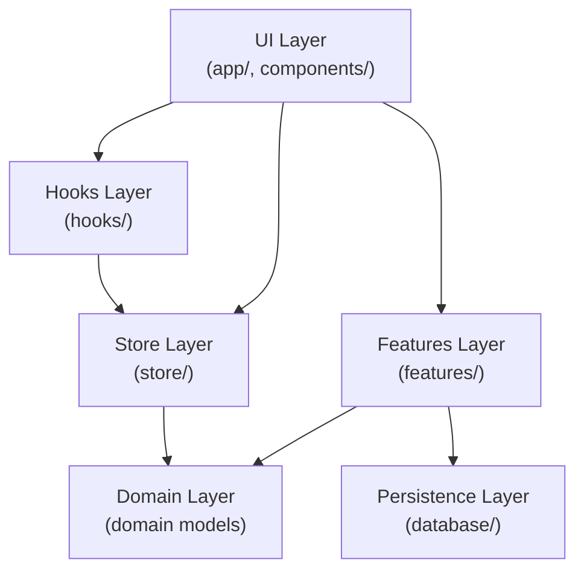
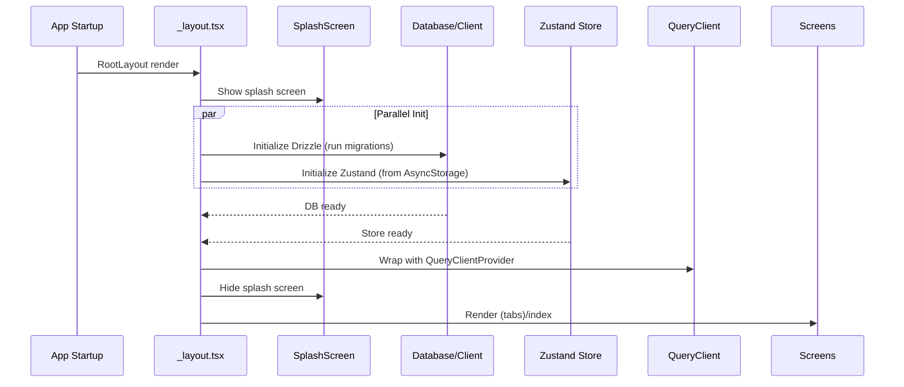

# Technical Design: Custom Boilerplate (RevenueCat除く)

## Overview

本設計は、Expo SDK 54 上で構築された プロダクション品質の React Native ボイラープレートを定義します。開発者が新規プロジェクト立ち上げ時に、基盤構築（ESLint/Prettier）、開発環境セットアップ（フォルダ構造、パスエイリアス、テスト環境）、コア機能（SQLite/Drizzle、Zustand、TanStack Query、テーマシステム）、UI/UX基盤（共通コンポーネント、ナビゲーション）を即座に利用できることを目的とします。

### Goals

- **開発開始時間短縮**: `pnpm create expo-app` 後、数分でセットアップ完了
- **型安全性確保**: TypeScript strict mode、Drizzle ORM、Zustand/TanStack Query の型推論
- **テスト駆動開発支援**: Jest + React Native Testing Library 完全セットアップ
- **コード品質の統一**: ESLint Flat Config + Prettier
- **再利用可能なコンポーネント**: Button, Card, Spacer, LoadingOverlay
- **スケーラブルなアーキテクチャ**: Feature-Sliced Design + Onion Architecture

### Non-Goals

- 認証機能の実装（base 提供のみ）
- API integration の詳細（TanStack Query セットアップのみ）
- RevenueCat 統合（separate specification）
- Advanced animation/gesture patterns

## Architecture

### Architecture Pattern & Boundary Map

Onion Architecture + Feature-Sliced Design の hybrid approach：



**Domain Boundaries**:
- **Store Domain**: Global app state — Zustand
- **Database Domain**: Local data persistence — Drizzle ORM + expo-sqlite
- **Features Domain**: Feature-specific logic — features/ folder
- **UI Domain**: Reusable components — components/
- **Constants Domain**: Theme, types, config — constants/, types/

### Technology Stack

| Layer | Choice | Role |
|-------|--------|------|
| Core Runtime | React 19.1.0, RN 0.81.5, Expo SDK 54, TS 5.9 | Component framework, native runtime |
| Navigation | expo-router 6.0, React Navigation 7.x | File-based routing, bottom-tabs |
| Database | Drizzle ORM, expo-sqlite | Type-safe DB query builder |
| State | Zustand, TanStack Query 5.90.11 | Global state, async caching |
| UI | RN StyleSheet, react-native-reanimated 4.1 | Styling, animations |
| Testing | Jest (jest-expo), RNTL, jest-native | Unit/integration testing |
| Quality | ESLint 9, Prettier | Linting, formatting |

## System Flows

### Initialization Flow



**Key Decisions**: 並列初期化で高速化、Splash で UX 改善、初期化失敗時は retry button 表示

### State Management Flow

- **Zustand**: App-wide state (onboarded, isPremium, user preferences)
- **TanStack Query**: API responses, server state
- **Local DB**: Drizzle useLiveQuery

## Requirements Traceability

| Req | Summary | Components |
|-----|---------|------------|
| 1.1-1.4 | ESLint/Prettier設定 | .prettierrc, eslint.config.js |
| 2.1-2.7 | フォルダ構造 | features/, components/, hooks/, store/, database/, lib/, types/ |
| 3.1-3.3 | @/* パスエイリアス | tsconfig.json |
| 4.1-4.4 | Jest設定 | jest.config.js, jest.setup.js |
| 5.1-5.4 | Drizzle/SQLite | database/client.ts, database/schema.ts, drizzle.config.ts |
| 6.1-6.4 | Zustand Store | store/index.ts, store/slices/app-slice.ts |
| 7.1-7.3 | TanStack Query | lib/query-client.ts, app/_layout.tsx |
| 8.1-8.4 | Theme System | constants/theme.ts, hooks/use-color-scheme.ts |
| 9.1-9.5 | UI Components | components/ui/button.tsx, card.tsx, spacer.tsx, loading-overlay.tsx |
| 10.1-10.4 | Navigation | app/_layout.tsx, app/(tabs)/_layout.tsx |
| 11.1-11.5 | npm scripts | package.json |
| 12.1-12.4 | Example Feature | features/_example/ |
| 13.1-13.3 | Cleanup | explore.tsx削除、不要sample削除 |
| 14.1-14.10 | iOS System Colors | constants/theme.ts (expo-design-system準拠) |
| 15.1-15.7 | 動作確認 | pnpm start/test/lint/typecheck |

## Components and Interfaces

### Persistence Layer

#### DrizzleDB Client

```typescript
// database/client.ts
interface DrizzleDB {
  initialize(): Promise<void>;
  db: Database;
  runMigrations(): Promise<void>;
}

// Usage in features:
import { db } from '@/database/client';
const items = await db.select().from(schema.items).all();
```

#### Database Schema

```typescript
// database/schema.ts
import { sqliteTable, text, integer, timestamp } from 'drizzle-orm/sqlite-core';

export const items = sqliteTable('items', {
  id: integer('id').primaryKey(),
  title: text('title').notNull(),
  description: text('description'),
  createdAt: timestamp('created_at').defaultNow(),
});

export type Item = typeof items.$inferSelect;
export type NewItem = typeof items.$inferInsert;
```

### State Management Layer

#### Zustand Store

```typescript
// store/types.ts
export interface UserPreferences {
  theme: 'light' | 'dark' | 'auto';
  language: string;
}

export interface AppState {
  isOnboarded: boolean;
  setOnboarded: (value: boolean) => void;
  isPremium: boolean;
  setPremium: (value: boolean) => void;
  userPreferences: UserPreferences;
  updateUserPreferences: (prefs: Partial<UserPreferences>) => void;
  hydrate: (state: Partial<AppState>) => void;
}

// store/slices/app-slice.ts
import type { StateCreator } from 'zustand';
import type { AppState } from '../types';

export const appSlice: StateCreator<AppState> = (set) => ({
  isOnboarded: false,
  setOnboarded: (value: boolean) => set({ isOnboarded: value }),
  isPremium: false,
  setPremium: (value: boolean) => set({ isPremium: value }),
  userPreferences: { theme: 'auto', language: 'en' },
  updateUserPreferences: (prefs) =>
    set((state) => ({
      userPreferences: { ...state.userPreferences, ...prefs },
    })),
  hydrate: (state) => set(state),
});

// store/index.ts
import { create } from 'zustand';
import { persist } from 'zustand/middleware';
import { appSlice } from './slices/app-slice';
import type { AppState } from './types';

export const useStore = create<AppState>()(
  persist(
    (set, get, api) => ({
      ...appSlice(set),
    }),
    { name: 'app-store', version: 1 }
  )
);
```

#### TanStack Query Configuration

```typescript
// lib/query-client.ts
import { QueryClient } from '@tanstack/react-query';

export const queryClient = new QueryClient({
  defaultOptions: {
    queries: {
      staleTime: 1000 * 60 * 5, // 5 minutes
      gcTime: 1000 * 60 * 10,   // 10 minutes
      retry: 1,
      refetchOnWindowFocus: true,
      refetchOnReconnect: true,
    },
    mutations: { retry: 1 },
  },
});
```

### UI Components Layer

#### Button Component

```typescript
// components/ui/button.tsx
interface ButtonProps {
  variant?: 'primary' | 'secondary' | 'ghost' | 'destructive';
  disabled?: boolean;
  onPress?: () => void;
  children: React.ReactNode;
}

export function Button({ variant = 'primary', disabled, onPress, children }: ButtonProps) {
  const backgroundColor = useThemeColor(
    { light: variant === 'primary' ? '#007AFF' : '#e0e0e0', dark: variant === 'primary' ? '#0A84FF' : '#333' },
    'background'
  );
  return (
    <Pressable onPress={onPress} disabled={disabled} style={[styles.button, { backgroundColor, minHeight: 44 }]}>
      <Text>{children}</Text>
    </Pressable>
  );
}
```

#### Card / Spacer / LoadingOverlay

```typescript
// components/ui/card.tsx
interface CardProps { children: React.ReactNode; style?: StyleProp<ViewStyle>; }
export function Card({ children, style }: CardProps) {
  const backgroundColor = useThemeColor({ light: '#fff', dark: '#1a1a1a' }, 'background');
  return <View style={[{ backgroundColor, borderRadius: 8, padding: 16 }, style]}>{children}</View>;
}

// components/ui/spacer.tsx
interface SpacerProps { size?: 4 | 8 | 12 | 16 | 20 | 24 | 32; horizontal?: boolean; }
export function Spacer({ size = 8, horizontal = false }: SpacerProps) {
  return <View style={{ width: horizontal ? size : 0, height: horizontal ? 0 : size }} />;
}

// components/ui/loading-overlay.tsx
interface LoadingOverlayProps { visible: boolean; message?: string; }
export function LoadingOverlay({ visible, message }: LoadingOverlayProps) {
  if (!visible) return null;
  return (
    <View style={[styles.overlay, { backgroundColor: 'rgba(0, 0, 0, 0.5)' }]}>
      <ActivityIndicator size="large" color="#007AFF" />
      {message && <Text>{message}</Text>}
    </View>
  );
}
```

### Routing & Layout Layer

#### RootLayout (_layout.tsx)

```typescript
// app/_layout.tsx
import React, { useEffect, useState } from 'react';
import { QueryClientProvider } from '@tanstack/react-query';
import { Stack } from 'expo-router';
import * as SplashScreen from 'expo-splash-screen';
import { useStore } from '@/store';
import { db } from '@/database/client';
import { queryClient } from '@/lib/query-client';
import { ThemeProvider } from '@/providers/theme-provider';

SplashScreen.preventAutoHideAsync();

export default function RootLayout() {
  const [appReady, setAppReady] = useState(false);
  const [initError, setInitError] = useState<Error | null>(null);

  useEffect(() => {
    const initializeApp = async () => {
      try {
        // Parallel initialization with timeout
        const dbInitPromise = Promise.race([
          db.initialize(),
          new Promise((_, reject) => setTimeout(() => reject(new Error('DB init timeout')), 5000)),
        ]);
        const storeHydrationPromise = useStore.persist.rehydrate();
        await Promise.all([dbInitPromise, storeHydrationPromise]);
        setAppReady(true);
      } catch (error) {
        console.error('App initialization failed:', error);
        setInitError(error as Error);
        setAppReady(true);
      } finally {
        await SplashScreen.hideAsync();
      }
    };
    initializeApp();
  }, []);

  if (!appReady) return null;

  if (initError) {
    return (
      <ThemeProvider>
        <Stack><Stack.Screen name="error" options={{ headerShown: false }} /></Stack>
      </ThemeProvider>
    );
  }

  return (
    <QueryClientProvider client={queryClient}>
      <ThemeProvider>
        <Stack>
          <Stack.Screen name="(tabs)" options={{ headerShown: false }} />
          <Stack.Screen name="modal" options={{ presentation: 'modal', title: 'Modal' }} />
        </Stack>
      </ThemeProvider>
    </QueryClientProvider>
  );
}
```

### Development & Quality Layer

#### ESLint Configuration

```javascript
// eslint.config.js
import js from '@eslint/js';
import tseslint from 'typescript-eslint';
import react from 'eslint-plugin-react';
import reactNative from 'eslint-plugin-react-native';
import prettier from 'eslint-config-prettier';

export default [
  { files: ['**/*.{ts,tsx}'], languageOptions: { parser: tseslint.parser } },
  js.configs.recommended,
  ...tseslint.configs.recommended,
  react.configs.recommended,
  reactNative.configs.all,
  prettier,
  { rules: { '@typescript-eslint/no-unused-vars': 'warn', 'react-native/no-unused-styles': 'warn' } },
];
```

#### Jest Configuration

```javascript
// jest.config.js
module.exports = {
  preset: 'jest-expo',
  setupFilesAfterEnv: ['<rootDir>/jest.setup.js'],
  moduleNameMapper: { '^@/(.*)$': '<rootDir>/$1' },
  testEnvironment: 'node',
  testMatch: ['**/__tests__/**/*.test.ts?(x)'],
  collectCoverageFrom: ['**/*.{ts,tsx}', '!**/*.d.ts', '!**/node_modules/**'],
  coverageThreshold: {
    global: { branches: 80, functions: 90, lines: 90, statements: 90 },
  },
};

// jest.setup.js
import '@testing-library/jest-native/extend-expect';

jest.mock('expo-sqlite', () => ({
  openDatabaseAsync: jest.fn().mockResolvedValue({
    execAsync: jest.fn().mockResolvedValue([]),
    runAsync: jest.fn().mockResolvedValue({ changes: 0 }),
    getFirstAsync: jest.fn().mockResolvedValue(null),
    getAllAsync: jest.fn().mockResolvedValue([]),
  }),
}));

jest.mock('@react-native-async-storage/async-storage', () => ({
  getItem: jest.fn().mockResolvedValue(null),
  setItem: jest.fn().mockResolvedValue(undefined),
  removeItem: jest.fn().mockResolvedValue(undefined),
}));
```

### Features Module (Example Pattern)

```
features/_example/
├── components/          # Feature-specific UI
│   ├── item-list.tsx
│   └── item-card.tsx
├── hooks/               # Feature-specific hooks
│   └── use-item-list.ts
├── services/            # Business logic, repository pattern
│   ├── repository.ts
│   └── query-keys.ts
├── __tests__/           # Feature tests
├── index.ts             # Barrel export
└── types.ts             # Feature-specific types
```

#### Feature Implementation Example

```typescript
// features/_example/types.ts
export interface Item {
  id: number;
  title: string;
  description?: string;
  createdAt: Date;
}
export interface CreateItemInput { title: string; description?: string; }

// features/_example/services/query-keys.ts
export const itemKeys = {
  all: ['items'] as const,
  lists: () => [...itemKeys.all, 'list'] as const,
  detail: (id: number) => [...itemKeys.all, 'detail', id] as const,
};

// features/_example/services/repository.ts
import { db } from '@/database/client';
import { items as itemsTable } from '@/database/schema';
import { eq, desc } from 'drizzle-orm';
import type { Item, CreateItemInput } from '../types';

export class ItemRepository {
  async getAll(): Promise<Item[]> {
    return db.select().from(itemsTable).orderBy(desc(itemsTable.createdAt)).all();
  }
  async getById(id: number): Promise<Item | null> {
    return db.select().from(itemsTable).where(eq(itemsTable.id, id)).get() ?? null;
  }
  async create(input: CreateItemInput): Promise<Item> {
    return db.insert(itemsTable).values(input).returning().get();
  }
  async update(id: number, input: Partial<CreateItemInput>): Promise<Item | null> {
    return db.update(itemsTable).set(input).where(eq(itemsTable.id, id)).returning().get() ?? null;
  }
  async delete(id: number): Promise<boolean> {
    const result = await db.delete(itemsTable).where(eq(itemsTable.id, id)).run();
    return result.changes > 0;
  }
  liveGetAll(callback: (items: Item[]) => void): () => void {
    return db.select().from(itemsTable).orderBy(desc(itemsTable.createdAt)).live().on('change', callback);
  }
}
export const itemRepository = new ItemRepository();

// features/_example/hooks/use-item-list.ts
import { useEffect, useState } from 'react';
import { itemRepository } from '../services/repository';
import type { Item } from '../types';

export function useItemList() {
  const [items, setItems] = useState<Item[]>([]);
  useEffect(() => {
    const unsubscribe = itemRepository.liveGetAll(setItems);
    return unsubscribe;
  }, []);
  return { items, isLoading: false };
}

// features/_example/index.ts
export { ItemRepository, itemRepository } from './services/repository';
export { useItemList } from './hooks/use-item-list';
export type { Item, CreateItemInput } from './types';
```

#### Test Pattern (概要)

テストは以下のカテゴリをカバー:
- **Happy path**: 正常系（CRUD成功）
- **Sad path**: 異常系（not found, constraint violations, DB errors）
- **Edge cases**: 境界値（empty array, null/undefined, unicode, large dataset）

```typescript
// features/_example/__tests__/repository.test.ts - テスト構造例
describe('ItemRepository', () => {
  describe('getAll', () => {
    it('should return all items sorted by createdAt DESC', async () => { /* ... */ });
    it('should return empty array when no items exist', async () => { /* ... */ });
    it('should handle database errors', async () => { /* ... */ });
  });
  describe('getById', () => {
    it('should return item by id', async () => { /* ... */ });
    it('should return null when not found', async () => { /* ... */ });
  });
  describe('create', () => {
    it('should create item with valid input', async () => { /* ... */ });
    it('should handle unicode characters', async () => { /* ... */ });
    it('should handle constraint violations', async () => { /* ... */ });
  });
  // update, delete, liveGetAll も同様
});
```

## Data Models

```
AppState (Zustand)
├── isOnboarded: boolean
├── isPremium: boolean
└── userPreferences: { theme, language }

LocalDatabase (Drizzle)
├── items table (id, title, description, createdAt)
└── [feature-specific tables]
```

**Invariants**:
- isOnboarded cannot be reverted
- Database timestamps are UTC
- All table primary keys are integer auto-increment

## Error Handling

| Category | Strategy |
|----------|----------|
| User Errors (4xx) | Field-level validation, inline error messages |
| System Errors (5xx) | Splash screen retry, auto-retry with exponential backoff |
| Business Logic (422) | Skip onboarding if done, show upsell if premium required |

#### Error Boundary Component

```typescript
// components/error-boundary.tsx
export class ErrorBoundary extends React.Component<Props, State> {
  static getDerivedStateFromError(error: Error): State {
    return { hasError: true, error };
  }
  componentDidCatch(error: Error, errorInfo: React.ErrorInfo) {
    console.error('Error caught by boundary:', error, errorInfo);
  }
  render() {
    if (this.state.hasError) {
      return (
        <View style={{ flex: 1, justifyContent: 'center', padding: 16 }}>
          <Text>Something went wrong</Text>
          <Text>{this.state.error?.message}</Text>
          <Button onPress={() => this.setState({ hasError: false, error: null })}>Try Again</Button>
        </View>
      );
    }
    return this.props.children;
  }
}
```

## Testing Strategy

| Type | Focus | Coverage |
|------|-------|----------|
| Unit | Repository CRUD, Store mutations, Utilities, Components | 90% |
| Integration | Feature flow, Store + Component, DB + TanStack Query | 80% |

## UI Theming System（iOS System Colors準拠）

> **参照**: `expo-design-system` Claude Skill (`.claude/skills/expo-design-system/SKILL.md`)

### Design Principles

1. 機能優先、装飾最小限
2. iOS標準準拠
3. Light/Dark両モード対応
4. WCAG AA基準（4.5:1）

### NG Rules

- Indigo系、グラデーション、ネオン系、パステル系、カスタムグレー禁止

### Theme Constants

```typescript
// constants/theme.ts
export enum AppPrimaryColor { blue = 'blue', green = 'green', orange = 'orange' }
export const PRIMARY_COLOR = AppPrimaryColor.blue;

export const Colors = {
  light: {
    primary: { blue: '#007AFF', green: '#34C759', orange: '#FF9500' },
    background: { base: '#FFFFFF', secondary: '#F2F2F7', tertiary: '#FFFFFF' },
    text: { primary: '#000000', secondary: '#3C3C43', tertiary: '#8E8E93', inverse: '#FFFFFF' },
    semantic: { success: '#34C759', warning: '#FF9500', error: '#FF3B30', info: '#007AFF' },
    interactive: { separator: '#C6C6C8', fill: '#787880', fillSecondary: '#BCBCC0' },
    // Legacy compatibility
    tint: '#007AFF', tabIconDefault: '#787880', tabIconSelected: '#007AFF',
  },
  dark: {
    // +10% brightness調整
    primary: { blue: '#0A84FF', green: '#30D158', orange: '#FF9F0A' },
    background: { base: '#000000', secondary: '#1C1C1E', tertiary: '#2C2C2E' },
    text: { primary: '#FFFFFF', secondary: '#EBEBF5', tertiary: '#8E8E93', inverse: '#000000' },
    semantic: { success: '#30D158', warning: '#FF9F0A', error: '#FF453A', info: '#0A84FF' },
    interactive: { separator: '#38383A', fill: '#787880', fillSecondary: '#48484A' },
    tint: '#FFFFFF', tabIconDefault: '#8E8E93', tabIconSelected: '#FFFFFF',
  },
};

export const Spacing = { xs: 4, sm: 8, md: 16, lg: 24, xl: 32, '2xl': 48 } as const;
export const BorderRadius = { sm: 4, md: 8, lg: 12, xl: 16, full: 9999 } as const;
export const TouchTarget = { min: 44 } as const;

export const Typography = {
  largeTitle: { fontSize: 34, fontWeight: '400' as const, lineHeight: 41 },
  title1: { fontSize: 28, fontWeight: '400' as const, lineHeight: 34 },
  title2: { fontSize: 22, fontWeight: '400' as const, lineHeight: 26 },
  headline: { fontSize: 17, fontWeight: '600' as const, lineHeight: 22 },
  body: { fontSize: 17, fontWeight: '400' as const, lineHeight: 22 },
  callout: { fontSize: 16, fontWeight: '400' as const, lineHeight: 21 },
  subheadline: { fontSize: 15, fontWeight: '400' as const, lineHeight: 20 },
  caption1: { fontSize: 13, fontWeight: '400' as const, lineHeight: 16 },
  footnote: { fontSize: 11, fontWeight: '400' as const, lineHeight: 13 },
} as const;

export const Shadows = {
  sm: { shadowColor: '#000', shadowOffset: { width: 0, height: 1 }, shadowOpacity: 0.05, shadowRadius: 2, elevation: 1 },
  md: { shadowColor: '#000', shadowOffset: { width: 0, height: 2 }, shadowOpacity: 0.1, shadowRadius: 4, elevation: 2 },
  lg: { shadowColor: '#000', shadowOffset: { width: 0, height: 4 }, shadowOpacity: 0.15, shadowRadius: 8, elevation: 4 },
} as const;
```

### Theme Usage Example

```typescript
// hooks/use-theme-color.ts (extended usage)
export function useThemedStyles() {
  const colorScheme = useColorScheme();
  const colors = Colors[colorScheme ?? 'light'];
  return {
    colors,
    primaryColor: colors.primary[PRIMARY_COLOR],
    spacing: Spacing,
    typography: Typography,
  };
}

// Example: Themed Card
export function ThemedCard() {
  const colorScheme = useColorScheme();
  const colors = Colors[colorScheme ?? 'light'];
  return (
    <View style={{ backgroundColor: colors.background.secondary, borderRadius: BorderRadius.md, padding: Spacing.md }}>
      <Text style={[Typography.headline, { color: colors.text.primary }]}>Card Title</Text>
      <Text style={[Typography.body, { color: colors.text.secondary }]}>Card description</Text>
    </View>
  );
}
```

## Implementation Considerations

### Phasing Strategy

| Phase | Focus | Components |
|-------|-------|------------|
| 1: Foundation | Tooling | ESLint, Prettier, folder structure, path alias |
| 2: Persistence | Database | Drizzle ORM, expo-sqlite, schema, migrations |
| 3: State | Store | Zustand + persist, TanStack Query, providers |
| 4: UI | Components | Button, Card, Spacer, LoadingOverlay, ErrorBoundary |
| 5: Routing | Navigation | RootLayout, tab navigation, _example feature |
| 6: QA | Testing | Jest setup, sample tests, cleanup, validation |

### Known Gaps & Future Enhancements

| Gap | Priority | Notes |
|-----|----------|-------|
| DevTools Integration | P1 | zustand-devtools |
| E2E Testing | P2 | Detox |
| CI/CD Integration | P2 | GitHub Actions |
| Offline-first Sync | P2 | Local-first + cloud sync |
| Crash Reporting | P3 | Sentry |
| Localization (i18n) | P3 | Multi-language support |
