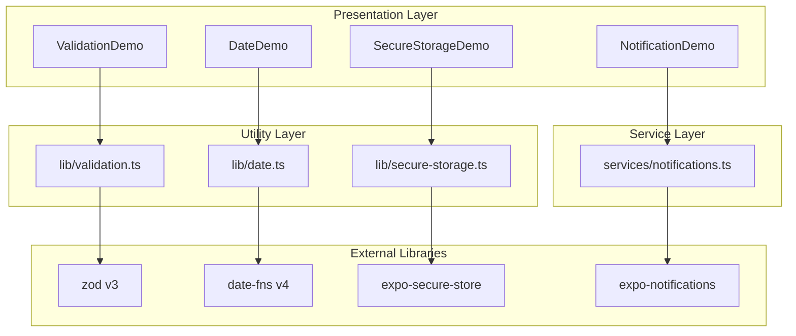
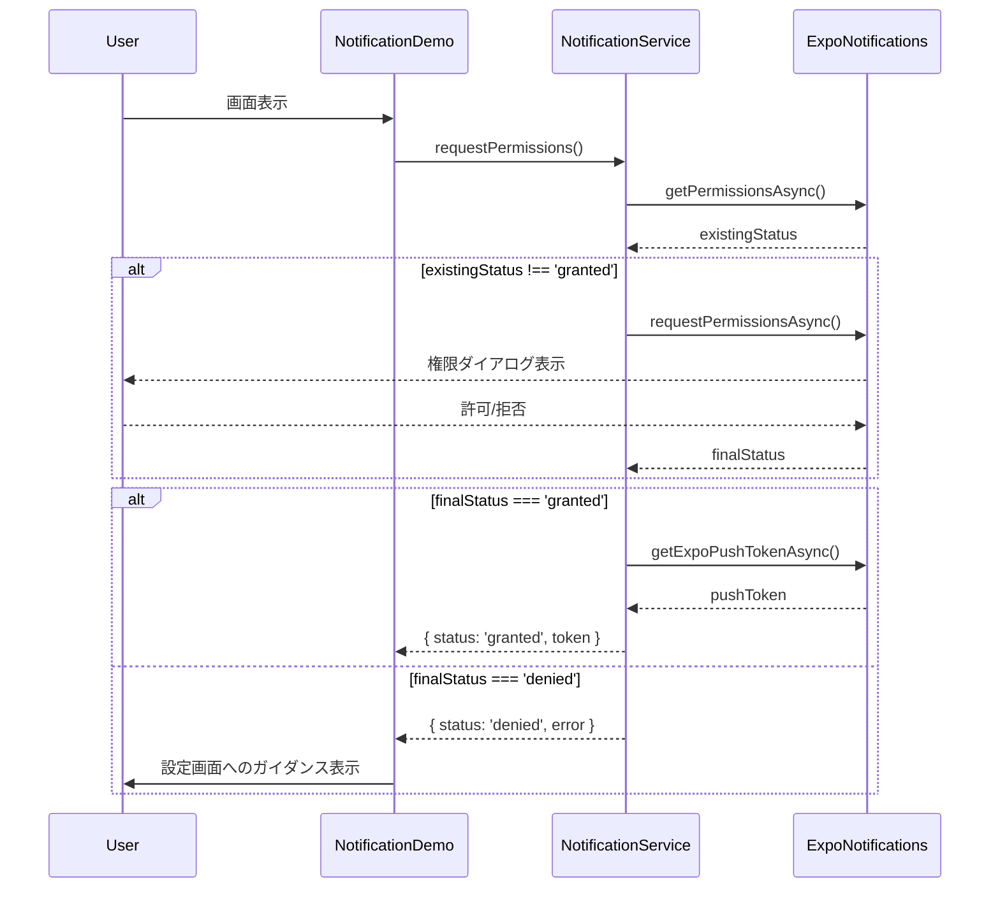

# Design Document: Library Integration

## Overview

本機能は、expo-quick-kitボイラープレートテンプレートに、TEMPLATE_ARCHITECTURE.mdで定義された技術スタックのうち未導入のライブラリ（zod、date-fns、expo-secure-store、expo-notifications）を追加し、それぞれの実践的なサンプル実装を提供する。開発者は新規プロジェクトでこれらのライブラリをすぐに活用できるようになり、フォームバリデーション、日付処理、セキュアストレージ、プッシュ通知といった一般的なモバイルアプリ要件を型安全かつ効率的に実装可能となる。

**Users**: React Native開発者は、features/_example/配下のサンプル実装を参照し、各ライブラリの統合パターンとベストプラクティスを学習する。

**Impact**: 既存のfeatures/_example/とlib/配下にサンプルモジュールとユーティリティを追加。既存コードの変更は最小限（package.json、CLAUDE.md、TEMPLATE_ARCHITECTURE.mdの更新のみ）。

### Goals

- zod v3バリデーションライブラリの統合とフォーム検証サンプルの提供
- date-fns v4日付処理ライブラリの統合と日付フォーマット/相対時刻表示サンプルの提供
- expo-secure-storeセキュアストレージの統合と機密データ保存サンプルの提供
- expo-notificationsプッシュ通知の統合とローカル通知スケジュールサンプルの提供
- 各ライブラリの統合パターンをlib/配下のユーティリティモジュールとして提供
- 全ライブラリのユニットテストカバレッジ80%以上を達成

### Non-Goals

- リモートプッシュ通知サーバーの実装（ローカル通知のみ）
- 多言語ロケール対応（日本語/英語のみ）
- react-hook-formとzodの統合サンプル（基本的なzodバリデーションのみ）
- カスタム通知サウンドやアイコンの実装（デフォルト設定のみ）

## Architecture

### Existing Architecture Analysis

expo-quick-kitは以下の既存パターンを採用している：

- **Feature Module Pattern**: features/_example/配下にcomponents/hooks/services/をグループ化
- **Repository Pattern**: database/client.tsでDrizzle ORMを使用したCRUD操作
- **TanStack Query Integration**: lib/query-client.tsで非同期状態管理
- **Utility Module Pattern**: lib/配下にformat.ts等の共通ユーティリティ
- **Path Alias**: `@/*`で全モジュールをインポート

本設計では、これらの既存パターンを尊重し、新規ライブラリも同様の構造に統合する。

### Architecture Pattern & Boundary Map



**Architecture Integration**:

- **Selected pattern**: Utility Module Pattern（lib/配下）+ Service Layer Pattern（services/配下）
- **Domain/feature boundaries**:
  - バリデーション: lib/validation.tsで再利用可能なスキーマ、features/_example/で実装例
  - 日付処理: lib/date.tsで汎用フォーマット関数、features/_example/でUI統合例
  - セキュアストレージ: lib/secure-storage.tsでラッパーAPI、features/_example/で保存/取得例
  - 通知: services/notifications.tsで権限/スケジュール管理、features/_example/でUI統合例
- **Existing patterns preserved**: 既存のfeatures/_example/構造、lib/配下のユーティリティパターン、TanStack Query統合パターン
- **New components rationale**:
  - lib/validation.ts: zodスキーマの再利用性確保
  - lib/date.ts: date-fns関数のプロジェクト固有ラッパー
  - lib/secure-storage.ts: SecureStore APIの型安全なラッパー
  - services/notifications.ts: 複雑な通知初期化ロジックのカプセル化
- **Steering compliance**: TEMPLATE_ARCHITECTURE.mdで定義された技術スタック、kebab-case命名規則、@/*パスエイリアス

### Technology Stack

| Layer | Choice / Version | Role in Feature | Notes |
|-------|------------------|-----------------|-------|
| Frontend / CLI | React Native 0.81.5 + Expo SDK 54 | UIコンポーネントレンダリング | 既存スタック |
| Validation | zod ^3.x | フォーム入力バリデーション | v3系を採用（v4はReact Native互換性問題） |
| Date Utility | date-fns ^4.1.0 | 日付フォーマット・相対時刻表示 | Tree-shaking対応、TypeScript型安全 |
| Secure Storage | expo-secure-store ~15.0.7 | 機密データ暗号化保存 | iOS Keychain、Android EncryptedSharedPreferences |
| Notifications | expo-notifications ~54.x | ローカル通知スケジュール・権限管理 | SDK 54以降Development Build必須 |
| Testing | Jest + @testing-library/react-native | ユニット/コンポーネントテスト | 既存スタック |

詳細な調査結果とバージョン選定理由は`research.md`を参照（Zod v3選定理由、date-fnsのHermes互換性、SecureStoreのペイロードサイズ制限等）。

## System Flows

### Notification Permission Flow



**Flow decisions**:
- 権限リクエストは初回画面表示時に実施（ユーザー体験を損なわないタイミング）
- 拒否された場合は設定画面へのディープリンク案内を表示
- Android 13以降は通知チャンネル作成後にプロンプト表示される仕様を考慮

## Requirements Traceability

| Requirement | Summary | Components | Interfaces | Flows |
|-------------|---------|------------|------------|-------|
| 1.1 | zodインストール | ValidationSchemas | Service Interface | - |
| 1.2 | zodバリデーションデモUI | ValidationDemo | State Management | - |
| 1.3 | 再利用可能なバリデーションスキーマ | ValidationSchemas | Service Interface | - |
| 1.4 | ローカライズされたエラーメッセージ | ValidationSchemas | Service Interface | - |
| 1.5 | zodスキーマのユニットテスト | lib/__tests__/validation.test.ts | - | - |
| 2.1 | date-fnsインストール | DateUtils | Service Interface | - |
| 2.2 | 日付フォーマットユーティリティ | DateUtils | Service Interface | - |
| 2.3 | 日付フォーマット例の表示 | DateDemo | State Management | - |
| 2.4 | format/formatDistance/formatRelativeサンプル | DateDemo | State Management | - |
| 2.5 | 日付ユーティリティのユニットテスト | lib/__tests__/date.test.ts | - | - |
| 3.1 | expo-secure-storeインストール | SecureStorageUtils | Service Interface | - |
| 3.2 | SecureStoreラッパー関数 | SecureStorageUtils | Service Interface | - |
| 3.3 | セキュアストレージ保存/取得デモ | SecureStorageDemo | State Management | - |
| 3.4 | SecureStore操作のエラーハンドリング | SecureStorageUtils | Service Interface | - |
| 3.5 | TypeScript型定義でキー管理 | SecureStorageUtils | Service Interface | - |
| 4.1 | expo-notificationsインストール | NotificationService | Service Interface | - |
| 4.2 | 通知サービスラッパー | NotificationService | Service Interface | Notification Permission Flow |
| 4.3 | 通知権限リクエスト | NotificationService | Service Interface | Notification Permission Flow |
| 4.4 | ローカル通知スケジュールデモ | NotificationDemo | State Management | Notification Permission Flow |
| 4.5 | フォアグラウンド通知ハンドリング | NotificationService | Event Contract | - |
| 4.6 | 権限拒否時のUI案内 | NotificationDemo | State Management | - |
| 4.7 | 通知スケジュール/キャンセル/取得関数 | NotificationService | Service Interface | - |
| 5.1 | 4ライブラリ統合の総合サンプル | features/_example/ | - | - |
| 5.2 | lib/README.mdドキュメント | ドキュメント | - | - |
| 5.3 | TypeScript型アノテーション例 | 全コンポーネント | - | - |
| 5.4 | 複数ライブラリ統合パターン | features/_example/ | - | - |
| 5.5 | 80%以上のコードカバレッジ | 全テストスイート | - | - |
| 5.6 | CLAUDE.md/TEMPLATE_ARCHITECTURE.md更新 | ドキュメント | - | - |

## Components and Interfaces

### Components Summary

| Component | Domain/Layer | Intent | Req Coverage | Key Dependencies (P0/P1) | Contracts |
|-----------|--------------|--------|--------------|--------------------------|-----------|
| ValidationSchemas | Utility | zodバリデーションスキーマ定義 | 1.1, 1.3, 1.4 | zod (P0) | Service |
| ValidationDemo | UI/Feature | zodバリデーションデモUI | 1.2 | ValidationSchemas (P0) | State |
| DateUtils | Utility | date-fnsフォーマットユーティリティ | 2.1, 2.2 | date-fns (P0) | Service |
| DateDemo | UI/Feature | 日付フォーマット例表示 | 2.3, 2.4 | DateUtils (P0) | State |
| SecureStorageUtils | Utility | SecureStoreラッパーAPI | 3.1, 3.2, 3.4, 3.5 | expo-secure-store (P0) | Service |
| SecureStorageDemo | UI/Feature | セキュアストレージデモUI | 3.3 | SecureStorageUtils (P0) | State |
| NotificationService | Service | 通知権限/スケジュール管理 | 4.1, 4.2, 4.3, 4.5, 4.7 | expo-notifications (P0) | Service, Event |
| NotificationDemo | UI/Feature | 通知機能デモUI | 4.4, 4.6 | NotificationService (P0) | State |

### Utility Layer

#### ValidationSchemas (lib/validation.ts)

| Field | Detail |
|-------|--------|
| Intent | zodバリデーションスキーマの定義と再利用可能なバリデーション関数を提供 |
| Requirements | 1.1, 1.3, 1.4 |

**Responsibilities & Constraints**

- 一般的なバリデーションパターン（email、password、phone number）のスキーマ定義
- ローカライズされたエラーメッセージ（日本語/英語）
- zod v3系APIを使用（v4互換性問題を回避）

**Dependencies**

- External: zod ^3.x — スキーマ定義とバリデーション実行 (P0)

**Contracts**: [x] Service

##### Service Interface

```typescript
import { z } from 'zod';

/**
 * Email validation schema with localized error messages
 */
export const emailSchema = z
  .string()
  .email({ message: 'メールアドレスの形式が正しくありません' })
  .min(1, { message: 'メールアドレスを入力してください' });

/**
 * Password validation schema
 * - At least 8 characters
 * - Contains at least one uppercase, one lowercase, and one number
 */
export const passwordSchema = z
  .string()
  .min(8, { message: 'パスワードは8文字以上で入力してください' })
  .regex(/[A-Z]/, { message: '大文字を1文字以上含めてください' })
  .regex(/[a-z]/, { message: '小文字を1文字以上含めてください' })
  .regex(/[0-9]/, { message: '数字を1文字以上含めてください' });

/**
 * Phone number validation schema (Japanese format)
 */
export const phoneSchema = z
  .string()
  .regex(/^0\d{9,10}$/, { message: '電話番号の形式が正しくありません（例: 09012345678）' });

/**
 * Generic form validation result type
 */
export type ValidationResult<T> =
  | { success: true; data: T }
  | { success: false; errors: Record<string, string> };

/**
 * Validate data against a zod schema and return typed result
 */
export function validateData<T>(
  schema: z.ZodSchema<T>,
  data: unknown
): ValidationResult<T> {
  const result = schema.safeParse(data);
  if (result.success) {
    return { success: true, data: result.data };
  }
  const errors: Record<string, string> = {};
  result.error.errors.forEach((err) => {
    const path = err.path.join('.');
    errors[path] = err.message;
  });
  return { success: false, errors };
}
```

- Preconditions: zodライブラリがインストール済み
- Postconditions: バリデーション成功時は型安全なデータ返却、失敗時はフィールド別エラーメッセージ
- Invariants: スキーマ定義は不変、エラーメッセージは日本語固定

**Implementation Notes**

- Integration: features/_example/components/validation-demo.tsxで使用
- Validation: validateData関数でエラーをRecord<string, string>形式に変換
- Risks: zod v4マイグレーション時にエラーメッセージ形式変更の可能性（research.md参照）

#### DateUtils (lib/date.ts)

| Field | Detail |
|-------|--------|
| Intent | date-fnsの主要関数をラップし、プロジェクト固有のデフォルト設定を提供 |
| Requirements | 2.1, 2.2 |

**Responsibilities & Constraints**

- format, formatDistance, formatRelative関数のラッパー
- デフォルトロケール設定（日本語: ja）
- Tree-shakingを維持するモジュラーインポート

**Dependencies**

- External: date-fns ^4.1.0 — 日付フォーマット関数 (P0)

**Contracts**: [x] Service

##### Service Interface

```typescript
import { format as dateFnsFormat, formatDistance, formatRelative } from 'date-fns';
import { ja } from 'date-fns/locale';

/**
 * Format date with default locale (ja)
 * @param date - Date object or timestamp
 * @param formatStr - Format string (e.g., 'yyyy-MM-dd HH:mm:ss')
 * @returns Formatted date string
 */
export function formatDate(date: Date | number, formatStr: string): string {
  return dateFnsFormat(date, formatStr, { locale: ja });
}

/**
 * Format distance between two dates with default locale (ja)
 * @param date - Target date
 * @param baseDate - Base date (defaults to now)
 * @returns Relative time string (e.g., '3日前')
 */
export function formatDistanceToNow(date: Date | number, baseDate?: Date | number): string {
  return formatDistance(date, baseDate ?? new Date(), { locale: ja, addSuffix: true });
}

/**
 * Format date relative to base date with default locale (ja)
 * @param date - Target date
 * @param baseDate - Base date (defaults to now)
 * @returns Relative date string (e.g., '今日', '昨日')
 */
export function formatRelativeDate(date: Date | number, baseDate?: Date | number): string {
  return formatRelative(date, baseDate ?? new Date(), { locale: ja });
}
```

- Preconditions: date-fnsライブラリとjaロケールがインストール済み
- Postconditions: 日本語ロケールでフォーマットされた文字列を返却
- Invariants: デフォルトロケールはja固定

**Implementation Notes**

- Integration: features/_example/components/date-demo.tsxで使用
- Validation: Date objectまたはnumber型のみ受付（文字列渡しを禁止してランタイム差異を回避）
- Risks: date-fnsのDate()コンストラクタ誤用（research.md参照）

#### SecureStorageUtils (lib/secure-storage.ts)

| Field | Detail |
|-------|--------|
| Intent | expo-secure-store APIの型安全なラッパーを提供し、キー管理を一元化 |
| Requirements | 3.1, 3.2, 3.4, 3.5 |

**Responsibilities & Constraints**

- SecureStore CRUD操作のラッパー
- TypeScript列挙型でストレージキーを管理
- エラーハンドリングの統一（Result型）
- ペイロードサイズ制限（2048バイト）の文書化

**Dependencies**

- External: expo-secure-store ~15.0.7 — 暗号化ストレージAPI (P0)

**Contracts**: [x] Service

##### Service Interface

```typescript
import * as SecureStore from 'expo-secure-store';

/**
 * Secure storage keys (enum for type safety)
 */
export enum SecureStorageKey {
  AUTH_TOKEN = 'auth_token',
  USER_ID = 'user_id',
  API_KEY = 'api_key',
}

/**
 * Result type for secure storage operations
 */
export type SecureStorageResult<T> =
  | { success: true; data: T }
  | { success: false; error: string };

/**
 * Save value to secure storage
 * @param key - Storage key (enum)
 * @param value - Value to store (max ~2048 bytes on iOS)
 * @returns Result with success/error
 */
export async function saveSecure(
  key: SecureStorageKey,
  value: string
): Promise<SecureStorageResult<void>> {
  try {
    await SecureStore.setItemAsync(key, value);
    return { success: true, data: undefined };
  } catch (error) {
    return {
      success: false,
      error: `Failed to save ${key}: ${error instanceof Error ? error.message : 'Unknown error'}`,
    };
  }
}

/**
 * Retrieve value from secure storage
 * @param key - Storage key (enum)
 * @returns Result with value or error
 */
export async function getSecure(
  key: SecureStorageKey
): Promise<SecureStorageResult<string | null>> {
  try {
    const value = await SecureStore.getItemAsync(key);
    return { success: true, data: value };
  } catch (error) {
    return {
      success: false,
      error: `Failed to get ${key}: ${error instanceof Error ? error.message : 'Unknown error'}`,
    };
  }
}

/**
 * Delete value from secure storage
 * @param key - Storage key (enum)
 * @returns Result with success/error
 */
export async function deleteSecure(
  key: SecureStorageKey
): Promise<SecureStorageResult<void>> {
  try {
    await SecureStore.deleteItemAsync(key);
    return { success: true, data: undefined };
  } catch (error) {
    return {
      success: false,
      error: `Failed to delete ${key}: ${error instanceof Error ? error.message : 'Unknown error'}`,
    };
  }
}
```

- Preconditions: expo-secure-storeライブラリがインストール済み、Development Build環境（Expo Goでは制約あり）
- Postconditions: 成功時はdata返却、失敗時はerror文字列返却
- Invariants: キーは列挙型のみ、ペイロードサイズは2048バイト以下推奨

**Implementation Notes**

- Integration: features/_example/components/secure-storage-demo.tsxで使用
- Validation: SecureStorageKey列挙型で型安全性確保
- Risks: ペイロードサイズ超過でiOSが拒否（research.md参照）、大容量データはSQLite使用を推奨

### Service Layer

#### NotificationService (services/notifications.ts)

| Field | Detail |
|-------|--------|
| Intent | expo-notificationsの権限リクエスト、通知スケジュール、トークン取得をカプセル化 |
| Requirements | 4.1, 4.2, 4.3, 4.5, 4.7 |

**Responsibilities & Constraints**

- 通知権限の確認とリクエスト
- Expo Push Tokenの取得
- ローカル通知のスケジュール/キャンセル/取得
- フォアグラウンド通知ハンドラーの設定
- Development Build必須（Expo Go非対応）

**Dependencies**

- External: expo-notifications ~54.x — 通知API (P0)
- External: expo-device — 物理デバイスチェック (P1)

**Contracts**: [x] Service [x] Event

##### Service Interface

```typescript
import * as Notifications from 'expo-notifications';
import * as Device from 'expo-device';

/**
 * Notification permission result
 */
export type PermissionResult =
  | { status: 'granted'; token: string }
  | { status: 'denied'; error: string };

/**
 * Request notification permissions and get push token
 * @returns Permission result with token or error
 */
export async function requestNotificationPermissions(): Promise<PermissionResult> {
  try {
    // Check if running on physical device
    if (!Device.isDevice) {
      return { status: 'denied', error: 'Must use physical device for push notifications' };
    }

    // Check existing permissions
    const { status: existingStatus } = await Notifications.getPermissionsAsync();
    let finalStatus = existingStatus;

    // Request permissions if not granted
    if (existingStatus !== 'granted') {
      const { status } = await Notifications.requestPermissionsAsync();
      finalStatus = status;
    }

    if (finalStatus !== 'granted') {
      return { status: 'denied', error: 'Permission to send notifications was denied' };
    }

    // Get push token
    const token = await Notifications.getExpoPushTokenAsync();
    return { status: 'granted', token: token.data };
  } catch (error) {
    return {
      status: 'denied',
      error: error instanceof Error ? error.message : 'Unknown error',
    };
  }
}

/**
 * Schedule a local notification
 * @param title - Notification title
 * @param body - Notification body
 * @param trigger - Trigger configuration (seconds from now or date)
 * @returns Notification identifier
 */
export async function scheduleNotification(
  title: string,
  body: string,
  trigger: { seconds: number } | { date: Date }
): Promise<string> {
  return await Notifications.scheduleNotificationAsync({
    content: { title, body },
    trigger,
  });
}

/**
 * Cancel scheduled notification by ID
 * @param notificationId - Notification identifier
 */
export async function cancelNotification(notificationId: string): Promise<void> {
  await Notifications.cancelScheduledNotificationAsync(notificationId);
}

/**
 * Get all scheduled notifications
 * @returns Array of scheduled notifications
 */
export async function getAllScheduledNotifications(): Promise<
  Notifications.NotificationRequest[]
> {
  return await Notifications.getAllScheduledNotificationsAsync();
}

/**
 * Setup foreground notification handler
 * @param handler - Handler function (optional, defaults to showing notification)
 */
export function setupForegroundHandler(
  handler?: (notification: Notifications.Notification) => void
): void {
  Notifications.setNotificationHandler({
    handleNotification: async (notification) => {
      handler?.(notification);
      return {
        shouldShowAlert: true,
        shouldPlaySound: true,
        shouldSetBadge: false,
      };
    },
  });
}
```

- Preconditions: expo-notificationsライブラリインストール済み、Development Build環境、Android 13以降は通知チャンネル作成済み
- Postconditions: 権限許可時はPush Token返却、通知スケジュール成功時はID返却
- Invariants: 物理デバイスでのみ動作（シミュレーターでは拒否）

##### Event Contract

- **Published events**: なし（ローカル通知のみ）
- **Subscribed events**:
  - `Notifications.addNotificationReceivedListener`: フォアグラウンド通知受信
  - `Notifications.addNotificationResponseReceivedListener`: 通知タップ時
- **Ordering / delivery guarantees**: システム通知配信は保証なし、ローカル通知はベストエフォート

**Implementation Notes**

- Integration: app/_layout.tsxで`setupForegroundHandler()`を初期化、features/_example/components/notification-demo.tsxで使用
- Validation: 物理デバイスチェック、権限状態確認、Android 13以降のチャンネル要件
- Risks: Expo Go非対応（research.md参照）、Development Build必須をREADMEに明記

### Presentation Layer

#### ValidationDemo (features/_example/components/validation-demo.tsx)

| Field | Detail |
|-------|--------|
| Intent | zodバリデーションのインタラクティブデモを提供 |
| Requirements | 1.2 |

**Responsibilities & Constraints**

- メール/パスワード/電話番号入力フォーム
- リアルタイムバリデーションとエラー表示
- ValidationSchemasを使用

**Dependencies**

- Inbound: なし
- Outbound: ValidationSchemas (lib/validation.ts) — バリデーション実行 (P0)

**Contracts**: [x] State

##### State Management

- **State model**: ローカルuseState（email, password, phone, errors）
- **Persistence & consistency**: なし（デモUI）
- **Concurrency strategy**: なし

**Implementation Notes**

- Integration: features/_example/index.tsからエクスポート
- Validation: 入力変更時にvalidateData関数を実行し、エラーメッセージをステートに反映
- Risks: なし

#### DateDemo (features/_example/components/date-demo.tsx)

| Field | Detail |
|-------|--------|
| Intent | date-fnsのフォーマット関数のサンプル表示 |
| Requirements | 2.3, 2.4 |

**Responsibilities & Constraints**

- format, formatDistanceToNow, formatRelativeDateの使用例表示
- 複数のフォーマットパターンを並列表示

**Dependencies**

- Inbound: なし
- Outbound: DateUtils (lib/date.ts) — 日付フォーマット (P0)

**Contracts**: [x] State

##### State Management

- **State model**: ローカルuseState（現在日時、過去日時のサンプル）
- **Persistence & consistency**: なし（デモUI）
- **Concurrency strategy**: なし

**Implementation Notes**

- Integration: features/_example/index.tsからエクスポート
- Validation: Date objectのみ渡す（文字列渡しを禁止）
- Risks: なし

#### SecureStorageDemo (features/_example/components/secure-storage-demo.tsx)

| Field | Detail |
|-------|--------|
| Intent | SecureStorageUtilsの保存/取得/削除デモを提供 |
| Requirements | 3.3 |

**Responsibilities & Constraints**

- SecureStorageKey.AUTH_TOKENの保存/取得/削除UI
- エラーハンドリングとユーザーフィードバック

**Dependencies**

- Inbound: なし
- Outbound: SecureStorageUtils (lib/secure-storage.ts) — セキュアストレージ操作 (P0)

**Contracts**: [x] State

##### State Management

- **State model**: ローカルuseState（value, status）
- **Persistence & consistency**: SecureStoreに委譲
- **Concurrency strategy**: なし

**Implementation Notes**

- Integration: features/_example/index.tsからエクスポート
- Validation: ペイロードサイズ制限を超えないよう入力制限（最大2000文字）
- Risks: ペイロードサイズ超過（research.md参照）

#### NotificationDemo (features/_example/components/notification-demo.tsx)

| Field | Detail |
|-------|--------|
| Intent | 通知権限リクエストとローカル通知スケジュールのデモを提供 |
| Requirements | 4.4, 4.6 |

**Responsibilities & Constraints**

- 権限リクエストボタン
- 通知スケジュール（5秒後、10秒後）
- 権限拒否時の設定案内表示

**Dependencies**

- Inbound: なし
- Outbound: NotificationService (services/notifications.ts) — 権限/スケジュール管理 (P0)

**Contracts**: [x] State

##### State Management

- **State model**: ローカルuseState（permissionStatus, pushToken, scheduledIds）
- **Persistence & consistency**: なし（デモUI）
- **Concurrency strategy**: なし

**Implementation Notes**

- Integration: features/_example/index.tsからエクスポート、app/_layout.tsxでsetupForegroundHandler()初期化
- Validation: 権限状態チェック、物理デバイス要件
- Risks: Development Build必須（research.md参照）

## Data Models

本機能はローカルストレージと一時的な状態管理のみを扱うため、データベーススキーマの変更は不要。SecureStoreとローカルステートのみ使用。

### Domain Model

- **Validation Domain**: zodスキーマで定義されたバリデーションルール（エンティティなし）
- **Date Domain**: date-fnsユーティリティ関数群（エンティティなし）
- **Secure Storage Domain**: キーバリューペア（SecureStorageKey列挙型で管理）
- **Notification Domain**: 通知権限ステータス、Push Token、スケジュール済み通知ID

データ永続化は最小限（SecureStoreのみ）、他はメモリ内状態。

## Error Handling

### Error Strategy

全モジュールでResult型パターンを採用し、エラーをユーザーフレンドリーなメッセージに変換。

### Error Categories and Responses

**User Errors (Validation)**:
- zodバリデーション失敗 → フィールド別エラーメッセージ表示（日本語）
- SecureStore保存時のペイロードサイズ超過 → "データサイズが大きすぎます（最大2048バイト）"

**System Errors**:
- SecureStore API失敗 → Result型でerror返却、UIに"保存に失敗しました"表示
- Notification権限拒否 → "通知を有効にするには設定画面で許可してください"案内
- Development Build以外で通知機能実行 → "Development Buildでのみ利用可能です"エラー

**Business Logic Errors**:
- 物理デバイス以外で通知リクエスト → "物理デバイスでのみプッシュ通知が利用可能です"

### Monitoring

- 各ライブラリのエラーは`console.error`でログ出力（開発環境）
- 本番環境ではSentryなどの監視ツール統合を推奨（本仕様外）

## Testing Strategy

### Unit Tests

- lib/validation.ts: zodスキーマのバリデーションルール（email, password, phone）
- lib/date.ts: formatDate, formatDistanceToNow, formatRelativeDateの出力形式
- lib/secure-storage.ts: saveSecure/getSecure/deleteSecureのモック化テスト
- services/notifications.ts: requestNotificationPermissions, scheduleNotificationのモック化テスト

### Integration Tests

- features/_example/components/validation-demo.tsx: フォーム入力とエラー表示の統合
- features/_example/components/date-demo.tsx: 日付フォーマット表示の統合
- features/_example/components/secure-storage-demo.tsx: SecureStore保存/取得の統合
- features/_example/components/notification-demo.tsx: 通知権限リクエストとスケジュールの統合

### Coverage Target

- **Minimum 80% code coverage**（Requirement 5.5）
- カバレッジレポート: `pnpm test:coverage`で生成
- Jestのcoverage thresholdを80%に設定

## Optional Sections

### Security Considerations

- **SecureStore**: iOS KeychainとAndroid EncryptedSharedPreferencesで暗号化保証
- **Notification Permissions**: ユーザー明示的許可が必要、拒否時はアプリ設定への案内
- **Validation**: zodスキーマでXSS/SQLインジェクション対策（文字列サニタイゼーション）

### Performance & Scalability

- **date-fns**: Tree-shakingで未使用関数を除外、バンドルサイズ最小化
- **zod**: スキーマ定義時のパフォーマンスコストは無視可能、バリデーション実行は数ミリ秒
- **SecureStore**: 小サイズデータ（~2KB）のみ保存推奨、大容量はSQLite使用

## Supporting References

なし（全情報は本文とresearch.mdに記載）
