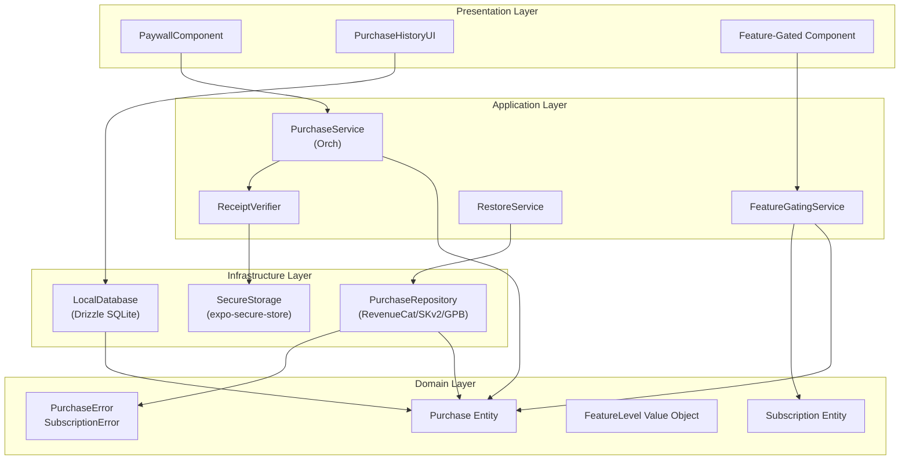
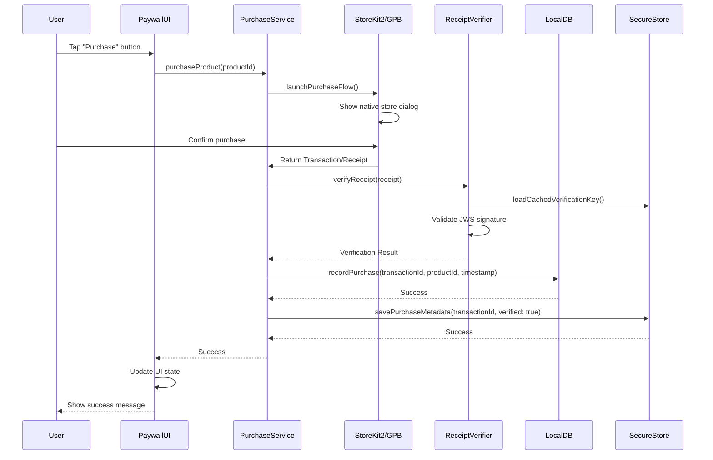
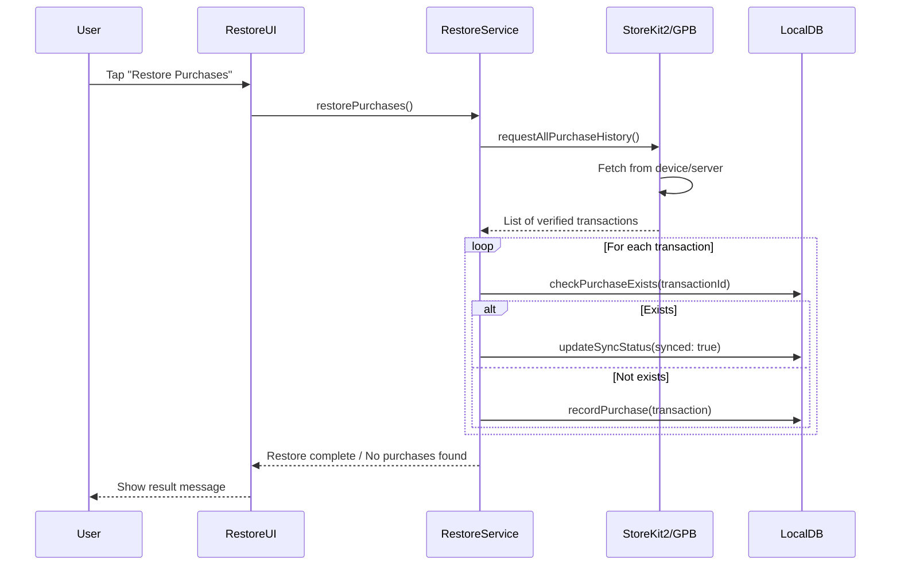
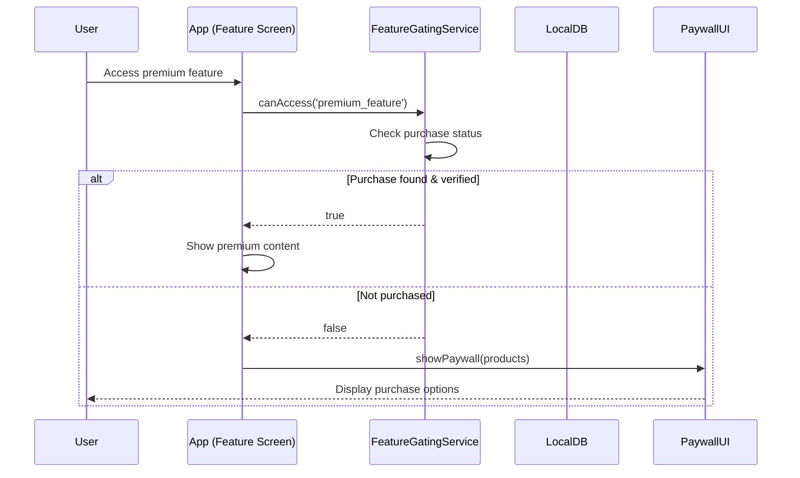
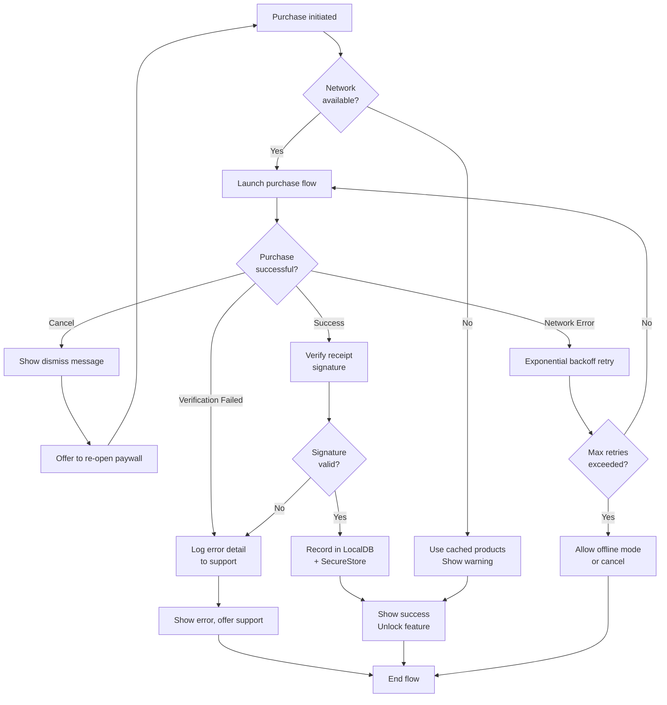

# 購入型・フリーミアム対応 - 技術設計書

## Overview

本設計は、既存のRevenueCat統合に加えて、ワンタイム購入（買い切り型）およびフリーミアムモデルへの対応を実現するための技術アーキテクチャを定めるものである。ユーザーは一度きりの購入で永続的に機能を解放でき、アプリケーション側は複数の購入オプション、オフラインサポート、堅牢なエラーハンドリングを備えた購入システムを提供する。

**Users**: エンドユーザー（プレミアム機能へのアクセス購入）、ビジネスチーム（売上分析・復旧管理）

**Impact**: 現在のSubscriptionモデル（定期購入のみ）から、ワンタイム購入＋定期購入の混在モデルへ拡張。既存Subscription機能は継続サポートし、新Purchase機能と並存。

### Goals

- ワンタイム購入フロー（確認→決済→DBレコード→機能解放）を実装
- StoreKit2 / Google Play Billingの両プラットフォームで動作
- オフラインシナリオで購入状態を利用可能に（ローカルキャッシュ）
- ネットワーク障害・決済エラーから安全に復旧
- フリーミアムUI（Paywall）でユーザーに購入オプションを提示
- 購入履歴・レシート検証を安全に管理

### Non-Goals

- サーバーサイドレシート検証実装（インフラチームが別途実装）
- RevenueCat以外の決済プラットフォーム統合
- ワンタイム購入の再購入制限カスタマイズ（プラットフォーム仕様に準拠）
- サブスクリプション到期時の自動ダウングレード機能

---

## Architecture

### Existing Architecture Analysis

**現在のSubscription実装パターン**:
- `features/subscription/core/` で domain entities (`Subscription`, `SubscriptionError`) を定義
- `repository.ts` で RevenueCat SDK との通信を抽象化 (`Purchases.getCustomerInfo()`, `purchasePackage()`)
- `service.ts` でビジネスロジック（tier determination、usage limits）を処理
- Zustand store で UI state 管理（`currentSubscription`, `offerings`）
- React Context (`SubscriptionProvider`) でグローバルアクセス

**既存の強み**:
- Error mapping via `toSubscriptionError()` で domain error type 統一
- `Result<T, E>` pattern で exception-free error handling
- TypeScript strict mode で型安全
- Test-oriented structure（unit/integration tests完備）

**対応すべき点**:
- ワンタイム購入エンティティの独立化（Subscriptionとは異なるlifecycle）
- ローカルDB（Drizzle ORM）への購入レコード永続化
- オフラインシナリオでのlocal state利用

---

### Architecture Pattern & Boundary Map



**Key Architecture Decisions**:

1. **ドメイン分離**: `Purchase`（ワンタイム、永続）と`Subscription`（定期、更新可）を別エンティティで管理
   - 理由: 異なるlifecycle、トランザクション境界、ビジネスロジック
   - 統合: `FeatureGatingService`で統合アクセス制御

2. **既存パターン継続**: `repository` + `domain error mapping` パターンを Purchase feature にも適用
   - 理由: チーム習熟度、テスト容易性
   - 拡張: `PurchaseRepository` でプラットフォーム API 抽象化

3. **ローカルDB中心**: オフラインシナリオでも機能解放するため、ローカル SQLite を source of truth とする
   - ただし: プラットフォーム（StoreKit, GPB）が official truth → sync reconciliation 必須

4. **Feature Gating 統一**: 既存 subscription-based gating に purchase-based gating を統合
   - パターン: `FeatureGatingService.canAccess(feature)` → boolean
   - 内部: subscription tier ∨ purchase state チェック

---

### Technology Stack & Alignment

| Layer                  | Choice / Version | Role in Feature | Alignment Notes |
|------------------------|------------------|-----------------|-----------------|
| **Frontend**           | React 19.1.0 / React Native 0.81.5 | UI components, hooks | Existing stack |
| **Navigation**         | expo-router 6.0.15 | Paywall, purchase history routing | Existing; typed routes enabled |
| **State Management**   | Zustand 5.x | Purchase UI state, async operations | Extends current subscription store |
| **Local Database**     | Drizzle ORM + expo-sqlite | Purchase records, transaction history | New; aligns with existing design |
| **Secure Storage**     | expo-secure-store | Transaction IDs, verification info | New; platform-native encryption |
| **Platform APIs**      | StoreKit2 (iOS 14+) / Google Play Billing v7+ | Receipt validation, product fetching | Native; RevenueCat wraps or direct |
| **RevenueCat SDK**     | react-native-purchases 7.x | Fallback for offerings, subscription data | Existing integration |
| **Analytics**          | Native events (Firebase/custom) | Purchase funnel tracking | To be integrated later |

**Technology Decisions**:
- **Direct StoreKit2/GPB over RevenueCat wrapper**: ワンタイム購入は RevenueCat では「non-consumable entitlement」として永続unlock となるため、より低レベルな制御が必要 → 直接 SDK 利用 + RevenueCat で subscription と補完
- **Drizzle ORM選定**: 型安全、Expo環境対応、既存DB schema 拡張容易、マイグレーション管理
- **expo-secure-store**: iOS Keychain / Android Keystore で自動暗号化 → 機密データ保護

---

## System Flows

### 1. One-Time Purchase Flow



**Key Flow Decisions**:
- **署名検証をクライアント側で実施**: オフラインシナリオで機能解放するため、ローカル検証が必須
- **トランザクションメタデータ分離**: ID・タイムスタンプは Drizzle SQLite、署名検証情報は secure-store で安全保管
- **非同期recordPurchase**: DB記録失敗時のリトライロジック別途実装

---

### 2. Purchase Restoration Flow



**Key Flow Decisions**:
- **プラットフォーム権威性**: StoreKit/GPB の transaction history が official source
- **Idempotent operation**: 既に存在する transaction は更新のみ（重複防止）

---

### 3. Feature Access Gating Flow



**Key Flow Decisions**:
- **同期的チェック**: ローカルDB から synchronous に購入状態確認（UX レスポンシビリティ）
- **オフラインレジリエンス**: ネットワーク接続不可時も、キャッシュされた購入状態を使用

---

## Requirements Traceability

| 要件 | Summary | Components | Interfaces | Flows |
|------|---------|-----------|-----------|-------|
| 1.1 | メタデータ読み込み | PurchaseRepository | `loadProductMetadata()` | Purchase initiation |
| 1.2 | 商品情報管理 | PurchaseEntity | N/A (Domain object) | Feature gating |
| 1.3 | RevenueCat利用可時の取得 | PurchaseRepository | `fetchFromRevenueCat()` | Startup |
| 1.4 | ローカルキャッシュ使用 | LocalDatabase | `getCachedProducts()` | Offline |
| 1.5 | 読み込み失敗時安全性 | ErrorHandler | Error logging | Purchase flow |
| 2.1 | 購入確認ダイアログ | PaywallComponent | UI component | Purchase flow |
| 2.2 | 決済API呼び出し | PurchaseRepository | `launchPurchaseFlow()` | Purchase flow |
| 2.3 | トランザクション記録 | LocalDatabase | `recordPurchase()` | Purchase flow |
| 2.4 | キャンセル処理 | PurchaseService | Graceful closure | Purchase flow |
| 2.5 | エラーメッセージ | ErrorHandler + UI | User-facing message | Error flow |
| 2.6 | ローディング表示 | PaywallComponent | Loading state | Purchase flow |
| 3.1 | 購入情報永続化 | LocalDatabase | `recordPurchase()` | Purchase flow |
| 3.2 | 同期フラグ管理 | LocalDatabase | `isSyncedFlag` column | Sync reconciliation |
| 3.3 | アプリ起動時復元 | PurchaseService | `restorePurchases()` | App initialization |
| 3.4 | オフライン機能解放 | FeatureGatingService | `canAccess()` | Feature gating |
| 3.5 | 接続復帰時同期 | SyncService | `syncPendingPurchases()` | Connectivity restoration |
| 3.6 | DB破損復旧 | RecoveryHandler | Recovery logic | Error recovery |
| 4.1 | 機能ロック状態定義 | FeatureLevelVO | `level: 'free' \| 'premium'` | Feature gating |
| 4.2 | 購入状態確認 | FeatureGatingService | `canAccess()` | Feature gating |
| 4.3 | アクセス許可 | FeatureGatingService | Return true | Feature gating |
| 4.4 | ペイウォール表示 | PaywallComponent | Conditional render | Feature gating |
| 4.5 | フリーティアル期間 | TrialManager | `getRemainingTrialDays()` | Trial logic |
| 4.6 | バンドル機能サポート | FeatureGatingService | Multiple features per product | Feature gating |
| 5.1 | ペイウォール表示 | PaywallComponent | UI component | Feature gating |
| 5.2 | オプションリスト表示 | PaywallComponent | Card-based list | Paywall render |
| 5.3 | オプション詳細表示 | PaywallComponent | Selection highlight | Paywall interaction |
| 5.4 | CTAボタン | PaywallComponent | Purchase button | Paywall interaction |
| 5.5 | 購入処理中UI | PaywallComponent | Loading overlay | Purchase flow |
| 5.6 | Dark mode対応 | PaywallComponent | Apple HIG colors | Theming |
| 6.1 | 復元ボタン提供 | AccountSettingsUI | UI button | Restore flow |
| 6.2 | 購入履歴取得 | RestoreService | `requestAllPurchaseHistory()` | Restore flow |
| 6.3 | 購入検証・登録 | RestoreService | Transaction verification | Restore flow |
| 6.4 | 購入なし通知 | RestoreService | Empty state message | Restore flow |
| 6.5 | ローディング表示 | RestoreUI | Loading indicator | Restore flow |
| 6.6 | 復元失敗エラー | ErrorHandler | Retry option | Error flow |
| 7.1 | 購入履歴表示 | PurchaseHistoryUI | List component | History view |
| 7.2 | 詳細モーダル表示 | PurchaseDetailsModal | Modal component | History detail |
| 7.3 | レシート検証 | ReceiptVerifier | JWS signature validation | Receipt processing |
| 7.4 | 署名検証 | ReceiptVerifier | Crypto verification | Verification |
| 7.5 | 検証失敗時無効化 | VerificationHandler | Purchase invalidation | Error handling |
| 7.6 | 検証済みレシート保存 | SecureStore | Encrypted storage | Data persistence |
| 8.1 | 再試行オプション提供 | RetryHandler | Retry UI/logic | Error flow |
| 8.2 | 詳細エラー説明 | ErrorHandler | User-facing message | Error flow |
| 8.3 | 不一致同期 | SyncReconciler | Sync logic | Reconciliation |
| 8.4 | エラー復旧中ロック | LockingMechanism | State lock | Safety |
| 8.5 | エラーログ記録 | ErrorLogger | Timestamp logging | Observability |
| 8.6 | ログエクスポート機能 | SupportHandler | Export functionality | Support |
| 9.1 | 暗号化保存 | SecureStore | Encrypted storage | Security |
| 9.2 | プラットフォーム検証 | ReceiptVerifier | API validation | Compliance |
| 9.3 | オフライン検証 | OfflineValidator | Cached verification | Offline mode |
| 9.4 | アクセス制御 | AuthorizationService | User isolation | Security |
| 9.5 | 削除対応 | PrivacyHandler | Data deletion | Privacy |
| 9.6 | レート制限 | RateLimiter | Request throttling | Rate limiting |
| 10.1 | イベント記録 | AnalyticsEngine | Event logging | Monitoring |
| 10.2 | 購入完了時メタデータ記録 | AnalyticsEngine | Structured logging | Analytics |
| 10.3 | 段階別処理時間測定 | PerformanceMonitor | Timing metrics | Performance |
| 10.4 | 遅延警告 | PerformanceAlert | Threshold monitoring | Monitoring |
| 10.5 | エラーレート監視 | ErrorMonitoring | Anomaly detection | Reliability |
| 10.6 | ダッシュボードデータ | ReportingSystem | Aggregated data | Analytics |

---

## Components and Interfaces

### Component Summary

| Component | Domain/Layer | Intent | Req Coverage | Key Dependencies | Contracts |
|-----------|--------------|--------|--------------|------------------|-----------|
| PurchaseRepository | Infrastructure | Platform API abstraction (StoreKit2, GPB, RevenueCat) | 1.1-1.5, 2.2-2.3 | Platform SDKs | Service |
| PurchaseService | Application | Purchase flow orchestration | 2.1-2.6, 3.1-3.5 | PurchaseRepository, ReceiptVerifier, LocalDatabase | Service |
| FeatureGatingService | Application | Feature access control unified (Purchase + Subscription) | 4.1-4.6 | PurchaseEntity, SubscriptionEntity | Service |
| ReceiptVerifier | Application | JWS signature & receipt validation | 7.3-7.6, 9.1-9.3 | SecureStore, PurchaseEntity | Service |
| RestoreService | Application | Purchase history restoration | 6.1-6.6 | PurchaseRepository, LocalDatabase | Service |
| LocalDatabase | Infrastructure | SQLite persistence layer (Drizzle ORM) | 3.1-3.6, 7.1 | Database schema | State |
| SecureStore | Infrastructure | Encrypted KV storage for sensitive data | 9.1, 7.6 | expo-secure-store library | State |
| PaywallComponent | Presentation | Premium feature purchase UI | 5.1-5.6, 4.2-4.4 | PurchaseService, FeatureGatingService | Service, State |
| PurchaseHistoryUI | Presentation | Purchase history list & details | 7.1-7.2 | LocalDatabase | State |
| ErrorHandler | Application | Error classification & user messaging | 8.1-8.6, 2.5 | SubscriptionError, PurchaseError types | Service |
| AnalyticsEngine | Infrastructure | Event tracking for monitoring | 10.1-10.2 | Custom analytics provider | Event |
| SyncReconciler | Application | Local-server purchase state reconciliation | 3.5, 8.3 | LocalDatabase, PurchaseRepository | Service |
| Purchase Entity | Domain | ワンタイム購入エンティティ | 1.2, 3.1, 4.1 | N/A | N/A |
| Subscription Entity | Domain | 既存サブスクリプションエンティティ（継続） | 4.2 | N/A | N/A |

---

### Domain Layer

#### Purchase Entity

| Field | Detail |
|-------|--------|
| Intent | ワンタイム購入を表すドメインエンティティ（永続的、一度きりの購入） |
| Requirements | 1.2, 3.1-3.3, 4.1, 7.1-7.2 |

**Responsibilities & Constraints**

- 購入識別子（transactionId）の永続管理
- 購入タイムスタンプ・プロダクトID・価格情報の保持
- 署名検証状態フラグの管理
- オフラインシナリオでも有効性を保証

**Attributes**

```typescript
interface Purchase {
  // Unique identifier
  transactionId: string;

  // Purchase metadata
  productId: string;
  purchasedAt: Date;
  price: number;
  currencyCode: string;

  // Verification state
  isVerified: boolean;
  verificationKey?: string; // JWS signature reference

  // Sync state
  isSynced: boolean; // Server-synced
  syncedAt?: Date;

  // Entitlements (can unlock multiple features)
  unlockedFeatures: string[];
}
```

**Invariants**

- `transactionId` は unique（primary key）
- `isVerified === true` のときのみ `unlockedFeatures` を有効
- `isSynced === true` の場合 `syncedAt` は null でない

---

### Infrastructure Layer

#### PurchaseRepository

| Field | Detail |
|-------|--------|
| Intent | プラットフォーム購入API（StoreKit2、Google Play Billing、RevenueCat）を抽象化 |
| Requirements | 1.1-1.5, 2.2, 3.2-3.3, 6.2, 10.2 |
| Key Dependencies | StoreKit2 (iOS), Google Play Billing (Android), RevenueCat SDK (fallback) |

**Responsibilities & Constraints**

- 購入商品メタデータの取得（ローカルキャッシュ・リモート）
- 購入フロー起動と取引の取得
- プラットフォーム API エラーの domain error へのマッピング
- オフラインシナリオでのキャッシュ参照

**Dependencies**

- Inbound: PurchaseService (P0 orchestration), RestoreService (P0 restoration)
- Outbound: StoreKit2 (P0 native), GPB (P0 native), RevenueCat (P1 fallback)
- External: react-native-purchases library

**Service Interface**

```typescript
interface PurchaseRepository {
  // Product metadata
  loadProductMetadata(productIds: string[]): Promise<Result<Product[], PurchaseError>>;
  getCachedProducts(): Promise<Product[]>;

  // Purchase operation
  launchPurchaseFlow(productId: string): Promise<Result<Transaction, PurchaseError>>;

  // Restoration
  requestAllPurchaseHistory(): Promise<Result<Transaction[], PurchaseError>>;

  // Verification
  verifyTransaction(transaction: Transaction): Promise<Result<boolean, PurchaseError>>;
}

type Product = {
  id: string;
  title: string;
  description: string;
  price: number;
  priceString: string;
  currencyCode: string;
};

type Transaction = {
  transactionId: string;
  productId: string;
  purchaseDate: Date;
  receiptData: string; // JWS for iOS, JSON for Android
  signature?: string; // Android only
};

type PurchaseError =
  | { code: 'NETWORK_ERROR'; message: string; retryable: true }
  | { code: 'STORE_PROBLEM_ERROR'; message: string; retryable: true }
  | { code: 'PURCHASE_CANCELLED'; message: string; retryable: false }
  | { code: 'PURCHASE_INVALID'; message: string; retryable: false }
  | { code: 'PRODUCT_UNAVAILABLE'; message: string; retryable: false }
  | { code: 'UNKNOWN_ERROR'; message: string; retryable: false };
```

**Implementation Notes**

- **Platform selection**: iOS は StoreKit2 直接利用、Android は Google Play Billing 直接利用
- **RevenueCat fallback**: メタデータ取得時に RevenueCat Offerings を二次ソースとして利用可能
- **Offline handling**: ネットワーク接続不可時は `getCachedProducts()` でローカル DB から返却
- **Error mapping**: プラットフォーム固有エラーコードを `PurchaseError` discriminated union へマッピング

---

#### LocalDatabase (Drizzle SQLite)

| Field | Detail |
|-------|--------|
| Intent | Drizzle ORM 経由で SQLite にローカル購入データを永続化 |
| Requirements | 3.1-3.6, 7.1-7.2, 8.3, 9.1, 10.1 |

**Responsibilities & Constraints**

- `purchases` テーブルでの transactionId、productId、timestamp の記録
- `sync_status` フラグで未同期購入を管理
- オフラインシナリオでも読み取り可能な状態の保証
- トランザクション境界の一貫性

**Data Model**

```typescript
// Drizzle schema
export const purchases = sqliteTable('purchases', {
  id: integer('id').primaryKey({ autoIncrement: true }),
  transactionId: text('transaction_id').unique().notNull(),
  productId: text('product_id').notNull(),
  purchasedAt: integer('purchased_at').notNull(), // Unix timestamp
  price: real('price').notNull(),
  currencyCode: text('currency_code').notNull(),
  isVerified: integer('is_verified', { mode: 'boolean' }).default(false),
  isSynced: integer('is_synced', { mode: 'boolean' }).default(false),
  syncedAt: integer('synced_at'),
  createdAt: integer('created_at').default(sql`(strftime('%s', 'now'))`),
  updatedAt: integer('updated_at').default(sql`(strftime('%s', 'now'))`),
});

export const purchaseFeatures = sqliteTable('purchase_features', {
  id: integer('id').primaryKey({ autoIncrement: true }),
  purchaseId: integer('purchase_id').notNull(),
  featureId: text('feature_id').notNull(),
  foreignKey: [purchases, 'id'],
});
```

**Service Interface**

```typescript
interface LocalDatabase {
  // Create
  recordPurchase(purchase: Purchase): Promise<Result<Purchase, DatabaseError>>;

  // Read
  getPurchase(transactionId: string): Promise<Result<Purchase | null, DatabaseError>>;
  getAllPurchases(): Promise<Result<Purchase[], DatabaseError>>;
  getPurchasesByFeature(featureId: string): Promise<Result<Purchase[], DatabaseError>>;

  // Update
  updateSyncStatus(transactionId: string, isSynced: boolean): Promise<Result<void, DatabaseError>>;
  updateVerificationStatus(transactionId: string, isVerified: boolean): Promise<Result<void, DatabaseError>>;

  // Delete (privacy)
  deletePurchase(transactionId: string): Promise<Result<void, DatabaseError>>;
}
```

**Implementation Notes**

- **Usability**: Drizzle の `useLiveQuery` hook で DB 変更をリアクティブに UI に反映
- **Migration**: `pnpm db:generate` で スキーマ変更をマイグレーションファイル化
- **Indexing**: `transactionId`、`productId` にインデックス付与（クエリ高速化）

---

#### ReceiptVerifier

| Field | Detail |
|-------|--------|
| Intent | JWS署名検証・レシート整合性確保 |
| Requirements | 7.3-7.6, 9.1-9.3 |

**Responsibilities & Constraints**

- iOS: JWS format レシートの署名検証
- Android: Google Play Billing receipt payload の署名検証
- ローカル検証キーの管理（オフライン対応）
- 署名検証失敗時の安全な無効化

**Dependencies**

- Inbound: PurchaseService (P0)
- Outbound: SecureStore (P0 verification keys), Platform SDKs (P0 native)

**Service Interface**

```typescript
interface ReceiptVerifier {
  // Verification
  verifyReceiptSignature(
    receiptData: string,
    platform: 'ios' | 'android'
  ): Promise<Result<VerificationResult, VerificationError>>;

  // Key management
  loadVerificationKey(): Promise<Result<string, VerificationError>>;
  cacheVerificationKey(key: string): Promise<Result<void, VerificationError>>;
}

type VerificationResult = {
  isValid: boolean;
  transactionId: string;
  productId: string;
  purchaseDate: Date;
};

type VerificationError =
  | { code: 'INVALID_SIGNATURE'; message: string }
  | { code: 'KEY_NOT_FOUND'; message: string }
  | { code: 'DECODING_ERROR'; message: string }
  | { code: 'UNKNOWN_ERROR'; message: string };
```

**Implementation Notes**

- **JWS validation**: `crypto` ライブラリで JWT/JWS signature 検証（or `jsonwebtoken`）
- **Offline mode**: キャッシュされた verification key でローカル検証可能
- **Timing**: 署名検証は購入フロー直後（検証情報新鮮度最大化）

---

### Application Layer

#### PurchaseService

| Field | Detail |
|-------|--------|
| Intent | 購入フロー全体のオーケストレーション（UI→決済→検証→DB記録） |
| Requirements | 2.1-2.6, 3.1-3.5 |

**Responsibilities & Constraints**

- Purchase flow の複合トランザクション管理
- 各ステップでの error recovery
- UI state の同期（loading、success、error）
- Idempotency の保証（重複購入防止）

**Dependencies**

- Inbound: PaywallComponent (P0), UI handlers
- Outbound: PurchaseRepository (P0), ReceiptVerifier (P0), LocalDatabase (P0)

**Service Interface**

```typescript
interface PurchaseService {
  // Main purchase flow
  purchaseProduct(productId: string): Promise<Result<Purchase, PurchaseFlowError>>;

  // Restoration
  restorePurchases(): Promise<Result<Purchase[], PurchaseFlowError>>;

  // State queries
  getActivePurchases(): Promise<Result<Purchase[], PurchaseFlowError>>;
  getPurchase(transactionId: string): Promise<Result<Purchase | null, PurchaseFlowError>>;
}

type PurchaseFlowError =
  | { code: 'CANCELLED'; retryable: false }
  | { code: 'NETWORK_ERROR'; retryable: true }
  | { code: 'VERIFICATION_FAILED'; retryable: false }
  | { code: 'DB_ERROR'; retryable: true }
  | { code: 'UNKNOWN_ERROR'; retryable: false };
```

**Preconditions**

- ネットワーク接続状態を事前確認（購入フロー開始前）
- 重複購入チェック（既に購入済みの場合は early return）

**Postconditions**

- 購入成功時: LocalDatabase に record、SecureStore に verification info 保存
- 購入失敗時: エラーログ記録、UI に error message 表示

**Invariants**

- 同時実行購入禁止（UI state lock で防止）
- Verification failed の場合、purchase record は作成しない

---

#### FeatureGatingService

| Field | Detail |
|-------|--------|
| Intent | Purchase + Subscription 統合での feature access control |
| Requirements | 4.1-4.6 |

**Responsibilities & Constraints**

- Feature の `level` (free / premium) 定義
- ユーザーの購入状態・subscription 状態から access 判定
- オフラインシナリオでもローカル state から判定可能
- Complex feature bundles（1つの購入で複数機能解放）対応

**Dependencies**

- Inbound: Feature components (P0), FeatureGateUI (P0)
- Outbound: PurchaseEntity (P0), SubscriptionEntity (P0), LocalDatabase (P0)

**Service Interface**

```typescript
interface FeatureGatingService {
  // Access control
  canAccess(featureId: string): Promise<boolean>;
  canAccessSync(featureId: string): boolean; // Synchronous (cached)

  // Feature definitions
  getFeatureDefinition(featureId: string): Result<FeatureDefinition, NotFoundError>;
  getFeaturesByLevel(level: FeatureLevel): FeatureDefinition[];

  // Purchase info for UI
  getRequiredPurchaseForFeature(featureId: string): Product | null;
}

interface FeatureDefinition {
  id: string;
  level: 'free' | 'premium';
  name: string;
  description: string;
  requiredProductId?: string; // if multiple products → array support
}
```

**Implementation Notes**

- **Hierarchical access**: Free users can access `level: 'free'` features
  ```typescript
  const hasAccess = subscription.tier === 'premium'
    || purchases.some(p => p.unlockedFeatures.includes(featureId));
  ```
- **Offline**: LocalDatabase のキャッシュされた purchase state で判定
- **Trial support**: `TrialManager` で trial period 残日数計算・表示

---

### Presentation Layer

#### PaywallComponent

| Field | Detail |
|-------|--------|
| Intent | Premium feature access 時に購入オプション提示（ペイウォールUI） |
| Requirements | 5.1-5.6, 4.2-4.4 |

**Responsibilities & Constraints**

- 利用可能な購入オプション（Product）のカード表示
- Loading / Error / Success state 表示
- 選択したオプションの詳細表示（価格・説明・機能リスト）
- Dark mode / Light mode 対応（Apple HIG準拠）

**Dependencies**

- Inbound: Feature screen
- Outbound: PurchaseService (P0), FeatureGatingService (P0)

**Props Interface**

```typescript
interface PaywallComponentProps {
  featureId: string; // Gated feature identifier
  onPurchaseComplete?: (purchase: Purchase) => void;
  onDismiss?: () => void;
  allowDismiss?: boolean; // Freemium では true（ユーザーが閉じ可能）
}
```

**Implementation Notes**

- **Card-based layout**: 各オプション `Product` をカードで表示
  ```
  ┌─────────────────────┐
  │ Product Name        │
  │ $9.99 / one-time    │
  │ Features: ABC, DEF  │
  │ [Purchase]          │
  └─────────────────────┘
  ```
- **Loading state**: 購入処理中は overlay + loading indicator
- **Error handling**: `PurchaseService` から error 受け取り、user-facing message 表示
- **Color system**: `useThemedColors()` で iOS HIG color palette 利用

---

## Data Models

### Domain Model

**Aggregates**:
- `Purchase Aggregate`: transactionId (root)、詳細情報・verification state・sync status を統括
  - Root: `Purchase` entity
  - Value objects: `PurchaseMetadata` (productId, price, currency)、`VerificationState` (isVerified, key)
  - Domain events: `PurchaseCompleted`、`PurchaseVerified`、`PurchaseSynced`

- `Subscription Aggregate`（既存）: 継続・互換性維持

**Entity Relationships**:
```
Purchase 1 ---> 0..* FeatureUnlock
  (一度の購入で複数機能を解放可能）
```

**Business Rules & Invariants**:
- Purchase は一度的に作成され、削除される（更新不可）
- `isVerified === true` のときのみ `unlockedFeatures` を有効に
- `isSynced === false` のときもオフラインで利用可能

---

### Logical Data Model

**Purchase Entity Relationships**:

```
Purchase
├── transactionId (PK, unique)
├── productId (FK → Product catalog)
├── purchasedAt (timestamp)
├── price, currencyCode
├── isVerified (boolean)
├── isSynced (boolean)
└── unlockedFeatures (1:M via PurchaseFeature junction)

PurchaseFeature
├── purchaseId (FK)
├── featureId (feature identifier)
```

**Consistency & Integrity**:
- Referential integrity: `productId` → product metadata（ローカル）
- Transaction boundary: `recordPurchase()` は atomic（DB + SecureStore）
- Cascading: Purchase 削除時 PurchaseFeature も削除

---

### Physical Data Model

**SQLite Schema** (Drizzle):

```sql
CREATE TABLE purchases (
  id INTEGER PRIMARY KEY AUTOINCREMENT,
  transaction_id TEXT UNIQUE NOT NULL,
  product_id TEXT NOT NULL,
  purchased_at INTEGER NOT NULL,
  price REAL NOT NULL,
  currency_code TEXT NOT NULL,
  is_verified INTEGER DEFAULT 0,
  is_synced INTEGER DEFAULT 0,
  synced_at INTEGER,
  created_at INTEGER DEFAULT (strftime('%s', 'now')),
  updated_at INTEGER DEFAULT (strftime('%s', 'now')),
  CHECK (is_verified IN (0, 1)),
  CHECK (is_synced IN (0, 1))
);

CREATE INDEX idx_transaction_id ON purchases(transaction_id);
CREATE INDEX idx_product_id ON purchases(product_id);
CREATE INDEX idx_is_synced ON purchases(is_synced);

CREATE TABLE purchase_features (
  id INTEGER PRIMARY KEY AUTOINCREMENT,
  purchase_id INTEGER NOT NULL REFERENCES purchases(id) ON DELETE CASCADE,
  feature_id TEXT NOT NULL,
  created_at INTEGER DEFAULT (strftime('%s', 'now')),
  UNIQUE(purchase_id, feature_id)
);

CREATE INDEX idx_purchase_id ON purchase_features(purchase_id);
CREATE INDEX idx_feature_id ON purchase_features(feature_id);
```

**Optimization**:
- `transactionId`、`product_id`、`is_synced` インデックスで常用クエリ最適化
- Purchase count が多い場合、日付単位の partition 検討

---

## Error Handling

### Error Strategy

**Philosophy**: Fail-safe（安全性優先）で、ユーザーへの詳細な guidance 提供

**3段階復旧**:
1. **Immediate recovery**: ユーザーが再試行・dismiss できる UI 提供
2. **Automatic retry**: Network error 等 transient error は exponential backoff で自動復旧
3. **Graceful degradation**: Server 接続不可 → ローカル cache で機能解放

---

### Error Categories and Responses

**User Errors** (4xx):
- `PURCHASE_CANCELLED`: ユーザーキャンセル → graceful closure、reopen paywall 可能
- `PRODUCT_UNAVAILABLE`: 商品削除 → older purchase 表示、新規購入不可

**System Errors** (5xx):
- `NETWORK_ERROR`: ネットワーク接続失敗 → exponential backoff + UI "Retry" button
- `STORE_PROBLEM_ERROR`: App Store / Play Store 問題 → 待機 + manual retry

**Business Logic Errors**:
- `VERIFICATION_FAILED`: 署名検証失敗 → error log 記録、support team escalation
- `PURCHASE_INVALID`: 不正な purchase record → admin review 案内

---

### Error Flow Visualization



**Monitoring**:

- Error logger: すべての購入関連エラーをtimestamp付きで記録
- Error rate dashboard: 異常検出（error rate > threshold）
- Alert system: Critical errors（verification failed）を support team に notify

---

## Testing Strategy

### Unit Tests

1. **PurchaseRepository.loadProductMetadata()**
   - Happy path: revenueCat からメタデータ取得成功
   - Offline path: ローカル cache から取得
   - Error path: network error → error result

2. **ReceiptVerifier.verifyReceiptSignature()**
   - Valid signature: verification success
   - Invalid signature: verification failure + error
   - Missing key: key loading error

3. **FeatureGatingService.canAccess()**
   - Free feature: always true
   - Premium + purchased: true
   - Premium + not purchased: false
   - Offline with cache: true

4. **LocalDatabase.recordPurchase()**
   - Successful insert: purchase record created
   - Duplicate transaction ID: unique constraint error
   - DB connection error: database error result

5. **ErrorHandler error mapping**
   - Platform error code → domain error type
   - Retryable flag correct
   - User-facing message accurate

---

### Integration Tests

1. **Full purchase flow** (PaywallComponent → PurchaseService → DB)
   - User taps purchase → dialog → payment API → verification → DB record
   - Verify feature unlocked post-purchase

2. **Offline purchase history**
   - Record purchase with `isSynced = false`
   - Query purchases while offline
   - Verify access granted

3. **Purchase restoration**
   - Fetch history from platform
   - De-duplicate existing records
   - Update sync status

4. **Error recovery with retry**
   - Network error during payment
   - Automatic retry with backoff
   - Eventually succeed or graceful degradation

5. **Multi-feature unlock**
   - Purchase product X
   - Verify multiple features are gated

---

### E2E/UI Tests

1. **Paywall presentation**
   - Tap premium feature → paywall shown
   - Select option → highlight change
   - Tap purchase → flow initiated

2. **Purchase success UX**
   - Paywall closes
   - Feature unlocked immediately
   - Success message shown

3. **Purchase failure UX**
   - Error message with retry option
   - Paywall remains open
   - Retry triggers new attempt

4. **History view**
   - Navigate to purchase history
   - Display all purchases with details
   - Tap for expanded info

---

## Supporting References

### TypeScript Definitions

**PurchaseError discriminated union** (detailed):

```typescript
type PurchaseError =
  | {
      code: 'NETWORK_ERROR';
      message: string;
      retryable: true;
      platform: 'ios' | 'android' | 'revenueCat';
    }
  | {
      code: 'STORE_PROBLEM_ERROR';
      message: string;
      retryable: true;
      nativeErrorCode: number;
    }
  | {
      code: 'PURCHASE_CANCELLED';
      message: 'User cancelled purchase';
      retryable: false;
    }
  | {
      code: 'PURCHASE_INVALID';
      message: string;
      retryable: false;
      reason: 'not_signed' | 'wrong_bundle' | 'revoked';
    }
  | {
      code: 'PRODUCT_UNAVAILABLE';
      message: string;
      retryable: false;
      productId: string;
    }
  | {
      code: 'UNKNOWN_ERROR';
      message: string;
      retryable: false;
    };
```

---

### API Configuration

**RevenueCat Offerings structure** (reference for comparison):

```typescript
interface RevenueCatOffering {
  identifier: string; // e.g., "premium_tier"
  packages: RevenueCatPackage[]; // $rc_monthly, $rc_annual, etc.
}

// For one-time purchases, create non-entitlement products:
interface OnePurchaseProduct {
  id: string; // e.g., "premium_unlock"
  type: 'non_consumable';
  entitlements: []; // Empty → lifetime unlock
  features: string[]; // Unlocked feature IDs
}
```

---

## Appendix: Comparison with Subscription Model

| Aspect | Subscription | One-Time Purchase |
|--------|--------------|-------------------|
| **Lifecycle** | Renews periodically | Permanent, one-time |
| **Revocation** | Expiration date, unsubscribe | Non-revocable |
| **Multiple purchases** | N/A (periodic) | Allowed (stacking) |
| **DB persistence** | Subscription entity | Purchase entity |
| **Verification** | Entitlement check | Transaction + signature |
| **Feature gating** | Tier-based (free/premium) | Product-based mapping |
| **RevenueCat integration** | Native entitlements | Non-consumable emulation |

---

