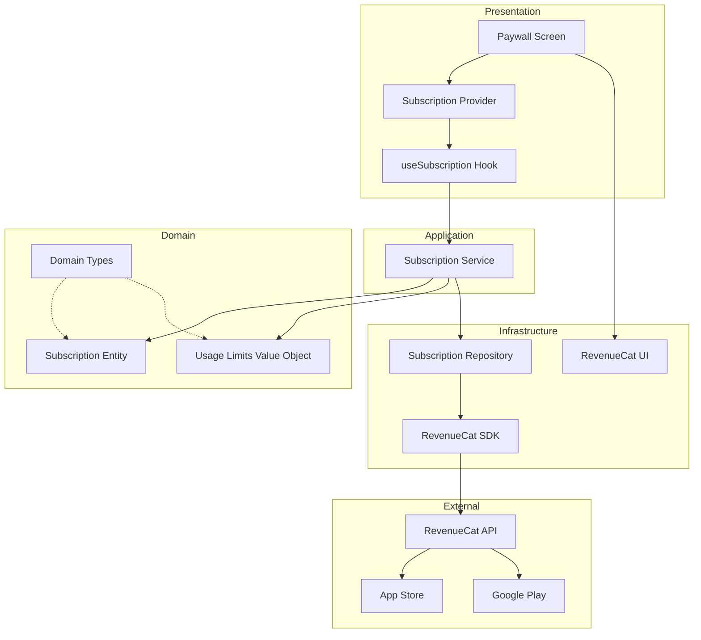
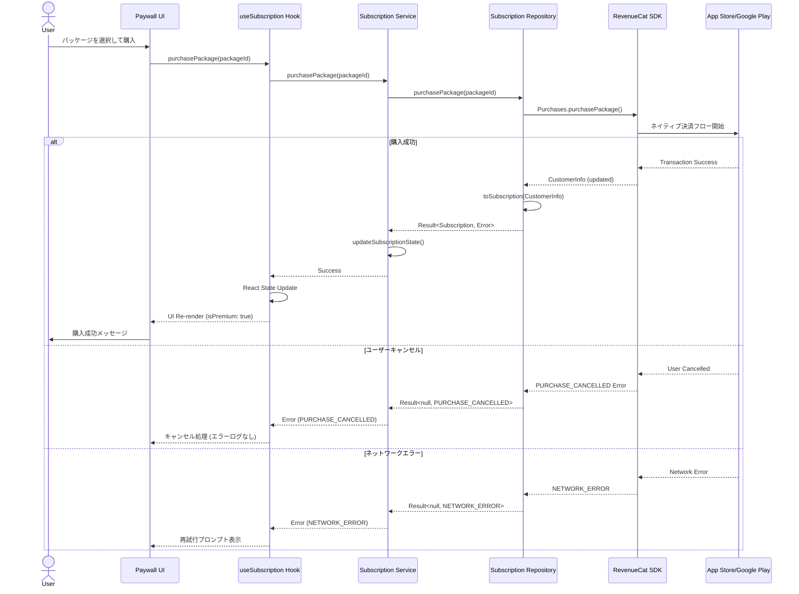
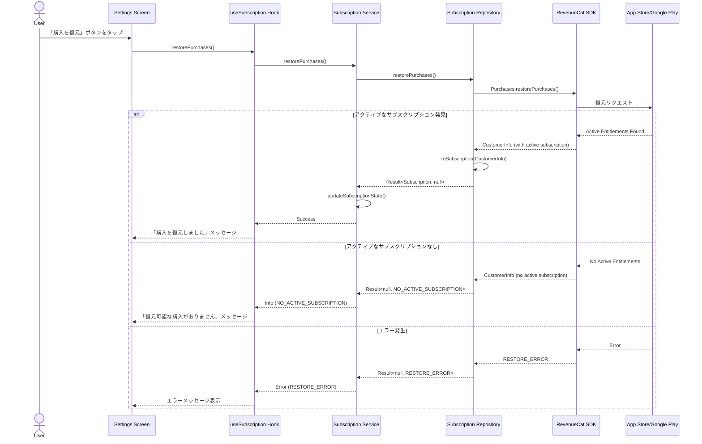
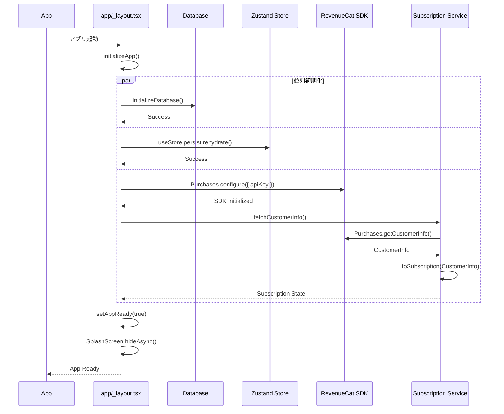
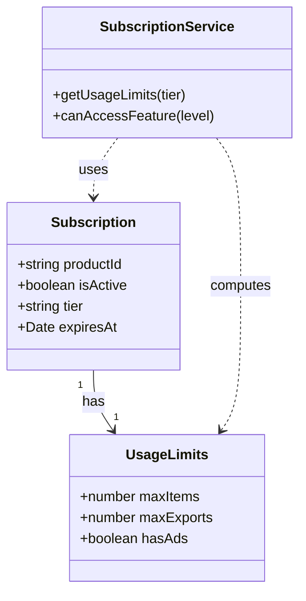

# 技術設計書

## 概要

本機能は、expo-quick-kit ボイラープレートに RevenueCat を使用したサブスクリプション収益化システムを統合するものです。Clean Architecture と DDD 原則に基づき、月額・年額プランの購入、機能制限 (Feature Gating)、復元フローを提供します。開発者がサブスクリプション機能をすぐに利用開始できる、完全に統合された実装を提供します。

**目的**: ボイラープレートユーザーに対し、プロダクション対応のサブスクリプションシステムを提供し、RevenueCat の設定から実装、テストまでの完全なワークフローを実現します。

**対象ユーザー**: expo-quick-kit を使用する React Native 開発者。サブスクリプション機能を迅速に統合し、ビジネスロジックに集中したい開発チーム。

**影響**: 新しい `features/subscription/` モジュールを追加し、Zustand ストア、アプリ初期化フロー (`app/_layout.tsx`)、および環境変数管理を変更します。

### ゴール

- RevenueCat SDK を Expo SDK 54 および React Native New Architecture 環境に統合
- Clean Architecture と DDD 原則に準拠したサブスクリプションモジュールを実装
- 月額・年額プランの購入、復元、Feature Gating の完全なフローを提供
- 既存のボイラープレート技術スタック (Zustand, TanStack Query, iOS Design System) とシームレスに統合
- 開発者が容易にカスタマイズ可能な、包括的なドキュメントとサンプルコードを提供

### 非ゴール

- RevenueCat 以外の決済プロバイダー (Stripe, PayPal など) の統合
- Web プラットフォーム向けのサブスクリプション実装 (iOS/Android のみ対象)
- カスタムペイウォール UI の実装 (RevenueCat の組み込み UI を使用)
- `PaywallFooterContainerView` の使用 (New Architecture 非対応のため除外)
- 複雑なプロモーションコードやトライアル管理 (RevenueCat Dashboard で管理)
- 既存機能の大規模なリファクタリング (新しい feature モジュールとして追加)

## アーキテクチャ

### 既存アーキテクチャ分析

expo-quick-kit は Feature-based モジュール構造と Clean Architecture 原則を採用しています。主な既存パターン:

- **Feature モジュール構造**: `features/` 配下に `components/`, `hooks/`, `services/`, `types.ts` を配置
- **状態管理**: Zustand (クライアント状態) + TanStack Query (サーバー状態) + Drizzle ORM (永続化)
- **型システム**: TypeScript strict mode、`@/*` パスエイリアス、kebab-case 命名規則
- **アプリ初期化**: `app/_layout.tsx` でデータベース初期化とストア rehydration を並列実行
- **テーマシステム**: iOS Design System (Apple HIG 準拠、Dark Mode 対応)
- **テスト戦略**: Jest + Testing Library、`__tests__/` ディレクトリ配置

統合アプローチ:
- **新規 Feature モジュール**: `features/subscription/` として追加し、既存構造を尊重
- **既存 Zustand ストア拡張**: `store/slices/app-slice.ts` の `isPremium` フラグと同期 (オプション)
- **アプリ初期化フロー拡張**: RevenueCat SDK 初期化を `app/_layout.tsx` に追加
- **既存テーマ利用**: Paywall UI で iOS Design System のカラーとタイポグラフィを活用

### アーキテクチャパターンと境界マップ

**選択されたパターン**: Clean Architecture (Onion Architecture) + Domain-Driven Design

**理由**: 既存のボイラープレート構造と整合性を保ちながら、サブスクリプションドメインロジックを外部 SDK (RevenueCat) から明確に分離します。これにより、将来的な決済プロバイダーの変更やテスト容易性を確保します。



**ドメイン境界**:
- **Subscription Core**: サブスクリプション状態、ティア、利用制限のビジネスロジック (外部依存なし)
- **Repository Layer**: RevenueCat SDK との通信を抽象化し、ドメインエンティティへの変換を担当
- **Presentation Layer**: React Context + Custom Hooks でサブスクリプション状態を UI に提供

**既存パターンの保持**:
- Feature モジュール構造 (`features/subscription/`)
- TanStack Query キャッシング戦略 (オプション)
- iOS Design System のテーマとコンポーネント
- Jest + Testing Library のテスト構造

**新規コンポーネントの根拠**:
- **Subscription Repository**: RevenueCat SDK の API を抽象化し、ドメインモデルへの変換を提供
- **Subscription Service**: ビジネスロジック (Feature Gating, Usage Limits 計算) を実装
- **Subscription Provider**: React Context で状態を管理し、コンポーネントツリー全体に提供
- **Paywall Screen**: RevenueCat UI ラッパーとして、カスタムイベント処理とナビゲーションを実装

**Steering 準拠**:
- Feature-based モジュール構造 (structure.md)
- Clean Architecture 原則 (DDD レイヤー分離)
- TypeScript strict mode と型安全性 (tech.md)
- iOS Design System 統合 (product.md)

### 技術スタック

| レイヤー                         | 選択技術 / バージョン                 | 機能における役割                                                     | 備考                                                                                   |
| -------------------------------- | ------------------------------------- | -------------------------------------------------------------------- | -------------------------------------------------------------------------------------- |
| **Frontend / UI**                | React Native 0.81.5 + Expo SDK 54     | クロスプラットフォーム UI 基盤                                       | New Architecture 有効化済み、React Compiler 対応                                       |
| **Subscription SDK**             | react-native-purchases 8.9.2+         | RevenueCat SDK (購入、復元、CustomerInfo 取得)                      | New Architecture 対応済み、Expo 開発ビルド必須、StoreKit 2 デフォルト               |
| **Paywall UI**                   | react-native-purchases-ui 9.2.1+      | RevenueCat 組み込みペイウォール UI                                   | Dashboard で遠隔設定可能、PaywallFooterContainerView は New Arch 非対応            |
| **State Management**             | Zustand 5.x + React Context           | クライアント状態管理 (isPremium フラグ) + コンポーネントツリー状態  | AsyncStorage 永続化、Subscription Provider で Context 提供                             |
| **Data Fetching (Optional)**     | TanStack Query 5.x                    | サブスクリプション状態のキャッシュと自動再フェッチ                   | オプション統合、既存 queryClient 利用                                                  |
| **Local Storage (Future)**       | Drizzle ORM + expo-sqlite             | サブスクリプション履歴の永続化 (将来的な拡張)                       | 初期実装では不要、RevenueCat が状態管理                                                |
| **Type System**                  | TypeScript 5.9 (strict mode)          | 型安全なサブスクリプションエンティティと API 契約                    | `any` 型禁止、Result 型パターン採用                                                    |
| **Testing**                      | Jest + @testing-library/react-native  | ユニット・統合テスト                                                 | RevenueCat SDK のモック実装 (`__mocks__/react-native-purchases.ts`)                   |
| **Environment Variables**        | Expo Constants + .env.local           | RevenueCat API キー管理 (EXPO_PUBLIC_REVENUE_CAT_API_KEY_APPLE/GOOGLE) | .gitignore 必須、本番環境では Expo Secrets 推奨                                        |
| **Infrastructure / Runtime**     | Expo Development Build (expo-dev-client) | ネイティブモジュール実行環境                                         | Expo Go 非対応、EAS Build または ローカルビルド必須                                    |

**選択理由の詳細**:

1. **RevenueCat SDK 8.9.2+**: New Architecture 対応済み、React Native 0.81+ と互換性あり。公式ドキュメントでは最小バージョン 0.73.0 を要求。SDK v8 は StoreKit 2 をデフォルト使用。
2. **react-native-purchases-ui**: RevenueCat Dashboard で UI を遠隔設定可能。コード変更なしでペイウォールデザインを更新できるため、迅速な A/B テストとイテレーションが可能。**注意**: `PaywallFooterContainerView` は New Architecture 非対応 ([GitHub Issue #1158](https://github.com/RevenueCat/react-native-purchases/issues/1158))。
3. **Zustand + React Context**: Zustand は既存ストアとの統合 (`isPremium` フラグ同期) を提供し、React Context はサブスクリプション状態のリアクティブな配信を担当。
4. **TypeScript strict mode**: RevenueCat の `CustomerInfo` を型安全なドメインエンティティ (`Subscription`) に変換し、実行時エラーを防止。

**外部依存関係の調査結果** (`research.md` 参照):
- RevenueCat API: REST API + SDK ラッパー、Rate Limits は一般的なユースケースで問題なし
- App Store / Google Play: ネイティブ決済フロー、RevenueCat が StoreKit 2 と Google Play Billing 7 をサポート
- セキュリティ考慮事項: API キーは Public Key (クライアント側安全)、サーバー側検証は RevenueCat が自動処理

## システムフロー

### 購入フロー



**フロー決定事項**:
- **購入キャンセル処理**: ユーザーがキャンセルした場合、エラーとして扱わずサイレントに処理。UI はキャンセル状態を表示するが、エラーログには記録しない。
- **エラーリトライ**: ネットワークエラー時のみ再試行を促す。設定エラー (API キー不足) は開発者向けエラーメッセージを表示。

### 復元フロー



**復元フロー決定事項**:
- **iOS App Store ガイドライン準拠**: 「購入を復元」ボタンを Settings 画面に必ず表示 (Apple 審査要件)
- **復元結果の明確化**: アクティブなサブスクリプションが見つからない場合、エラーではなく情報メッセージとして扱う

### アプリ初期化フロー (拡張)



**初期化フロー決定事項**:
- **並列初期化**: データベース、ストア rehydration、RevenueCat SDK 初期化を並列実行しアプリ起動時間を最小化
- **タイムアウト管理**: 既存の `INIT_TIMEOUT_MS` (5000ms) を適用し、RevenueCat 初期化が長時間ブロックしないよう保証
- **エラーハンドリング**: RevenueCat 初期化エラーは致命的ではないため、アプリは起動を継続し、サブスクリプション状態を "free tier" としてフォールバック

## 要件トレーサビリティ

| 要件 ID | 要約                                 | コンポーネント                                               | インターフェース                              | フロー       |
| ------- | ------------------------------------ | ------------------------------------------------------------ | --------------------------------------------- | ------------ |
| 1.1     | RevenueCat SDK 初期化                | SDK Configuration, Subscription Repository                   | `configurePurchases()`                        | 初期化フロー |
| 1.2     | デバッグログ有効化                   | SDK Configuration                                            | `Purchases.setLogLevel()`                     | -            |
| 1.3     | API キー検証                         | SDK Configuration                                            | Environment Variable Check                    | -            |
| 1.4     | expo-dev-client 対応                 | Build Configuration                                          | -                                             | -            |
| 1.5     | 初期化ロジック配置                   | `features/subscription/core/sdk.ts`                          | -                                             | -            |
| 2.1     | レイヤー構造実装                     | Subscription Module (core, providers, hooks, components)     | -                                             | -            |
| 2.2     | ドメインロジック分離                 | Subscription Service                                         | Service Interface                             | -            |
| 2.3     | CustomerInfo → Subscription 変換     | Subscription Repository                                      | `toSubscription()`                            | 購入・復元   |
| 2.4     | 既存技術スタック統合                 | Zustand Integration, TanStack Query (Optional), iOS Theme    | -                                             | -            |
| 2.5     | モジュール配置                       | `features/subscription/`                                     | -                                             | -            |
| 3.1     | Subscription 型定義                  | Domain Types (`core/types.ts`)                               | `Subscription`, `UsageLimits`                 | -            |
| 3.2     | UsageLimits 型定義                   | Domain Types                                                 | `UsageLimits`                                 | -            |
| 3.3     | Free Tier 制限                       | Subscription Service                                         | `getUsageLimits(tier: 'free')`                | -            |
| 3.4     | Premium Tier 制限                    | Subscription Service                                         | `getUsageLimits(tier: 'premium')`             | -            |
| 3.5     | 型定義配置                           | `features/subscription/core/types.ts`                        | -                                             | -            |
| 4.1     | 月額・年額プラン取得                 | Subscription Repository                                      | `getAvailablePackages()`                      | -            |
| 4.2     | パッケージ情報返却                   | Subscription Service                                         | `SubscriptionPackage[]`                       | -            |
| 4.3     | 割引率計算                           | Paywall UI Component                                         | `calculateDiscount()`                         | -            |
| 4.4     | Offerings 未取得時エラー             | Subscription Repository                                      | Error Logging                                 | -            |
| 4.5     | 導入価格サポート                     | Subscription Repository                                      | `introPrice` in `SubscriptionPackage`         | -            |
| 5.1     | 購入 API 呼び出し                    | Subscription Repository                                      | `purchasePackage(packageId)`                  | 購入フロー   |
| 5.2     | 購入成功時の状態更新                 | Subscription Service                                         | `updateSubscriptionState()`                   | 購入フロー   |
| 5.3     | 購入キャンセルエラー                 | Subscription Repository                                      | `PURCHASE_CANCELLED`                          | 購入フロー   |
| 5.4     | ネットワークエラー                   | Subscription Repository                                      | `NETWORK_ERROR`                               | 購入フロー   |
| 5.5     | ローディング状態管理                 | useSubscription Hook                                         | `loading` state                               | 購入フロー   |
| 6.1     | 復元 API 呼び出し                    | Subscription Repository                                      | `restorePurchases()`                          | 復元フロー   |
| 6.2     | 復元成功時の状態更新                 | Subscription Service                                         | `updateSubscriptionState()`                   | 復元フロー   |
| 6.3     | 復元可能な購入なし                   | Subscription Service                                         | `NO_ACTIVE_SUBSCRIPTION`                      | 復元フロー   |
| 6.4     | 復元ボタン表示 (iOS ガイドライン)    | Settings Screen                                              | -                                             | -            |
| 6.5     | 復元ローディング状態                 | useSubscription Hook                                         | `loading` state                               | 復元フロー   |
| 7.1     | 起動時のサブスクリプション状態取得   | Subscription Provider                                        | `fetchCustomerInfo()`                         | 初期化フロー |
| 7.2     | 状態変更通知                         | Subscription Context                                         | React Context                                 | -            |
| 7.3     | useSubscription Hook 状態返却        | useSubscription Hook                                         | `isPremium`, `isFree`, `usageLimits`, etc.    | -            |
| 7.4     | アクション関数提供                   | useSubscription Hook                                         | `purchasePackage`, `restorePurchases`, etc.   | -            |
| 7.5     | 期限切れ時の Free Tier フォールバック | Subscription Service                                         | `toSubscription()` ロジック                   | -            |
| 8.1     | Basic 機能レベルアクセス許可         | Subscription Service                                         | `canAccessFeature('basic')`                   | -            |
| 8.2     | Premium 機能レベルアクセス制限       | Subscription Service                                         | `canAccessFeature('premium')`                 | -            |
| 8.3     | アイテム数制限到達時のメッセージ     | UI Components                                                | -                                             | -            |
| 8.4     | Premium 広告非表示                   | Subscription Service                                         | `usageLimits.hasAds`                          | -            |
| 8.5     | Feature Gating 実装レイヤー          | Service Layer (`canAccessFeature`) + UI Layer (`useSubscription`) | -                                             | -            |
| 9.1     | RevenueCat Paywall UI 使用           | Paywall Component (`features/subscription/components/Paywall.tsx`) | `<RevenueCatUI.Paywall>`                      | -            |
| 9.2     | Offering 自動表示                    | Paywall Component                                            | RevenueCat Dashboard Configuration            | -            |
| 9.3     | ローディング状態自動管理             | RevenueCatUI.Paywall                                         | -                                             | -            |
| 9.4     | イベントコールバック対応             | Paywall Component                                            | `onPurchaseCompleted`, `onRestoreCompleted`, etc. | -            |
| 9.5     | Paywall ラッパー実装                 | `features/subscription/components/Paywall.tsx`               | -                                             | -            |
| 9.6     | 閉じるボタン表示                     | Paywall Component                                            | -                                             | -            |
| 10.1    | RevenueCat エラーマッピング          | Subscription Repository                                      | `toSubscriptionError()`                       | -            |
| 10.2    | 購入キャンセルエラー非ログ化         | Subscription Repository                                      | Conditional Logging                           | -            |
| 10.3    | ネットワークエラー再試行可能表示     | Subscription Repository                                      | `NETWORK_ERROR` with `retryable` flag         | -            |
| 10.4    | 設定エラー詳細情報提供               | SDK Configuration                                            | `CONFIGURATION_ERROR`                         | -            |
| 10.5    | 開発モード詳細ログ                   | SDK Configuration                                            | `Purchases.setLogLevel(DEBUG)`                | -            |
| 11.1    | モック関数提供                       | Mock Module (`__mocks__/react-native-purchases.ts`)          | `setupFreeUserMock()`, `setupPremiumUserMock()` | -            |
| 11.2    | Jest テストモック                    | Mock Module                                                  | Jest Mock Implementation                      | -            |
| 11.3    | フローシミュレーション                | Mock Module                                                  | Purchase/Restore/Error Simulation Functions   | -            |
| 11.4    | モック配置                           | `__mocks__/react-native-purchases.ts`                        | -                                             | -            |
| 11.5    | 実 API 呼び出し回避                  | Jest Configuration                                           | -                                             | -            |
| 12.1    | 環境変数からの API キー読み込み      | SDK Configuration                                            | `process.env.EXPO_PUBLIC_REVENUE_CAT_API_KEY_*` | -            |
| 12.2    | API キー未設定時のエラー             | SDK Configuration                                            | Error Message Display                         | -            |
| 12.3    | .env.local 設定手順ドキュメント      | README.md                                                    | -                                             | -            |
| 12.4    | .gitignore 設定                      | .gitignore                                                   | -                                             | -            |
| 12.5    | 本番環境 API キー管理                | Documentation                                                | Expo Secrets Guide                            | -            |
| 13.1    | README.md アーキテクチャ説明         | `features/subscription/README.md`                            | -                                             | -            |
| 13.2    | UsageLimits カスタマイズ例           | README.md                                                    | -                                             | -            |
| 13.3    | RevenueCat Dashboard 設定手順        | README.md                                                    | -                                             | -            |
| 13.4    | サンプルコード提供                   | `features/_example/` or Demo Screen                          | -                                             | -            |
| 13.5    | トラブルシューティングセクション     | README.md                                                    | -                                             | -            |
| 14.1    | Zustand `isPremium` 連携             | Subscription Service                                         | Zustand Store Update (Optional)               | -            |
| 14.2    | サブスクリプション変更時ストア更新   | Subscription Service                                         | `useStore.getState().setPremium()`            | -            |
| 14.3    | TanStack Query 統合                  | Subscription Service                                         | Query Client Cache (Optional)                 | -            |
| 14.4    | iOS Design System 利用               | Paywall UI Component                                         | `useThemedColors()`                           | -            |
| 14.5    | プロジェクト構造準拠                 | Subscription Module                                          | `@/*` alias, kebab-case                       | -            |
| 15.1    | 型エラーなし                         | TypeScript Configuration                                     | `pnpm typecheck`                              | -            |
| 15.2    | ESLint ルール準拠                    | ESLint Configuration                                         | `pnpm lint`                                   | -            |
| 15.3    | Prettier フォーマット準拠            | Prettier Configuration                                       | `pnpm format`                                 | -            |
| 15.4    | ユニット・統合テスト合格             | Jest Configuration                                           | `pnpm test`                                   | -            |
| 15.5    | すべての品質チェック合格             | CI/CD Pipeline                                               | `pnpm check`                                  | -            |

## コンポーネントとインターフェース

### コンポーネントサマリ

| コンポーネント                        | ドメイン/レイヤー          | 意図                                                         | 要件カバレッジ            | 主要依存関係 (優先度)                               | 契約                    |
| ------------------------------------- | -------------------------- | ------------------------------------------------------------ | ------------------------- | --------------------------------------------------- | ----------------------- |
| SDK Configuration                     | Infrastructure / Core      | RevenueCat SDK の初期化と設定                                | 1.1, 1.2, 1.3, 1.5, 10.5, 12.1, 12.2 | RevenueCat SDK (P0), Environment Variables (P0)     | Service                 |
| Subscription Repository               | Infrastructure / Repository| RevenueCat API との通信とドメインエンティティ変換            | 2.3, 4.1, 5.1, 6.1, 10.1, 10.2, 10.3 | RevenueCat SDK (P0)                                 | Service                 |
| Subscription Service                  | Application / Service      | サブスクリプションビジネスロジックと Feature Gating         | 2.2, 3.3, 3.4, 5.2, 6.2, 7.5, 8.1, 8.2, 8.4, 14.1, 14.2 | Subscription Repository (P0), Zustand Store (P1)    | Service                 |
| Subscription Entity & Types           | Domain / Entity            | サブスクリプション状態と制限のドメインモデル                 | 3.1, 3.2, 3.5             | -                                                   | -                       |
| Subscription Provider                 | Presentation / Provider    | サブスクリプション状態を React Context で提供               | 7.1, 7.2                  | Subscription Service (P0), React Context API (P0)   | State                   |
| useSubscription Hook                  | Presentation / Hook        | サブスクリプション状態とアクションを UI に公開               | 7.3, 7.4, 5.5, 6.5        | Subscription Provider (P0)                          | State                   |
| Paywall Component                     | Presentation / Component   | RevenueCat Paywall UI のラッパーとカスタムイベント処理      | 9.1, 9.2, 9.3, 9.4, 9.5, 9.6, 4.3, 14.4 | RevenueCat UI (P0), useSubscription Hook (P0), iOS Design System (P1) | API, Event              |
| Mock Module                           | Infrastructure / Testing   | Jest テスト用の RevenueCat SDK モック実装                    | 11.1, 11.2, 11.3, 11.4, 11.5 | Jest (P0)                                           | -                       |
| Settings Screen (Integration Point)   | Presentation / Screen      | 復元ボタンの統合と iOS ガイドライン準拠                      | 6.4                       | useSubscription Hook (P0)                           | -                       |

### Infrastructure Layer

#### SDK Configuration

| フィールド            | 詳細                                                                                 |
| --------------------- | ------------------------------------------------------------------------------------ |
| **意図**              | RevenueCat SDK の初期化、デバッグログ設定、API キー検証を担当                       |
| **要件**              | 1.1, 1.2, 1.3, 1.5, 10.5, 12.1, 12.2                                                 |
| **Owner / Reviewers** | -                                                                                    |

**責任と制約**:
- RevenueCat SDK をプラットフォーム別 API キーで初期化 (iOS: Apple key, Android: Google key)
- 開発モードで DEBUG レベルのログを有効化
- API キーが環境変数に存在しない場合、明確なエラーメッセージを表示し初期化を中断
- `app/_layout.tsx` の `initializeApp()` 内で呼び出され、並列初期化の一部として実行

**依存関係**:
- **Outbound**: RevenueCat SDK (`react-native-purchases`) - SDK API 呼び出し (P0)
- **External**: Environment Variables (`EXPO_PUBLIC_REVENUE_CAT_API_KEY_APPLE/GOOGLE`) - API キー取得 (P0)

**契約**: Service [x]

##### Service Interface

```typescript
interface SDKConfiguration {
  /**
   * Configure RevenueCat SDK with platform-specific API keys
   * @throws {Error} API key not found in environment variables
   */
  configurePurchases(): Promise<void>;

  /**
   * Check if SDK is properly initialized
   */
  isConfigured(): boolean;
}
```

**事前条件**:
- 環境変数 `EXPO_PUBLIC_REVENUE_CAT_API_KEY_APPLE` (iOS) または `EXPO_PUBLIC_REVENUE_CAT_API_KEY_GOOGLE` (Android) が設定されている

**事後条件**:
- RevenueCat SDK が初期化され、`Purchases.getCustomerInfo()` が呼び出し可能

**不変条件**:
- 初期化は1度のみ実行される (冪等性保証)

**実装ノート**:
- **統合**: `app/_layout.tsx` の `initializeApp()` で並列初期化の一部として実行。タイムアウト管理は上位レイヤー (`initializeApp()`) が担当。
- **検証**: API キー未設定時は `Error` を throw し、アプリは free tier モードで起動継続 (エラーハンドリングは `_layout.tsx` が担当)。
- **リスク**: RevenueCat API 接続失敗時、アプリは起動するがサブスクリプション状態が取得できない。UI はローディング状態からタイムアウト後に free tier 表示へ遷移。

#### Subscription Repository

| フィールド            | 詳細                                                                                 |
| --------------------- | ------------------------------------------------------------------------------------ |
| **意図**              | RevenueCat SDK との通信を抽象化し、ドメインエンティティへの変換を提供               |
| **要件**              | 2.3, 4.1, 5.1, 6.1, 10.1, 10.2, 10.3                                                 |
| **Owner / Reviewers** | -                                                                                    |

**責任と制約**:
- RevenueCat SDK の API (購入、復元、CustomerInfo 取得) を呼び出し
- `CustomerInfo` をドメインエンティティ (`Subscription`) に変換
- RevenueCat のエラーをドメインエラー (`SubscriptionError`) にマッピング
- 外部依存 (RevenueCat SDK) の唯一の接触点として機能 (依存性逆転の原則)

**依存関係**:
- **Outbound**: RevenueCat SDK (`react-native-purchases`) - 購入・復元 API (P0)
- **Inbound**: Subscription Service - ビジネスロジックからの呼び出し (P0)

**契約**: Service [x]

##### Service Interface

```typescript
/**
 * Result type for error handling without exceptions
 */
type Result<T, E> = { success: true; data: T } | { success: false; error: E };

interface SubscriptionRepository {
  /**
   * Fetch current subscription state from RevenueCat
   */
  getCustomerInfo(): Promise<Result<Subscription, SubscriptionError>>;

  /**
   * Get available subscription packages (monthly, annual)
   */
  getAvailablePackages(): Promise<Result<SubscriptionPackage[], SubscriptionError>>;

  /**
   * Purchase a subscription package
   * @param packageId - Package identifier (e.g., "$rc_monthly", "$rc_annual")
   */
  purchasePackage(packageId: string): Promise<Result<Subscription, SubscriptionError>>;

  /**
   * Restore previous purchases
   */
  restorePurchases(): Promise<Result<Subscription | null, SubscriptionError>>;
}

/**
 * Domain entity representing subscription state
 */
interface Subscription {
  isActive: boolean;
  tier: 'free' | 'premium';
  expiresAt: Date | null;
  productId: string | null;
}

/**
 * Domain error types
 */
type SubscriptionError =
  | { code: 'PURCHASE_CANCELLED'; message: string; retryable: false }
  | { code: 'PURCHASE_NOT_ALLOWED'; message: string; retryable: false }
  | { code: 'PURCHASE_INVALID'; message: string; retryable: false }
  | { code: 'PRODUCT_ALREADY_PURCHASED'; message: string; retryable: false }
  | { code: 'NETWORK_ERROR'; message: string; retryable: true }
  | { code: 'CONFIGURATION_ERROR'; message: string; retryable: false }
  | { code: 'INVALID_CREDENTIALS_ERROR'; message: string; retryable: false }
  | { code: 'UNEXPECTED_BACKEND_RESPONSE_ERROR'; message: string; retryable: true }
  | { code: 'RECEIPT_ALREADY_IN_USE_ERROR'; message: string; retryable: false }
  | { code: 'UNKNOWN_ERROR'; message: string; retryable: false };
```

**事前条件**:
- RevenueCat SDK が初期化済み (`configurePurchases()` 完了)

**事後条件**:
- `getCustomerInfo()`: 現在のサブスクリプション状態を返却
- `purchasePackage()`: 購入成功時、更新された `Subscription` を返却
- `restorePurchases()`: 復元成功時、`Subscription` を返却、失敗時は `null`

**不変条件**:
- `CustomerInfo` から `Subscription` への変換ロジックは一貫性を保つ (同じ `CustomerInfo` は常に同じ `Subscription` を生成)

**実装ノート**:
- **統合**: RevenueCat SDK の `PurchasesError` を `SubscriptionError` にマッピング。`error.code` を参照し、`PURCHASE_CANCELLED_ERROR_CODE` (1) は `PURCHASE_CANCELLED`、ネットワーク系エラーは `NETWORK_ERROR` に変換。
- **検証**: `CustomerInfo.entitlements.active` に "premium" entitlement が存在するかをチェックし、`tier` を決定。
- **リスク**: RevenueCat の CustomerInfo スキーマ変更により変換ロジックが破綻する可能性。定期的な SDK バージョン更新と統合テストで対応。

### Application Layer

#### Subscription Service

| フィールド            | 詳細                                                                                 |
| --------------------- | ------------------------------------------------------------------------------------ |
| **意図**              | サブスクリプションのビジネスロジック (Feature Gating, Usage Limits) を実装          |
| **要件**              | 2.2, 3.3, 3.4, 5.2, 6.2, 7.5, 8.1, 8.2, 8.4, 14.1, 14.2                             |
| **Owner / Reviewers** | -                                                                                    |

**責任と制約**:
- サブスクリプション状態に基づいた `UsageLimits` の計算 (free: 10 items, premium: unlimited)
- Feature Gating ロジック (`canAccessFeature(level)`) の実装
- Zustand ストアの `isPremium` フラグ更新 (オプション統合)
- 外部 SDK に依存せず、純粋なビジネスロジックのみを含む (Hexagonal Architecture の Core)

**依存関係**:
- **Outbound**: Subscription Repository - サブスクリプション状態の取得・更新 (P0)
- **Outbound**: Zustand Store (`useStore`) - `isPremium` フラグの同期 (P1, オプション)
- **Inbound**: Subscription Provider / useSubscription Hook - UI からの呼び出し (P0)

**契約**: Service [x]

##### Service Interface

```typescript
interface SubscriptionService {
  /**
   * Get current subscription state
   */
  getCurrentSubscription(): Promise<Subscription>;

  /**
   * Get usage limits based on subscription tier
   */
  getUsageLimits(tier: 'free' | 'premium'): UsageLimits;

  /**
   * Check if user can access a feature based on feature level
   */
  canAccessFeature(level: FeatureLevel): boolean;

  /**
   * Purchase a subscription package
   */
  purchasePackage(packageId: string): Promise<Result<Subscription, SubscriptionError>>;

  /**
   * Restore previous purchases
   */
  restorePurchases(): Promise<Result<Subscription | null, SubscriptionError>>;

  /**
   * Update subscription state and sync with Zustand store (optional)
   */
  updateSubscriptionState(subscription: Subscription): void;
}

/**
 * Usage limits value object
 */
interface UsageLimits {
  maxItems: number;
  maxExports: number;
  hasAds: boolean;
}

/**
 * Feature access level
 */
type FeatureLevel = 'basic' | 'premium';
```

**事前条件**:
- Subscription Repository が初期化済み

**事後条件**:
- `getUsageLimits('free')`: `{ maxItems: 10, maxExports: 1, hasAds: true }`
- `getUsageLimits('premium')`: `{ maxItems: Infinity, maxExports: Infinity, hasAds: false }`
- `canAccessFeature('basic')`: 常に `true`
- `canAccessFeature('premium')`: `tier === 'premium'` の場合のみ `true`

**不変条件**:
- UsageLimits の値は tier に基づいて決定論的に計算される (副作用なし)

**実装ノート**:
- **統合**: Zustand ストアの `isPremium` フラグ更新は `updateSubscriptionState()` 内で `useStore.getState().setPremium(subscription.tier === 'premium')` を呼び出す。これにより、既存のボイラープレートコードとの互換性を保つ。
- **検証**: `canAccessFeature()` は UI コンポーネントから頻繁に呼び出されるため、軽量な実装を保証 (単純な boolean チェック)。
- **リスク**: UsageLimits のカスタマイズが必要な場合 (例: AI アプリで "maxTokens" を追加)、`UsageLimits` 型を拡張し、`getUsageLimits()` ロジックを更新する必要がある。ドキュメント (README.md) にカスタマイズ例を記載。

### Domain Layer

#### Subscription Entity & Types

| フィールド            | 詳細                                                                                 |
| --------------------- | ------------------------------------------------------------------------------------ |
| **意図**              | サブスクリプション状態と利用制限のドメインモデルを定義                               |
| **要件**              | 3.1, 3.2, 3.5                                                                        |
| **Owner / Reviewers** | -                                                                                    |

**責任と制約**:
- サブスクリプション状態 (`Subscription`) の型定義
- 利用制限 (`UsageLimits`) の Value Object 定義
- エラー型 (`SubscriptionError`) の定義
- 外部依存を一切持たない純粋なドメインモデル (DDD Entity & Value Object)

**依存関係**:
- なし (ドメイン層は依存を持たない)

**契約**: 型定義のみ (インターフェース定義なし)

**実装ノート**:
- すべての型定義は `features/subscription/core/types.ts` に配置
- `Subscription` は Entity (識別子: `productId`)、`UsageLimits` は Value Object (不変オブジェクト)
- TypeScript strict mode で `any` 型は禁止

### Presentation Layer

#### Subscription Provider

| フィールド            | 詳細                                                                                 |
| --------------------- | ------------------------------------------------------------------------------------ |
| **意図**              | サブスクリプション状態を React Context で管理し、コンポーネントツリーに提供         |
| **要件**              | 7.1, 7.2                                                                             |
| **Owner / Reviewers** | -                                                                                    |

**責任と制約**:
- アプリ起動時に `fetchCustomerInfo()` を呼び出し、初期サブスクリプション状態を取得
- サブスクリプション状態の変更を React Context で配信
- `useSubscription` Hook に状態とアクションを提供
- アプリのルートレイアウト (`app/_layout.tsx`) でマウント

**依存関係**:
- **Outbound**: Subscription Service - サブスクリプション状態の取得・更新 (P0)
- **Outbound**: React Context API - 状態配信 (P0)
- **Inbound**: All UI Components - `useSubscription` Hook 経由でアクセス (P0)

**契約**: State [x]

##### State Management

```typescript
interface SubscriptionContextValue {
  subscription: Subscription | null;
  loading: boolean;
  error: SubscriptionError | null;

  // Actions
  purchasePackage: (packageId: string) => Promise<void>;
  restorePurchases: () => Promise<void>;
  refetchSubscription: () => Promise<void>;
}

/**
 * Context Provider Component
 */
function SubscriptionProvider({ children }: { children: React.ReactNode }): JSX.Element;
```

**永続化と一貫性**:
- 状態は React Context にのみ保持 (永続化は RevenueCat サーバー側で管理)
- ローカルキャッシュは不要 (CustomerInfo は常に RevenueCat API から取得)

**並行性戦略**:
- 購入・復元処理中は `loading: true` とし、重複リクエストを防止
- React の `useEffect` で初回マウント時に `fetchCustomerInfo()` を実行

**実装ノート**:
- **統合**: `app/_layout.tsx` の `<QueryClientProvider>` と同階層に `<SubscriptionProvider>` を配置し、アプリ全体にサブスクリプション状態を提供。
- **検証**: `loading` 状態は購入・復元処理の開始時に `true` に設定し、完了時に `false` にリセット。UI はこの状態を参照してローディングインジケーターを表示。
- **リスク**: RevenueCat API のレスポンスタイムが長い場合、初回起動時のローディング時間が延びる。タイムアウト管理 (既存の `INIT_TIMEOUT_MS`) で対応。

#### useSubscription Hook

| フィールド            | 詳細                                                                                 |
| --------------------- | ------------------------------------------------------------------------------------ |
| **意図**              | サブスクリプション状態とアクションを UI コンポーネントに公開                         |
| **要件**              | 7.3, 7.4, 5.5, 6.5                                                                   |
| **Owner / Reviewers** | -                                                                                    |

**責任と制約**:
- Subscription Context から状態とアクションを取得
- 派生状態 (`isPremium`, `isFree`, `usageLimits`) を計算
- UI フレンドリーなインターフェースを提供
- Context 外での呼び出しを防ぐエラーハンドリング

**依存関係**:
- **Inbound**: Subscription Provider (Context) - 状態の取得 (P0)
- **Outbound**: UI Components - Hook の呼び出し (P0)

**契約**: State [x]

##### State Management

```typescript
interface UseSubscriptionReturn {
  // Derived state
  isPremium: boolean;
  isFree: boolean;
  usageLimits: UsageLimits;

  // Raw state
  subscription: Subscription | null;
  loading: boolean;
  error: SubscriptionError | null;

  // Actions
  purchasePackage: (packageId: string) => Promise<void>;
  restorePurchases: () => Promise<void>;
  canAccessFeature: (level: FeatureLevel) => boolean;
  refetchSubscription: () => Promise<void>;
}

/**
 * Hook to access subscription state and actions
 * @throws {Error} Must be used within SubscriptionProvider
 */
function useSubscription(): UseSubscriptionReturn;
```

**実装ノート**:
- **統合**: UI コンポーネントは `const { isPremium, purchasePackage, ... } = useSubscription()` で状態とアクションにアクセス。
- **検証**: Context 外で呼び出された場合、`throw new Error('useSubscription must be used within SubscriptionProvider')` でエラーを発生させる。
- **リスク**: なし (軽量な Hook 実装)

#### Paywall Component

| フィールド            | 詳細                                                                                 |
| --------------------- | ------------------------------------------------------------------------------------ |
| **意図**              | RevenueCat Paywall UI のラッパーとして、カスタムイベント処理とナビゲーションを実装 |
| **要件**              | 9.1, 9.2, 9.3, 9.4, 9.5, 9.6, 4.3, 14.4                                             |
| **Owner / Reviewers** | -                                                                                    |

**責任と制約**:
- RevenueCat の `<RevenueCatUI.Paywall>` コンポーネントをラップ
- 購入・復元・キャンセル・エラーイベントに対するカスタム処理を実装
- 割引率計算ロジック (`calculateDiscount()`) を提供
- iOS Design System のカラーとタイポグラフィを適用
- 閉じるボタンとナビゲーション制御を実装

**依存関係**:
- **Outbound**: RevenueCat UI (`react-native-purchases-ui`) - Paywall 表示 (P0)
- **Outbound**: useSubscription Hook - サブスクリプション状態とアクション (P0)
- **Outbound**: iOS Design System (`useThemedColors`) - テーマカラー適用 (P1)

**契約**: API [x], Event [x]

##### API Contract

RevenueCat UI の `<Paywall>` コンポーネントを使用:

```typescript
interface PaywallProps {
  offering?: PurchasesOffering; // RevenueCat Offering (オプション、未指定時は Default Offering)
  onPurchaseStarted?: () => void;
  onPurchaseCompleted?: (customerInfo: CustomerInfo) => void;
  onPurchaseError?: (error: PurchasesError) => void;
  onRestoreCompleted?: (customerInfo: CustomerInfo) => void;
  onRestoreError?: (error: PurchasesError) => void;
  onDismiss?: () => void;
}
```

##### Event Contract

- **Published events**: なし (イベントを発行しない)
- **Subscribed events**:
  - `onPurchaseCompleted`: 購入成功時、`useSubscription().refetchSubscription()` を呼び出し
  - `onRestoreCompleted`: 復元成功時、`useSubscription().refetchSubscription()` を呼び出し
  - `onDismiss`: Paywall 閉じる時、ナビゲーションで前の画面に戻る
- **Ordering / delivery guarantees**: イベントは順序保証なし (React のイベントハンドラに依存)

**実装ノート**:
- **統合**: Paywall は `app/paywall.tsx` として独立したルートに配置し、`expo-router` のナビゲーションで表示。
- **検証**: 割引率計算は `((monthlyPrice * 12 - annualPrice) / (monthlyPrice * 12)) * 100` で算出し、小数点第1位まで表示 (例: "16.6% off")。
- **リスク**: RevenueCat Dashboard で Offering が設定されていない場合、Paywall が表示されない。エラーハンドリングで「Offering が見つかりません」メッセージを表示。

### Testing Layer

#### Mock Module

| フィールド            | 詳細                                                                                 |
| --------------------- | ------------------------------------------------------------------------------------ |
| **意図**              | Jest テスト用の RevenueCat SDK モック実装を提供                                      |
| **要件**              | 11.1, 11.2, 11.3, 11.4, 11.5                                                         |
| **Owner / Reviewers** | -                                                                                    |

**実装ノート**:
- **モック配置**: `__mocks__/react-native-purchases.ts` に配置し、Jest が自動検出
- **モック関数**: `setupFreeUserMock()`, `setupPremiumUserMock()` でテストケース別の状態を設定
- **シミュレーション**: 購入フロー、復元フロー、エラーケース (PURCHASE_CANCELLED, NETWORK_ERROR) をシミュレート

## データモデル

### ドメインモデル

**Aggregates と Transaction Boundaries**:
- **Subscription Aggregate**: `Subscription` エンティティ (識別子: `productId`) + `UsageLimits` Value Object
  - トランザクション境界: 単一の Subscription 状態変更 (購入・復元は1トランザクション)
  - Aggregate Root: `Subscription` エンティティ

**Entities, Value Objects, Domain Events**:
- **Entity**: `Subscription` (識別子: `productId`, 可変状態: `isActive`, `tier`, `expiresAt`)
- **Value Object**: `UsageLimits` (不変オブジェクト: `maxItems`, `maxExports`, `hasAds`)
- **Domain Events**: なし (初期実装では不要、将来的に "SubscriptionActivated", "SubscriptionExpired" イベント追加可能)

**ビジネスルールと不変条件**:
- `Subscription.isActive === true` の場合、`expiresAt` は未来の日時または `null` (無期限)
- `tier === 'free'` の場合、`UsageLimits.maxItems === 10`, `hasAds === true`
- `tier === 'premium'` の場合、`UsageLimits.maxItems === Infinity`, `hasAds === false`



### 論理データモデル

**構造定義**:
- **Subscription**: RevenueCat の `CustomerInfo` から変換され、メモリ内に保持 (永続化なし)
- **CustomerInfo** (外部スキーマ): RevenueCat API が管理するサブスクリプション情報
  - Relationships: `CustomerInfo` 1 -- * `Entitlement` (アクティブな Entitlement を "premium" tier にマッピング)

**一貫性と整合性**:
- **Transaction Boundaries**: 購入・復元は RevenueCat API トランザクションとして実行 (Atomic)
- **Cascading Rules**: なし (ローカル永続化を行わないため)
- **Temporal Aspects**: `expiresAt` フィールドでサブスクリプションの有効期限を管理

### 物理データモデル

**初期実装では物理データモデルなし**:
- RevenueCat がサブスクリプション状態をサーバー側で管理
- クライアントはメモリ内状態のみ保持 (React Context)
- 将来的な拡張として、Drizzle ORM で購入履歴を永続化する可能性あり (オプション)

### データ契約と統合

**API Data Transfer**:

RevenueCat SDK の `CustomerInfo` スキーマ (外部 API):

```typescript
// RevenueCat SDK のレスポンス型 (簡略版)
interface CustomerInfo {
  entitlements: {
    active: Record<string, Entitlement>; // { "premium": { ... } }
    all: Record<string, Entitlement>;
  };
  activeSubscriptions: string[]; // ["monthly_plan"]
  allPurchasedProductIdentifiers: string[];
  latestExpirationDate: string | null;
}

interface Entitlement {
  identifier: string;
  isActive: boolean;
  productIdentifier: string;
  expirationDate: string | null;
}
```

**Request/Response Schemas**:
- **購入**: `Purchases.purchasePackage(packageId)` → `CustomerInfo`
- **復元**: `Purchases.restorePurchases()` → `CustomerInfo`
- **状態取得**: `Purchases.getCustomerInfo()` → `CustomerInfo`

**Validation Rules**:
- `CustomerInfo.entitlements.active["premium"]` が存在する場合、`tier = 'premium'`
- `expirationDate` が未来の日時の場合、`isActive = true`

**Serialization Format**: JSON (RevenueCat API のデフォルト)

**Repository 変換ロジック**:

```typescript
function toSubscription(customerInfo: CustomerInfo): Subscription {
  const premiumEntitlement = customerInfo.entitlements.active['premium'];

  return {
    isActive: premiumEntitlement?.isActive ?? false,
    tier: premiumEntitlement?.isActive ? 'premium' : 'free',
    expiresAt: premiumEntitlement?.expirationDate
      ? new Date(premiumEntitlement.expirationDate)
      : null,
    productId: premiumEntitlement?.productIdentifier ?? null,
  };
}
```

## エラーハンドリング

### エラー戦略

Result 型パターンを採用し、例外を使用しないエラーハンドリングを実装:

```typescript
type Result<T, E> = { success: true; data: T } | { success: false; error: E };
```

すべての Repository メソッドは `Result` 型を返却し、Service Layer で Result を評価してエラー処理を実行。

### エラーカテゴリと対応

**ユーザーエラー (4xx 相当)**:
- **PURCHASE_CANCELLED**: ユーザーが購入をキャンセル
  - 対応: エラーログなし、UI は「キャンセルされました」と表示し、Paywall を閉じない
- **PURCHASE_NOT_ALLOWED**: デバイスで購入が無効
  - 対応: 「このデバイスでは購入できません」メッセージ表示
- **PURCHASE_INVALID**: 無効な購入
  - 対応: エラーログ記録、ユーザーにサポート連絡を促す
- **PRODUCT_ALREADY_PURCHASED**: 既に購入済み
  - 対応: 自動的に `restorePurchases()` を実行

**システムエラー (5xx 相当)**:
- **NETWORK_ERROR**: ネットワーク接続失敗、RevenueCat API タイムアウト
  - 対応: 再試行可能フラグ (`retryable: true`) を設定、UI は「接続エラー。再試行してください」メッセージと「再試行」ボタンを表示
- **CONFIGURATION_ERROR**: API キー未設定、SDK 初期化失敗
  - 対応: 開発者向けエラーメッセージをコンソールに出力、アプリは free tier モードで起動継続
- **INVALID_CREDENTIALS_ERROR**: API キーが無効
  - 対応: 開発者向けエラー、環境変数の確認を促す
- **UNEXPECTED_BACKEND_RESPONSE_ERROR**: サーバーエラー
  - 対応: エラーログ記録、一時的なエラーとして再試行を促す
- **RECEIPT_ALREADY_IN_USE_ERROR**: レシートが他のアカウントで使用中
  - 対応: 「この購入は別のアカウントで使用されています」メッセージ表示

**ビジネスロジックエラー (422 相当)**:
- **NO_ACTIVE_SUBSCRIPTION**: 復元時にアクティブなサブスクリプションが見つからない
  - 対応: エラーではなく情報メッセージとして扱い、UI は「復元可能な購入がありません」と表示
  - ルール違反の説明: なし (正常なケース)

### モニタリング

- **エラートラッキング**: 開発モードでは `console.error()` にすべてのエラーを出力、本番環境では Sentry などのエラートラッキングツールへの統合を推奨 (オプション)
- **ロギング**: RevenueCat SDK の DEBUG ログを開発モードで有効化 (`Purchases.setLogLevel(LOG_LEVEL.DEBUG)`)
- **Health Monitoring**: RevenueCat Dashboard でサブスクリプション状態、収益、チャーンレートを監視

## テスト戦略

### ユニットテスト

1. **Subscription Service**:
   - `getUsageLimits('free')` が正しい制限を返すことを検証
   - `canAccessFeature('premium')` が tier に基づいて正しく判定することを検証
2. **Subscription Repository**:
   - `toSubscription(CustomerInfo)` が正しくドメインエンティティに変換することを検証
   - `toSubscriptionError(PurchasesError)` がエラーコードを正しくマッピングすることを検証
3. **useSubscription Hook**:
   - 派生状態 (`isPremium`, `isFree`) が subscription state に基づいて正しく計算されることを検証
4. **SDK Configuration**:
   - API キー未設定時に `Error` を throw することを検証

### 統合テスト

1. **Purchase Flow**:
   - Mock SDK を使用し、`purchasePackage()` 呼び出しから `CustomerInfo` 取得、`Subscription` 状態更新までの完全なフローを検証
2. **Restore Flow**:
   - Mock SDK を使用し、`restorePurchases()` 呼び出しから状態更新までのフローを検証
3. **Provider Integration**:
   - `SubscriptionProvider` が初回マウント時に `fetchCustomerInfo()` を呼び出すことを検証
4. **Zustand Store Sync**:
   - サブスクリプション状態変更時に `useStore.getState().isPremium` が更新されることを検証
5. **Error Handling**:
   - ネットワークエラー時に `NETWORK_ERROR` が返され、再試行フラグが設定されることを検証

### E2E/UI テスト (オプション)

1. **Paywall Display**:
   - Paywall 画面が正しく表示され、月額・年額プランがリストされることを確認
2. **Purchase Cancellation**:
   - ユーザーが購入をキャンセルした場合、Paywall が閉じずにキャンセルメッセージが表示されることを確認
3. **Restore Button**:
   - Settings 画面に「購入を復元」ボタンが表示され、タップ時に復元フローが実行されることを確認

### パフォーマンス/負荷テスト (該当する場合)

1. **初回起動時間**:
   - RevenueCat SDK 初期化がアプリ起動時間に与える影響を測定 (目標: 500ms 以内)
2. **Concurrent Requests**:
   - 複数ユーザーが同時に購入を実行した場合のレースコンディションを検証 (RevenueCat SDK が内部でハンドリング)

## オプションセクション

### セキュリティ考慮事項

**脅威モデリング**:
- **API キー漏洩**: RevenueCat の Public API Key はクライアント側に安全に埋め込み可能 (Secret Key は使用しない)
- **不正購入**: RevenueCat がサーバー側でレシート検証を自動実行するため、クライアント側の検証は不要
- **中間者攻撃 (MITM)**: RevenueCat SDK は HTTPS 通信を強制、証明書ピンニングは SDK が内部で管理

**セキュリティ制御**:
- **環境変数管理**: `.env.local` を `.gitignore` に追加し、API キーをリポジトリにコミットしない
- **本番環境**: Expo Secrets または環境変数管理サービス (AWS Secrets Manager, Doppler) を使用
- **データ保護**: サブスクリプション状態はメモリ内のみ保持、ローカルストレージに機密情報を保存しない

**コンプライアンス要件**:
- **iOS App Store ガイドライン**: 「購入を復元」ボタンを Settings 画面に必ず表示 (要件 6.4)
- **Google Play ポリシー**: サブスクリプション管理画面へのリンクを提供 (RevenueCat Dashboard で自動生成)

### パフォーマンスとスケーラビリティ

**ターゲットメトリクス**:
- **初回起動時間**: RevenueCat SDK 初期化 + CustomerInfo 取得を合わせて 500ms 以内
- **Paywall 表示時間**: RevenueCat UI の表示まで 200ms 以内
- **購入フロー完了時間**: ユーザーが購入ボタンをタップしてから成功メッセージ表示まで 5 秒以内 (ネイティブ決済フローに依存)

**測定戦略**:
- React Native Performance Monitor を使用し、SDK 初期化とレンダリングパフォーマンスを測定
- RevenueCat Dashboard で購入フロー完了率 (Conversion Rate) を監視

**スケーリングアプローチ**:
- RevenueCat API はサーバー側でスケーリング管理されるため、クライアント側の対応不要
- 水平スケーリング: アプリのユーザー数増加に対し、RevenueCat が自動スケーリング

**キャッシング戦略**:
- TanStack Query を使用したキャッシングはオプション統合 (初期実装では不要)
- RevenueCat SDK が内部で CustomerInfo をキャッシュ (5分間のデフォルトキャッシュ)

**最適化技術**:
- React Context の不要な再レンダリングを防ぐため、`useMemo` で派生状態 (`isPremium`, `usageLimits`) をメモ化
- Paywall UI の lazy loading: `React.lazy()` で Paywall コンポーネントを遅延ロード (初回表示時のみ)

### マイグレーション戦略 (該当しない)

初期実装のため、マイグレーション戦略は不要。将来的に RevenueCat から他の決済プロバイダーに移行する場合のみ、Repository Layer の実装を置き換える。

## サポート参照資料

### TypeScript 型定義 (完全版)

```typescript
// features/subscription/core/types.ts

/**
 * Subscription entity representing the user's subscription state
 */
export interface Subscription {
  /** Whether the subscription is currently active */
  isActive: boolean;
  /** Subscription tier (free or premium) */
  tier: 'free' | 'premium';
  /** Expiration date of the subscription (null for lifetime or free tier) */
  expiresAt: Date | null;
  /** Product identifier (e.g., "monthly_plan", null for free tier) */
  productId: string | null;
}

/**
 * Usage limits based on subscription tier
 */
export interface UsageLimits {
  /** Maximum number of items user can create */
  maxItems: number;
  /** Maximum number of exports user can perform */
  maxExports: number;
  /** Whether ads are displayed */
  hasAds: boolean;
}

/**
 * Subscription package available for purchase
 */
export interface SubscriptionPackage {
  /** Package identifier (e.g., "$rc_monthly", "$rc_annual") */
  identifier: string;
  /** Display title (e.g., "Monthly", "Annual") */
  title: string;
  /** Price string (e.g., "$9.99") */
  priceString: string;
  /** Price in cents (e.g., 999) */
  price: number;
  /** Currency code (e.g., "USD") */
  currencyCode: string;
  /** Introductory price (if available) */
  introPrice?: {
    priceString: string;
    price: number;
    period: string; // e.g., "1 week", "1 month"
  };
}

/**
 * Feature access level
 */
export type FeatureLevel = 'basic' | 'premium';

/**
 * Subscription error types
 */
export type SubscriptionError =
  | { code: 'PURCHASE_CANCELLED'; message: string; retryable: false }
  | { code: 'PURCHASE_NOT_ALLOWED'; message: string; retryable: false }
  | { code: 'PURCHASE_INVALID'; message: string; retryable: false }
  | { code: 'PRODUCT_ALREADY_PURCHASED'; message: string; retryable: false }
  | { code: 'NETWORK_ERROR'; message: string; retryable: true }
  | { code: 'CONFIGURATION_ERROR'; message: string; retryable: false }
  | { code: 'INVALID_CREDENTIALS_ERROR'; message: string; retryable: false }
  | { code: 'UNEXPECTED_BACKEND_RESPONSE_ERROR'; message: string; retryable: true }
  | { code: 'RECEIPT_ALREADY_IN_USE_ERROR'; message: string; retryable: false }
  | { code: 'NO_ACTIVE_SUBSCRIPTION'; message: string; retryable: false }
  | { code: 'UNKNOWN_ERROR'; message: string; retryable: false };

/**
 * Result type for error handling without exceptions
 */
export type Result<T, E> =
  | { success: true; data: T }
  | { success: false; error: E };
```

### RevenueCat Offerings 設定例

RevenueCat Dashboard での製品設定手順 (詳細は `features/subscription/README.md` に記載):

1. **Products 作成**:
   - iOS: App Store Connect で月額・年額プランを作成 (例: "monthly_plan", "annual_plan")
   - Android: Google Play Console でサブスクリプションを作成
2. **Entitlements 作成**:
   - Entitlement 名: "premium"
   - Description: "Access to all premium features"
3. **Offerings 作成**:
   - Default Offering: "default"
   - Packages: 月額プラン (`$rc_monthly`) と年額プラン (`$rc_annual`) を追加
4. **Paywall 設定**:
   - RevenueCat Dashboard の Paywalls タブでデザインをカスタマイズ
   - テンプレート: "Simple" または "Comparison" を選択
